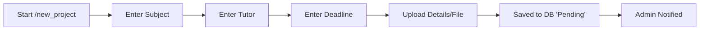
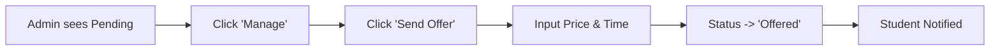
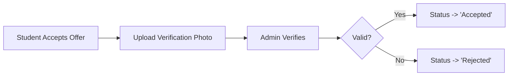

# System Architecture

The **SVU Helper Bot** is designed as a modular, state-driven application using **Aiogram 3**.

## 🏗 High-Level Structure
The project is split into distinct layers to separate concerns:

1.  **`main.py` (Entry Point)**
    -   Initializes the bot and database.
    -   Sets up logging (File + Console).
    -   Registers "Routers" (the handlers).
    -   Starts the polling loop (listening for messages).

2.  **`handlers/` (The Brain)**
    -   **`client.py`**: Handles student interactions. Uses a **Finite State Machine (FSM)** to guide users step-by-step through "New Project" submission.
    -   **`admin.py`**: The control panel. Allows the admin to view pending work, send offers, and verify payments.
    -   **`common.py`**: Basic commands like `/start`, `/help`, and `/cancel`.

3.  **`database.py` (The Memory)**
    -   A simplified wrapper around **SQLite**.
    -   Functions like `add_project()`, `update_project_status()`.
    -   Uses a "Context Manager" (`with get_db_connection()...`) to ensure the database always closes safely, preventing corruption.

4.  **`keyboards/` (The Interface)**
    -   Contains "Builders" for the buttons you see (Inline and Reply keyboards).
    -   Keeps the UI code separate from the logic code.

## 🔄 Key Workflows (Data Flow)

### 1. The Project Submission Flow (Student)

### 2. The Offer System (Admin)

### 3. The Payment Loop

## 📂 Database Schema
The `projects` table is the core of the system:
- **`id`**: Unique Project ID.
- **`status`**: The lifecycle state (Pending -> Offered -> Accepted -> Finished).
- **`file_id`**: Reference to the file on Telegram's servers.
- **`price` / `delivery_date`**: The terms offered by the admin.
