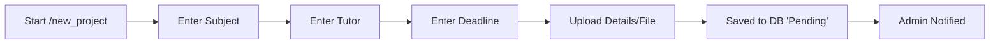
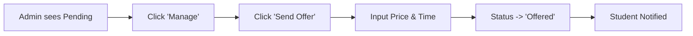
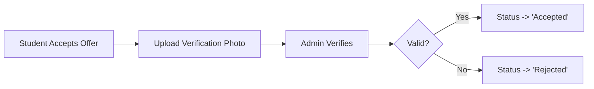

# SVU Helper - Full Codebase Source

This document contains the entire current source code of the project, consolidated into a single file. Each section represents a file in the project, starting with its relative path. This structure allows AI models to understand the architecture and inter-dependencies of the codebase.

---

## File: `.pre-commit-config.yaml`

```yaml
repos:
    - repo: https://github.com/pre-commit/pre-commit-hooks
      rev: v4.4.0
      hooks:
          - id: trailing-whitespace
          - id: end-of-file-fixer
          - id: check-yaml
          - id: check-added-large-files

    - repo: https://github.com/charliermarsh/ruff-pre-commit
      # Ruff version.
      rev: "v0.0.261"
      hooks:
          - id: ruff
            args: [--fix, --exit-non-zero-on-fix]

    - repo: https://github.com/psf/black
      rev: 23.3.0
      hooks:
          - id: black
```

---

## File: `AG_SKILLS_GUIDE.md`

```markdown
# Antigravity Skills & Workflows for SVU Helper

Based on the `svu_helper` project stack (**Python, Aiogram, Telethon, Motor/MongoDB, Pytest, Pydantic, Sentry**) and the current Clean Architecture implementation, this guide curates the most impactful skills from the `antigravity-awesome-skills` library and how to use them.

## 1. Telegram Bot & Framework Mastery
Because you are building an advanced bot using `aiogram` and test with `telethon`:
*   **`telegram-bot-builder` & `telegram`** 
    *   **Use Case:** Invoke these skills when adding complex Telegram UI/UX flows (like Reply Keyboards), handling Deep Links, preventing command leakage in your Finite State Machine (FSM), or dealing with rate-limiting and Telegram API quotas.
*   **`pydantic-models-py`**
    *   **Use Case:** Use this for defining strict schemas when validating incoming user data from Telegram or safely loading environment settings via `pydantic-settings`.

## 2. Architecture & Code Quality
The project follows a Clean Architecture pattern.
*   **`clean-architecture`**
    *   **Use Case:** Call this skill whenever you are adding a new feature. It ensures that new files correctly split Domain models, Application use cases (business logic), and Infrastructure concerns without violating dependency rules.
*   **`python-pro`**
    *   **Use Case:** Use this for advanced `asyncio` patterns. Since both `aiogram` and `motor` are heavily asynchronous, this skill helps prevent event-loop blocking and ensures optimal performance.

## 3. Database Operations
The project uses `motor` for asynchronous MongoDB operations.
*   **`nosql-expert` & `database`**
    *   **Use Case:** Use these when creating complex MongoDB aggregation pipelines for admin statistics, managing collections/indexes, or ensuring proper data cleanup scripts during tests.

## 4. Advanced Testing Workflows
The project invests in unit and Telethon-based E2E tests.
*   **`e2e-testing` & `python-testing-patterns`**
    *   **Use Case:** Ideal for maintaining and expanding `telethon` automated flows. These skills provide patterns for dealing with asynchronous E2E flakiness, race conditions, and correctly mocking states.
*   **`tdd-workflow`** (Test-Driven Development)
    *   **Use Case:** Use this for new features to follow a Red-Green-Refactor cycle, writing failing tests for repositories before implementing logic.

## 5. Debugging & Observability
*   **`systematic-debugging`**
    *   **Use Case:** When an E2E test fails or a regression occurs, use this skill to systematically isolate the problem (e.g., state management or unacknowledged updates).
*   **`sentry-automation` & `observability-engineer`**
    *   **Use Case:** Use these to build proper error middleware so admins are alerted immediately whenever an unexpected exception occurs.

## 6. DevOps & Version Control
*   **`github` & `pr-writer`**
    *   **Use Case:** After finishing a work phase, use these to audit commit history, generate professional Conventional Commits, and open clean pull requests.

---

## How to use them
If you want to apply any of these skills in a conversation, you can instruct the assistant like this:
> *"Use the `clean-architecture` and `python-testing-patterns` skills to help me create a new repository method for fetching student stats."*

> [!NOTE]
> These skills are accessible on-demand even if they are not pre-loaded in the initial AI context.
```

---

## File: `ARCHITECTURE.md`

```markdown
# System Architecture

The **SVU Helper Bot** is designed as a modular, state-driven application using **Aiogram 3**.

## 🏗 High-Level Structure
The project is split into distinct layers to separate concerns:

1.  **`main.py` (Entry Point)**
    -   Initializes the bot and database.
    -   Sets up logging (File + Console).
    -   Registers "Routers" (the handlers).
    -   Starts the polling loop (listening for messages).

2.  **`handlers/` (The Brain)**
    -   **`client.py`**: Handles student interactions. Uses a **Finite State Machine (FSM)** to guide users step-by-step through "New Project" submission.
    -   **`admin.py`**: The control panel. Allows the admin to view pending work, send offers, and verify payments.
    -   **`common.py`**: Basic commands like `/start`, `/help`, and `/cancel`.

3.  **database.py (The Memory)**
    -   A wrapper around **MongoDB** (using `Motor` for async).
    -   Functions like `add_project()`, `update_project_status()`.
    -   Uses a **Singleton Pattern** to maintain a persistent connection pool.

4.  **`keyboards/` (The Interface)**
    -   Contains "Builders" for the buttons you see (Inline and Reply keyboards).
    -   Keeps the UI code separate from the logic code.

## 🔄 Key Workflows (Data Flow)

### 1. The Project Submission Flow (Student)


### 2. The Offer System (Admin)


### 3. The Payment Loop


## 📂 Database Schema
The `projects` table is the core of the system:
- **`id`**: Unique Project ID.
- **`status`**: The lifecycle state (Pending -> Offered -> Accepted -> Finished).
- **`file_id`**: Reference to the file on Telegram's servers.
- **`price` / `delivery_date`**: The terms offered by the admin.
```

---

## File: `config.py`

```python

import logging
import sys
from typing import List, Optional
import functools

from pydantic import Field, field_validator
from pydantic_settings import BaseSettings, SettingsConfigDict
import structlog

# Initialize logging for the config loader
logger = structlog.get_logger()

class Settings(BaseSettings):
    # Bot Configuration
    BOT_TOKEN: str = Field(..., description="Telegram Bot Token")
    
    # Admin Configuration
    # We read as string to handle comma-separated values safely
    ADMIN_IDS_RAW: str = Field(..., alias="ADMIN_IDS", description="List of Admin IDs (comma-separated)")
    
    # Database Configuration
    MONGO_URI: str = Field(..., description="MongoDB Connection URI")
    DB_NAME: str = Field(default="svu_helper_bot", description="Database Name")
    
    # Sentry Configuration
    SENTRY_DSN: Optional[str] = Field(default=None, description="Sentry DSN for error tracking")
    
    # Logging Configuration
    LOG_FILE: str = Field(default="bot.log", description="Log file path")

    model_config = SettingsConfigDict(
        env_file=".env",
        env_file_encoding="utf-8",
        extra="ignore"
    )

    @functools.cached_property
    def admin_ids(self) -> List[int]:
        """Parses the comma-separated ADMIN_IDS string into a list of integers."""
        try:
            return [int(x.strip()) for x in self.ADMIN_IDS_RAW.split(",") if x.strip()]
        except ValueError:
            logger.error("Failed to parse ADMIN_IDS", raw_ids=self.ADMIN_IDS_RAW)
            return []

# Instantiate settings
# This will raise pydantic.ValidationError if configuration is missing
try:
    settings = Settings()
except Exception as e:
    # We log it but we re-raise so the app (or test) fails loudly but traced
    logger.critical("Configuration Error", error=str(e))
    raise
```

---

## File: `docker-compose.yml`

```yaml
version: '3.8'

services:
  bot:
    build: .
    container_name: svu_helper_bot
    restart: always
    environment:
      - BOT_TOKEN=${BOT_TOKEN}
      - ADMIN_IDS=${ADMIN_IDS}
      - MONGO_URI=mongodb://mongo:27017
    depends_on:
      - mongo
    volumes:
      - .:/app # Mounts current directory for hot-reloading (optional, good for dev)

  mongo:
    image: mongo:latest
    container_name: svu_helper_mongo
    restart: always
    volumes:
      - mongo_data:/data/db
    ports:
      - "27017:27017" # Expose to host if you want to connect from outside

  mongo-express:
    image: mongo-express
    container_name: svu_helper_mongo_express
    restart: always
    ports:
      - "8081:8081"
    environment:
      - ME_CONFIG_MONGODB_SERVER=mongo
      - ME_CONFIG_MONGODB_PORT=27017
      - ME_CONFIG_BASICAUTH_USERNAME=${MONGO_EXPRESS_USER:-admin}
      - ME_CONFIG_BASICAUTH_PASSWORD=${MONGO_EXPRESS_PASS:-pass}
    depends_on:
      - mongo

volumes:
  mongo_data:
```

---

## File: `Dockerfile`

```text
# Stage 1: Builder
FROM python:3.10-slim as builder

WORKDIR /app

# Prevent python from writing pyc files to disc
ENV PYTHONDONTWRITEBYTECODE=1
ENV PYTHONUNBUFFERED=1

# Install system dependencies required for building wheels (if any)
# RUN apt-get update && apt-get install -y --no-install-recommends gcc && rm -rf /var/lib/apt/lists/*

COPY requirements.txt .
RUN pip wheel --no-cache-dir --no-deps --wheel-dir /app/wheels -r requirements.txt


# Stage 2: Final Runtime
FROM python:3.10-slim

WORKDIR /app

# Create a non-root user for security
RUN groupadd -r appuser && useradd -r -g appuser appuser

# Copy wheels from builder
COPY --from=builder /app/wheels /wheels
COPY --from=builder /app/requirements.txt .

# Install dependencies (from pre-built wheels)
RUN pip install --no-cache /wheels/*

# Copy application code
COPY . .

# Change ownership to non-root user
RUN chown -R appuser:appuser /app

# Switch to non-root user
USER appuser

CMD ["python", "main.py"]
```

---

## File: `main.py`

```python
import asyncio
import logging
import sys

from aiohttp import web
from aiogram import Bot, Dispatcher, types

# Internal Project Imports
import sentry_sdk

from config import settings
from database.connection import init_db, mongo_client
from handlers.admin_routes import router as admin_router
from handlers.client_routes import router as client_router
from handlers.common import router as common_router
from middlewares.error_handler import GlobalErrorHandler
from middlewares.maintenance import MaintenanceMiddleware
from middlewares.throttling import ThrottlingMiddleware
from middlewares.db_injection import DbInjectionMiddleware
from middlewares.correlation import CorrelationLoggingMiddleware
from utils.storage import MongoStorage

# Ensure console handles UTF-8 for emojis (especially on Windows)
if sys.stdout.encoding.lower() != "utf-8":
    import io

    sys.stdout = io.TextIOWrapper(sys.stdout.buffer, encoding="utf-8")
    sys.stderr = io.TextIOWrapper(sys.stderr.buffer, encoding="utf-8")

# ... imports
from utils.logger import setup_logger

# ... (imports)

# --- LOGGING CONFIGURATION ---
logger = setup_logger()

# --- SENTRY INITIALIZATION ---
if settings.SENTRY_DSN:
    sentry_sdk.init(
        dsn=settings.SENTRY_DSN,
        traces_sample_rate=0.1,  # Sample 10% of transactions for performance
        profiles_sample_rate=0.1,
    )
    logger.info("✅ Sentry Integration Enabled")
else:
    logger.warning("⚠️ Sentry DSN not found. Error tracking disabled.")


# --- BOT INITIALIZATION ---
bot = Bot(token=settings.BOT_TOKEN)

# Use MongoDB for persistent storage — must use the SAME DB as app data
storage = MongoStorage(mongo_client, db_name=settings.DB_NAME)
dp = Dispatcher(storage=storage)

# Register Middleware
# Order matters: Correlation -> DB Injection -> Maintenance -> Throttling -> Error Handler
dp.message.outer_middleware(CorrelationLoggingMiddleware())
dp.callback_query.outer_middleware(CorrelationLoggingMiddleware())
dp.edited_message.outer_middleware(CorrelationLoggingMiddleware())
dp.message.middleware(DbInjectionMiddleware())
dp.callback_query.middleware(DbInjectionMiddleware())
dp.edited_message.middleware(DbInjectionMiddleware())
dp.message.middleware(ThrottlingMiddleware(rate_limit=0.5))
dp.callback_query.middleware(ThrottlingMiddleware(rate_limit=0.5))
dp.message.middleware(MaintenanceMiddleware())
dp.message.middleware(GlobalErrorHandler())
dp.callback_query.middleware(GlobalErrorHandler())
dp.edited_message.middleware(GlobalErrorHandler())

# Register all hander routers
dp.include_router(common_router)
dp.include_router(client_router)
dp.include_router(admin_router)


# --- KEEP-ALIVE WEB SERVER FOR RAILWAY ---
async def handle_ping(request):
    return web.Response(text="Bot is running!")

async def start_keepalive_server():
    app = web.Application()
    app.router.add_get("/", handle_ping)
    app.router.add_get("/health", handle_ping)
    
    runner = web.AppRunner(app)
    await runner.setup()
    
    import os
    port = int(os.environ.get("PORT", 8080))
    site = web.TCPSite(runner, "0.0.0.0", port)
    await site.start()
    logger.info("Keep-alive server started", port=port)
    return runner


# --- MAIN ENTRY POINT ---
async def main():
    """
    Initializes the bot, sets up commands, and starts the polling loop.
    Ensures the database is ready before accepting any updates.
    """
    try:
        # Step 1: Initialize Database schema
        await init_db()
        logger.info("📂 Database initialized.")

        # Set bot commands
        student_commands = [
            types.BotCommand(command="start", description="🏠 القائمة الرئيسية"),
            types.BotCommand(command="new_project", description="📚 تقديم مشروع جديد"),
            types.BotCommand(command="my_projects", description="📂 عرض مشاريعي"),
            types.BotCommand(command="my_offers", description="🎁 الأسعار والعروض"),
            types.BotCommand(command="help", description="❓ مساعدة"),
            types.BotCommand(command="cancel", description="🚫 إلغاء العملية"),
        ]

        admin_commands = [
            types.BotCommand(command="admin", description="🛠 لوحة التحكم"),
            types.BotCommand(command="stats", description="📊 الإحصائيات"),
            types.BotCommand(command="maintenance_on", description="🛑 تفعيل الصيانة"),
            types.BotCommand(command="maintenance_off", description="✅ إيقاف الصيانة"),
        ]

        # Apply student commands to everyone
        await bot.set_my_commands(
            student_commands, scope=types.BotCommandScopeDefault()
        )

        # Apply admin commands only to admins
        for admin_id in settings.admin_ids:
            await bot.set_my_commands(
                admin_commands, scope=types.BotCommandScopeChat(chat_id=admin_id)
            )

        logger.info("Bot online", admin_ids=settings.admin_ids)

        await bot.delete_webhook(drop_pending_updates=True)
        
        # Start keep-alive web server for Railway
        runner = await start_keepalive_server()
        
        await dp.start_polling(bot)

    except Exception as e:
        logger.error("Error occurred while running bot", e=str(e), exc_info=True)
    finally:
        await bot.session.close()
        try:
            if 'runner' in locals() and runner:
                await runner.cleanup()
        except Exception:
            pass


if __name__ == "__main__":
    asyncio.run(main())
```

---

## File: `pyproject.toml`

```text
[tool.pytest.ini_options]
minversion = "6.0"
addopts = "-ra -q"
testpaths = [
    "tests",
]
pythonpath = [
    ".",
]

[tool.black]
line-length = 88
target-version = ['py310']

[tool.isort]
profile = "black"
line_length = 88
```

---

## File: `README.md`

```markdown
# SVU Helper Bot 🚀

A modular Telegram bot built with **Aiogram 3** to manage student project submissions and tutor offers.

## Features
- 📚 **Project Submission**: Guided FSM flow for students to submit projects with file support.
- 🎁 **Offer Management**: Admins can send price/delivery offers for submitted projects.
- 💳 **Payment Verification**: Integrated workflow for handling payment receipts.
- 📂 **Project Tracking**: Categorized views for pending, ongoing, and completed projects.
- 📢 **Broadcasting**: Admin tool to send messages to all bot users.

## Setup Instructions

### 1. Prerequisites
- Python 3.10+
- A Telegram Bot Token (from [@BotFather](https://t.me/botfather))

### 2. Installation
1. Clone the repository.
2. Create and activate a virtual environment:
   ```bash
   python -m venv venv
   source venv/Scripts/activate  # On Windows: venv\Scripts\activate
   ```
3. Install dependencies:
   ```bash
   pip install -r requirements.txt
   ```

### 3. Configuration
Create a `.env` file in the root directory:
```env
BOT_TOKEN=your_telegram_bot_token
ADMIN_ID=your_telegram_user_id
MONGO_URI=mongodb://localhost:27017
```

### 4. Running the Bot
```bash
python main.py
```

## Project Structure
- `handlers/`: logic for admin and client events.
- `keyboards/`: Inline and reply keyboard definitions.
- `utils/`: Constants and formatting helpers.
- `scripts/`: Maintenance and debugging utilities.
- `database.py`: **MongoDB** async wrapper using Motor.
- `main.py`: Entry point and bot initialization.

## Maintenance
Use scripts in the `scripts/` folder for routine checks:
- `python scripts/read_db.py`: View current database records.
- `python scripts/debug_commands.py`: Reset bot menu commands.
```

---

## File: `requirements.txt`

```text
aiogram>=3.0.0
pydantic>=2.0.0
pydantic-settings>=2.0.0
python-dotenv>=1.0.0

motor
dnspython

pytest
pytest-asyncio
black
isort
flake8
sentry-sdk
telethon
cachetools
structlog>=24.0.0
```

---

## File: `states.py`

```python
from aiogram.fsm.state import State, StatesGroup


class ProjectOrder(StatesGroup):
    subject = State()
    tutor = State()
    deadline = State()
    details = State()
    waiting_for_payment_proof = State()


class AdminStates(StatesGroup):
    waiting_for_broadcast = State()
    waiting_for_price = State()
    waiting_for_delivery = State()
    waiting_for_notes_decision = State()  # Do you want notes? (Yes/No)
    waiting_for_notes_text = State()  # Type the notes here.
    waiting_for_finished_work = State()
```

---

## File: `application/admin_service.py`

```python
"""
Application Services – Admin reads & system control
=====================================================
Thin services wrapping the admin read-only queries and system control
operations. Each service is its own class so handlers receive exactly
the dependency they need and tests can mock precisely.

Services here:
  GetCategorizedProjectsService – full master report data
  GetPendingProjectsService     – projects awaiting review
  GetOngoingProjectsService     – accepted + awaiting-verification projects
  GetProjectHistoryService      – finished / denied projects
  GetAllPaymentsService         – all payment records (for history view)
  GetStatsService               – aggregate statistics
  MaintenanceService            – enable / disable maintenance mode
  GetAllUserIdsService          – user-id list for broadcast
"""
from typing import Any, Dict, List

from domain.enums import ProjectStatus
from infrastructure.repositories import (
    PaymentRepository,
    ProjectRepository,
    SettingsRepository,
    StatsRepository,
)


class GetCategorizedProjectsService:
    """Returns all projects grouped into display categories."""

    def __init__(self, project_repo: ProjectRepository) -> None:
        self._repo = project_repo

    async def execute(self) -> Dict[str, List[Dict[str, Any]]]:
        return await self._repo.get_all_categorized()


class GetPendingProjectsService:
    """Returns all projects awaiting admin review."""

    def __init__(self, project_repo: ProjectRepository) -> None:
        self._repo = project_repo

    async def execute(self) -> List[Dict[str, Any]]:
        return await self._repo.get_projects_by_status([ProjectStatus.PENDING])


class GetOngoingProjectsService:
    """Returns accepted and awaiting-verification (in-progress) projects."""

    def __init__(self, project_repo: ProjectRepository) -> None:
        self._repo = project_repo

    async def execute(self) -> List[Dict[str, Any]]:
        return await self._repo.get_projects_by_status(
            [ProjectStatus.ACCEPTED, ProjectStatus.AWAITING_VERIFICATION]
        )


class GetProjectHistoryService:
    """Returns finished and denied projects for the history view."""

    def __init__(self, project_repo: ProjectRepository) -> None:
        self._repo = project_repo

    async def execute(self) -> List[Dict[str, Any]]:
        return await self._repo.get_projects_by_status(
            [
                ProjectStatus.FINISHED,
                ProjectStatus.DENIED_ADMIN,
                ProjectStatus.DENIED_STUDENT,
                ProjectStatus.REJECTED_PAYMENT,
            ]
        )


class GetAllPaymentsService:
    """Returns all payment records sorted by ID descending."""

    def __init__(self, payment_repo: PaymentRepository) -> None:
        self._repo = payment_repo

    async def execute(self) -> List[Dict[str, Any]]:
        return await self._repo.get_all()


class GetStatsService:
    """Returns the aggregate project statistics dict."""

    def __init__(self, stats_repo: StatsRepository) -> None:
        self._repo = stats_repo

    async def execute(self) -> Dict[str, int]:
        return await self._repo.get_stats()


class MaintenanceService:
    """Enables or disables global maintenance mode."""

    def __init__(self, settings_repo: SettingsRepository) -> None:
        self._repo = settings_repo

    async def enable(self) -> None:
        await self._repo.set_maintenance_mode(True)

    async def disable(self) -> None:
        await self._repo.set_maintenance_mode(False)


class GetAllUserIdsService:
    """Returns the list of all distinct user IDs (used by broadcast)."""

    def __init__(self, project_repo: ProjectRepository) -> None:
        self._repo = project_repo

    async def execute(self) -> List[int]:
        return await self._repo.get_all_user_ids()
```

---

## File: `application/offer_service.py`

```python
"""
Application Services – Admin Offer & Work Lifecycle
=====================================================
Services covering the admin side of a project's lifecycle:
fetching project details for review, sending an offer to the student,
finishing a project (delivering work), and denying a project.

Services here:
  GetProjectDetailService – fetch full project data for admin review
  SendOfferService        – persist offer and return notification payload
  FinishProjectService    – mark project Finished, return notification payload
  DenyProjectService      – deny from admin or student side, return notify payload
"""
from dataclasses import dataclass
from typing import Optional

from domain.enums import ProjectStatus
from infrastructure.repositories import ProjectRepository


# ---------------------------------------------------------------------------
# Result types
# ---------------------------------------------------------------------------

@dataclass
class ProjectDetail:
    """All fields needed to render the admin project-detail message."""
    proj_id: int
    subject: str          # raw (not escaped)
    tutor: str            # raw
    deadline: str         # raw
    details: str          # raw
    file_id: Optional[str]
    file_type: Optional[str]
    user_id: int
    user_full_name: str   # raw
    username: Optional[str]  # raw, may be None


@dataclass
class SendOfferResult:
    """Data the handler needs to notify the student of a new offer."""
    user_id: int
    proj_id: int
    subject: str    # raw
    price: str      # raw
    delivery: str   # raw
    notes: str      # raw


@dataclass
class FinishProjectResult:
    """Data the handler needs to relay finished work to the student."""
    user_id: int
    proj_id: int
    subject: str    # raw


@dataclass
class DenyResult:
    """
    Outcome of a denial action.

    is_admin_deny=True  → admin denied; handler notifies student_user_id.
    is_admin_deny=False → student denied; handler notifies all admin_ids.
    """
    proj_id: int
    is_admin_deny: bool
    student_user_id: Optional[int]  # set only when is_admin_deny=True


# ---------------------------------------------------------------------------
# GetProjectDetailService
# ---------------------------------------------------------------------------

class GetProjectDetailService:
    """Fetches a full project record for the admin detail view."""

    def __init__(self, project_repo: ProjectRepository) -> None:
        self._repo = project_repo

    async def execute(self, proj_id: int) -> Optional[ProjectDetail]:
        project = await self._repo.get_project_by_id(proj_id)
        if not project:
            return None
        return ProjectDetail(
            proj_id=project["id"],
            subject=project["subject_name"],
            tutor=project["tutor_name"],
            deadline=project["deadline"],
            details=project["details"],
            file_id=project.get("file_id"),
            file_type=project.get("file_type"),
            user_id=project["user_id"],
            user_full_name=project.get("user_full_name") or "Unknown",
            username=project.get("username"),
        )


# ---------------------------------------------------------------------------
# SendOfferService
# ---------------------------------------------------------------------------

class SendOfferService:
    """
    Persists price, delivery date, and status=OFFERED.
    Returns the notification payload for the student.

    Raises:
        ValueError: if project not found.
    """

    def __init__(self, project_repo: ProjectRepository) -> None:
        self._repo = project_repo

    async def execute(
        self, proj_id: int, price: str, delivery: str, notes: str
    ) -> SendOfferResult:
        project = await self._repo.get_project_by_id(proj_id)
        if not project:
            raise ValueError(f"Project #{proj_id} not found.")

        await self._repo.update_offer(proj_id, price, delivery)
        await self._repo.update_status(proj_id, ProjectStatus.OFFERED)

        return SendOfferResult(
            user_id=project["user_id"],
            proj_id=proj_id,
            subject=project["subject_name"],
            price=price,
            delivery=delivery,
            notes=notes,
        )


# ---------------------------------------------------------------------------
# FinishProjectService
# ---------------------------------------------------------------------------

class FinishProjectService:
    """
    Marks a project as FINISHED.
    Returns the data the handler needs to relay the work file to the student.

    Raises:
        ValueError: if project not found.
    """

    def __init__(self, project_repo: ProjectRepository) -> None:
        self._repo = project_repo

    async def execute(self, proj_id: int) -> FinishProjectResult:
        project = await self._repo.get_project_by_id(proj_id)
        if not project:
            raise ValueError(f"Project #{proj_id} not found.")

        await self._repo.update_status(proj_id, ProjectStatus.FINISHED)

        return FinishProjectResult(
            user_id=project["user_id"],
            proj_id=proj_id,
            subject=project["subject_name"],
        )


# ---------------------------------------------------------------------------
# DenyProjectService
# ---------------------------------------------------------------------------

class DenyProjectService:
    """
    Handles project denial from either the admin or the student side.

    execute_admin_deny  → updates status to DENIED_ADMIN, notifies student.
    execute_student_deny → validates ownership, updates status to DENIED_STUDENT,
                           notifies admin(s).

    Raises:
        PermissionError: (student deny) if project isn't owned by user.
    """

    def __init__(self, project_repo: ProjectRepository) -> None:
        self._repo = project_repo

    async def execute_admin_deny(self, proj_id: int) -> DenyResult:
        await self._repo.update_status(proj_id, ProjectStatus.DENIED_ADMIN)
        project = await self._repo.get_project_by_id(proj_id)
        return DenyResult(
            proj_id=proj_id,
            is_admin_deny=True,
            student_user_id=project["user_id"] if project else None,
        )

    async def execute_student_deny(self, proj_id: int, user_id: int) -> DenyResult:
        project = await self._repo.get_project_by_id(proj_id)
        if not project or project["user_id"] != user_id:
            raise PermissionError("غير مصرح لك بذلك")
        await self._repo.update_status(proj_id, ProjectStatus.DENIED_STUDENT)
        return DenyResult(
            proj_id=proj_id,
            is_admin_deny=False,
            student_user_id=None,
        )
```

---

## File: `application/payment_service.py`

```python
"""
Application Services – Payment Lifecycle
==========================================
Services covering the full payment flow: submission by the student,
confirmation by the admin, and rejection (reset so the student can retry).

Result dataclasses carry all the data handlers need to send Telegram
notifications, without the services knowing anything about aiogram.
"""
from dataclasses import dataclass
from typing import Optional

from domain.enums import PaymentStatus, ProjectStatus
from infrastructure.repositories import PaymentRepository, ProjectRepository


# ---------------------------------------------------------------------------
# Result types
# ---------------------------------------------------------------------------

@dataclass
class SubmitPaymentResult:
    """Returned after a student submits a receipt."""
    payment_id: int
    proj_id: int
    file_id: str
    file_type: Optional[str]


@dataclass
class PaymentActionResult:
    """Returned after an admin confirms or rejects a payment."""
    payment_id: int
    proj_id: int
    user_id: int
    subject: str  # raw, not escaped


# ---------------------------------------------------------------------------
# SubmitPaymentService
# ---------------------------------------------------------------------------

class SubmitPaymentService:
    """
    Persists a payment receipt and advances the project status to
    AWAITING_VERIFICATION.

    Raises:
        ValueError: if proj_id is missing from FSM data.
    """

    def __init__(
        self,
        project_repo: ProjectRepository,
        payment_repo: PaymentRepository,
    ) -> None:
        self._project_repo = project_repo
        self._payment_repo = payment_repo

    async def execute(
        self,
        proj_id: int,
        user_id: int,
        file_id: str,
        file_type: Optional[str],
    ) -> SubmitPaymentResult:
        if not proj_id:
            raise ValueError("No active project for payment – missing FSM state.")

        payment_id = await self._payment_repo.add_payment(
            proj_id, user_id, file_id, file_type=file_type
        )
        await self._project_repo.update_status(proj_id, ProjectStatus.AWAITING_VERIFICATION)

        return SubmitPaymentResult(
            payment_id=payment_id,
            proj_id=proj_id,
            file_id=file_id,
            file_type=file_type,
        )


# ---------------------------------------------------------------------------
# ConfirmPaymentService
# ---------------------------------------------------------------------------

class ConfirmPaymentService:
    """
    Marks a payment Accepted and advances the project to Accepted (ongoing).

    Raises:
        ValueError: if payment_id not found.
    """

    def __init__(
        self,
        project_repo: ProjectRepository,
        payment_repo: PaymentRepository,
    ) -> None:
        self._project_repo = project_repo
        self._payment_repo = payment_repo

    async def execute(self, payment_id: int) -> PaymentActionResult:
        payment = await self._payment_repo.get_payment(payment_id)
        if not payment:
            raise ValueError(f"Payment #{payment_id} not found.")

        proj_id = payment["project_id"]
        await self._payment_repo.update_status(payment_id, PaymentStatus.ACCEPTED)
        await self._project_repo.update_status(proj_id, ProjectStatus.ACCEPTED)

        project = await self._project_repo.get_project_by_id(proj_id)
        return PaymentActionResult(
            payment_id=payment_id,
            proj_id=proj_id,
            user_id=project["user_id"],
            subject=project.get("subject_name", ""),
        )


# ---------------------------------------------------------------------------
# RejectPaymentService
# ---------------------------------------------------------------------------

class RejectPaymentService:
    """
    Marks a payment Rejected and resets the project back to OFFERED so the
    student can upload a correct receipt.

    Raises:
        ValueError: if payment_id not found.
    """

    def __init__(
        self,
        project_repo: ProjectRepository,
        payment_repo: PaymentRepository,
    ) -> None:
        self._project_repo = project_repo
        self._payment_repo = payment_repo

    async def execute(self, payment_id: int) -> PaymentActionResult:
        payment = await self._payment_repo.get_payment(payment_id)
        if not payment:
            raise ValueError(f"Payment #{payment_id} not found.")

        proj_id = payment["project_id"]
        await self._payment_repo.update_status(payment_id, PaymentStatus.REJECTED)
        # Reset to OFFERED so student can re-upload
        await self._project_repo.update_status(proj_id, ProjectStatus.OFFERED)

        project = await self._project_repo.get_project_by_id(proj_id)
        return PaymentActionResult(
            payment_id=payment_id,
            proj_id=proj_id,
            user_id=project["user_id"] if project else 0,
            subject=project.get("subject_name", "") if project else "",
        )
```

---

## File: `application/project_service.py`

```python
"""
Application Services – Project (Student Flows)
================================================
All use-cases that a student triggers around their project lifecycle.

Services here:
  AddProjectService         – submit a new project (existing)
  VerifyProjectOwnershipService – auth-check before offer acceptance
  GetStudentProjectsService – list all non-offered projects
  GetStudentOffersService   – list OFFERED projects
  GetOfferDetailService     – fetch + validate a single offer detail
"""
from typing import Any, Dict, List, Optional

from domain.entities import _parse_deadline
from domain.enums import ProjectStatus
from infrastructure.repositories import ProjectRepository


# ---------------------------------------------------------------------------
# AddProjectService (original)
# ---------------------------------------------------------------------------

class AddProjectService:
    """Use-case: submit a new project on behalf of a student."""

    MAX_SUBJECT_LENGTH = 150
    MAX_TUTOR_LENGTH = 150
    MAX_DEADLINE_LENGTH = 50
    MAX_DETAILS_LENGTH = 3000
    MAX_FILE_SIZE_MB = 15
    MAX_FILE_SIZE_BYTES = MAX_FILE_SIZE_MB * 1024 * 1024

    def __init__(self, project_repo: ProjectRepository) -> None:
        self._repo = project_repo

    async def execute(
        self,
        *,
        user_id: int,
        username: Optional[str],
        user_full_name: str,
        subject: str,
        tutor: str,
        deadline: str,
        details: str,
        file_id: Optional[str],
        file_type: Optional[str],
    ) -> int:
        """Validates inputs and persists the project. Returns the new project ID."""
        self._validate(subject, tutor, deadline, details)
        return await self._repo.add_project(
            user_id=user_id,
            username=username,
            user_full_name=user_full_name,
            subject=subject,
            tutor=tutor,
            deadline=deadline,
            details=details,
            file_id=file_id,
            file_type=file_type,
        )

    def _validate(self, subject: str, tutor: str, deadline: str, details: str) -> None:
        if len(subject) > self.MAX_SUBJECT_LENGTH:
            raise ValueError(f"Subject too long: max {self.MAX_SUBJECT_LENGTH} chars.")
        if len(tutor) > self.MAX_TUTOR_LENGTH:
            raise ValueError(f"Tutor name too long: max {self.MAX_TUTOR_LENGTH} chars.")
        _parse_deadline(deadline)  # raises ValueError with Arabic message on bad format
        if len(details) > self.MAX_DETAILS_LENGTH:
            raise ValueError(f"Details too long: max {self.MAX_DETAILS_LENGTH} chars.")


# ---------------------------------------------------------------------------
# VerifyProjectOwnershipService
# ---------------------------------------------------------------------------

class VerifyProjectOwnershipService:
    """
    Confirms that a project exists and belongs to the requesting user.

    Raises:
        PermissionError: if not found or user_id doesn't match.
    """

    def __init__(self, project_repo: ProjectRepository) -> None:
        self._repo = project_repo

    async def execute(self, proj_id: int, user_id: int) -> Dict[str, Any]:
        project = await self._repo.get_project_by_id(proj_id)
        if not project or project["user_id"] != user_id:
            raise PermissionError("غير مصرح لك بذلك")
        return project


# ---------------------------------------------------------------------------
# GetStudentProjectsService
# ---------------------------------------------------------------------------

# All statuses shown in "My Projects" (excludes OFFERED which has its own menu)
_ALL_PROJECT_STATUSES: List[ProjectStatus] = [
    ProjectStatus.PENDING,
    ProjectStatus.ACCEPTED,
    ProjectStatus.AWAITING_VERIFICATION,
    ProjectStatus.FINISHED,
    ProjectStatus.DENIED_ADMIN,
    ProjectStatus.DENIED_STUDENT,
    ProjectStatus.REJECTED_PAYMENT,
]


class GetStudentProjectsService:
    """Returns all non-offered projects owned by a student."""

    def __init__(self, project_repo: ProjectRepository) -> None:
        self._repo = project_repo

    async def execute(self, user_id: int) -> List[Dict[str, Any]]:
        return await self._repo.get_projects_by_status(
            _ALL_PROJECT_STATUSES, user_id=user_id
        )


# ---------------------------------------------------------------------------
# GetStudentOffersService
# ---------------------------------------------------------------------------

class GetStudentOffersService:
    """Returns projects in OFFERED state for a student."""

    def __init__(self, project_repo: ProjectRepository) -> None:
        self._repo = project_repo

    async def execute(self, user_id: int) -> List[Dict[str, Any]]:
        return await self._repo.get_projects_by_status(
            [ProjectStatus.OFFERED], user_id=user_id
        )


# ---------------------------------------------------------------------------
# GetOfferDetailService
# ---------------------------------------------------------------------------

class GetOfferDetailService:
    """
    Fetches a specific project, validates the requester owns it.

    Raises:
        PermissionError: if not found or user_id doesn't match.
    """

    def __init__(self, project_repo: ProjectRepository) -> None:
        self._repo = project_repo

    async def execute(self, proj_id: int, user_id: int) -> Dict[str, Any]:
        project = await self._repo.get_project_by_id(proj_id)
        if not project or project["user_id"] != user_id:
            raise PermissionError("غير مصرح لك بذلك")
        return project
```

---

## File: `application/__init__.py`

```python
# Application layer – use-cases and service orchestration.
from application.project_service import (
    AddProjectService,
    GetOfferDetailService,
    GetStudentOffersService,
    GetStudentProjectsService,
    VerifyProjectOwnershipService,
)
from application.payment_service import (
    ConfirmPaymentService,
    PaymentActionResult,
    RejectPaymentService,
    SubmitPaymentResult,
    SubmitPaymentService,
)
from application.offer_service import (
    DenyProjectService,
    DenyResult,
    FinishProjectResult,
    FinishProjectService,
    GetProjectDetailService,
    ProjectDetail,
    SendOfferResult,
    SendOfferService,
)
from application.admin_service import (
    GetAllPaymentsService,
    GetAllUserIdsService,
    GetCategorizedProjectsService,
    GetOngoingProjectsService,
    GetPendingProjectsService,
    GetProjectHistoryService,
    GetStatsService,
    MaintenanceService,
)

__all__ = [
    # project
    "AddProjectService",
    "VerifyProjectOwnershipService",
    "GetStudentProjectsService",
    "GetStudentOffersService",
    "GetOfferDetailService",
    # payment
    "SubmitPaymentService",
    "SubmitPaymentResult",
    "ConfirmPaymentService",
    "RejectPaymentService",
    "PaymentActionResult",
    # offer / lifecycle
    "GetProjectDetailService",
    "ProjectDetail",
    "SendOfferService",
    "SendOfferResult",
    "FinishProjectService",
    "FinishProjectResult",
    "DenyProjectService",
    "DenyResult",
    # admin
    "GetCategorizedProjectsService",
    "GetPendingProjectsService",
    "GetOngoingProjectsService",
    "GetProjectHistoryService",
    "GetAllPaymentsService",
    "GetStatsService",
    "MaintenanceService",
    "GetAllUserIdsService",
]
```

---

## File: `database/connection.py`

```python
"""
Backward-compatibility shim.
The canonical implementation is now infrastructure.mongo_db.
All new code should import from there directly.
"""
from infrastructure.mongo_db import (  # noqa: F401
    Database,
    get_db,
    init_db,
    mongo_client,
)

__all__ = ["Database", "get_db", "init_db", "mongo_client"]
```

---

## File: `database/repositories.py`

```python
"""
Backward-compatibility shim.
The canonical DI-enabled repositories live in infrastructure.repositories.
All new code should import from there or receive instances via middleware.
"""
from infrastructure.repositories import (  # noqa: F401
    PaymentRepository,
    ProjectRepository,
    SettingsRepository,
    StatsRepository,
)

__all__ = [
    "ProjectRepository",
    "PaymentRepository",
    "StatsRepository",
    "SettingsRepository",
]
```

---

## File: `database/__init__.py`

```python

# Legacy facade removed.
# Import from database.connection or database.repositories instead.
```

---

## File: `domain/entities.py`

```python
"""
Domain Entities
===============
Pydantic models representing the core domain objects.
No framework (aiogram) or database (motor) dependencies here.
"""
import re
from datetime import datetime, timezone
from typing import Optional

from pydantic import BaseModel, ConfigDict, Field, field_validator

from domain.enums import PaymentStatus, ProjectStatus

# Accepted deadline formats: DD/MM/YYYY  or  YYYY-MM-DD (ISO 8601)
_DEADLINE_RE = re.compile(
    r"^(?:"
    r"(?P<dmy>\d{2}/\d{2}/\d{4})"  # DD/MM/YYYY
    r"|"
    r"(?P<iso>\d{4}-\d{2}-\d{2})"  # YYYY-MM-DD
    r")$"
)


def _parse_deadline(value: str) -> str:
    """Validate deadline and normalise to YYYY-MM-DD for DB storage."""
    value = value.strip()
    m = _DEADLINE_RE.match(value)
    if not m:
        raise ValueError(
            "صيغة التاريخ غير صحيحة. استخدم DD/MM/YYYY أو YYYY-MM-DD "
            "(مثال: 31/12/2025 أو 2025-12-31)."
        )
    if m.group("dmy"):
        # Convert DD/MM/YYYY → YYYY-MM-DD for consistent storage
        day, month, year = value.split("/")
        try:
            datetime(int(year), int(month), int(day))
        except ValueError:
            raise ValueError(
                "التاريخ غير صحيح (يوم/شهر/سنة). تأكد من صحة القيم."
            )
        return f"{year}-{month}-{day}"
    # ISO path – verify the calendar date is real
    try:
        datetime.fromisoformat(value)
    except ValueError:
        raise ValueError("التاريخ غير صحيح. تأكد من صحة اليوم والشهر والسنة.")
    return value


class Project(BaseModel):
    id: int
    user_id: int
    username: Optional[str] = None
    user_full_name: Optional[str] = None
    subject_name: str
    tutor_name: str
    deadline: str
    details: str
    file_id: Optional[str] = None
    file_type: Optional[str] = None
    status: ProjectStatus = Field(default=ProjectStatus.PENDING)
    price: Optional[str] = None
    delivery_date: Optional[str] = None
    created_at: datetime = Field(
        default_factory=lambda: datetime.now(timezone.utc)
    )

    model_config = ConfigDict(use_enum_values=True)

    @field_validator("deadline", mode="before")
    @classmethod
    def validate_deadline(cls, v: str) -> str:  # noqa: N805
        return _parse_deadline(v)


class Payment(BaseModel):
    id: int
    project_id: int
    user_id: int
    file_id: str
    file_type: Optional[str] = None   # photo / document / video / etc.
    status: PaymentStatus = Field(default=PaymentStatus.PENDING)
    created_at: datetime = Field(
        default_factory=lambda: datetime.now(timezone.utc)
    )

    model_config = ConfigDict(use_enum_values=True)
```

---

## File: `domain/enums.py`

```python
"""
Domain Enums
============
Core status value-objects for Project and Payment lifecycles.
These are pure Python – no framework or database dependencies.

IMPORTANT: Enum values are English slugs stored directly in MongoDB.
Display labels (Arabic) live in utils/constants.py -> STATUS_LABELS dict.
Never put display strings here.
"""
from enum import Enum


class ProjectStatus(str, Enum):
    PENDING               = "pending"
    ACCEPTED              = "accepted"
    AWAITING_VERIFICATION = "awaiting_verification"
    FINISHED              = "finished"
    OFFERED               = "offered"
    DENIED_ADMIN          = "denied_admin"
    DENIED_STUDENT        = "denied_student"
    REJECTED_PAYMENT      = "rejected_payment"


class PaymentStatus(str, Enum):
    PENDING  = "pending"
    ACCEPTED = "accepted"
    REJECTED = "rejected"
```

---

## File: `domain/__init__.py`

```python
# Domain layer – core entities, enums, and value objects.
# This package has no dependencies on frameworks, databases, or UI.
from domain.entities import Project, Payment
from domain.enums import ProjectStatus, PaymentStatus

__all__ = ["Project", "Payment", "ProjectStatus", "PaymentStatus"]
```

---

## File: `handlers/common.py`

```python
"""
Common Handlers Module
======================
Manages universal bot commands like /start, /help, and /cancel,
as well as basic main menu navigation logic.
"""

from aiogram import Router, types, F
from aiogram.filters import Command
from aiogram.fsm.context import FSMContext

from utils.constants import (
    BTN_MY_OFFERS,
    BTN_MY_PROJECTS,
    BTN_NEW_PROJECT,
    MSG_CANCELLED,
    MSG_HELP,
    MSG_NO_ACTIVE_PROCESS,
    MSG_WELCOME,
)
from keyboards.common_kb import get_student_main_kb
from keyboards.callbacks import MenuCallback, MenuAction
from keyboards.calendar_kb import build_calendar, CalendarCallback
from states import ProjectOrder, AdminStates
from utils.constants import MSG_ASK_DETAILS, MSG_ASK_NOTES
from keyboards.admin_kb import get_notes_decision_kb

# --- ROUTER INITIALIZATION ---
router = Router()


@router.message(Command("start"))
async def welcome(message: types.Message):
    """Greets the user and provides basic instructions."""
    await message.answer(MSG_WELCOME, reply_markup=get_student_main_kb())


@router.message(Command("help"))
async def help_command(message: types.Message):
    """Provides help information to the user."""
    await message.answer(MSG_HELP, reply_markup=types.ReplyKeyboardRemove())

@router.callback_query(MenuCallback.filter(F.action == MenuAction.help))
async def cb_help(callback: types.CallbackQuery):
    await callback.message.answer(MSG_HELP)
    await callback.answer()


@router.message(Command("cancel"))
async def global_cancel(message: types.Message, state: FSMContext):
    """Universal cancel command to reset any active FSM state."""
    current_state = await state.get_state()
    if current_state is None:
        await message.answer(
            MSG_NO_ACTIVE_PROCESS, reply_markup=types.ReplyKeyboardRemove()
        )
        return
    await state.clear()
    await message.answer(MSG_CANCELLED, reply_markup=types.ReplyKeyboardRemove())

@router.callback_query(CalendarCallback.filter())
async def process_calendar(callback: types.CallbackQuery, callback_data: CalendarCallback, state: FSMContext):
    action = callback_data.action
    year = callback_data.year
    month = callback_data.month
    day = callback_data.day

    if action == "ignore":
        return await callback.answer()

    if action == "nav":
        await callback.message.edit_reply_markup(reply_markup=build_calendar(year, month))
        return await callback.answer()

    if action == "day":
        date_str = f"{year:04d}-{month:02d}-{day:02d}"
        current_state = await state.get_state()
        
        # Remove the calendar
        try:
            await callback.message.edit_reply_markup(reply_markup=None)
        except Exception:
            pass

        if current_state == ProjectOrder.deadline.state:
            await state.update_data(deadline=date_str)
            await callback.message.answer(MSG_ASK_DETAILS, parse_mode="Markdown")
            await state.set_state(ProjectOrder.details)
            
        elif current_state == AdminStates.waiting_for_delivery.state:
            await state.update_data(delivery=date_str)
            await callback.message.answer(MSG_ASK_NOTES, reply_markup=get_notes_decision_kb())
            await state.set_state(AdminStates.waiting_for_notes_decision)

    # Always answer the callback to dismiss the spinner, regardless of state
    await callback.answer()
```

---

## File: `handlers/__init__.py`

```python
# handlers/__init__.py
from . import admin_routes, client_routes, common
```

---

## File: `handlers/admin_routes/broadcast.py`

```python
import logging
from aiogram import Router, F, types
from aiogram.fsm.context import FSMContext

from application.admin_service import GetAllUserIdsService
from config import settings
from infrastructure.repositories import ProjectRepository
from keyboards.admin_kb import get_cancel_kb
from keyboards.callbacks import MenuCallback, MenuAction
from states import AdminStates
from utils.constants import MSG_BROADCAST_PROMPT, MSG_BROADCAST_SUCCESS
from utils.broadcaster import Broadcaster
from utils.constants import BTN_CANCEL
import structlog

router = Router()
logger = structlog.get_logger()


@router.callback_query(
    MenuCallback.filter(F.action == MenuAction.admin_broadcast),
    F.from_user.id.in_(settings.admin_ids),
)
async def trigger_broadcast(callback: types.CallbackQuery, state: FSMContext):
    await callback.message.answer(MSG_BROADCAST_PROMPT, reply_markup=get_cancel_kb())
    await state.set_state(AdminStates.waiting_for_broadcast)


@router.message(
    AdminStates.waiting_for_broadcast, F.from_user.id.in_(settings.admin_ids)
)
async def execute_broadcast(
    message: types.Message,
    state: FSMContext,
    bot,
    project_repo: ProjectRepository,
):
    """GetAllUserIdsService fetches recipients; handler drives the broadcast loop."""
    try:
        users = await GetAllUserIdsService(project_repo).execute()
        status_msg = await message.answer("🔄 **جاري عملية الأرسال...**")
        success_count = await Broadcaster(bot).broadcast(
            users, f"🔔 **إعلان هام:**\n\n{message.text}"
        )
        await status_msg.delete()
        await message.answer(
            MSG_BROADCAST_SUCCESS.format(success_count),
            reply_markup=types.ReplyKeyboardRemove(),
        )
    except Exception as e:
        logger.error("Broadcast failed", error=str(e), exc_info=True)
        await message.answer("⚠️ حدث خطأ أثناء عملية الإرسال.")
    finally:
        await state.clear()
```

---

## File: `handlers/admin_routes/dashboard.py`

```python
import logging
from aiogram import Router, F, types
from aiogram.filters import Command
from aiogram.fsm.context import FSMContext
import structlog

from application.admin_service import GetStatsService, MaintenanceService
from config import settings
from infrastructure.repositories import SettingsRepository, StatsRepository
from keyboards.admin_kb import get_admin_dashboard_kb
from keyboards.callbacks import MenuCallback, MenuAction
from utils.constants import BTN_CANCEL, MSG_ADMIN_DASHBOARD, MSG_CANCELLED

router = Router()
logger = structlog.get_logger()


@router.message(F.text == BTN_CANCEL, F.from_user.id.in_(settings.admin_ids))
async def admin_cancel_process(message: types.Message, state: FSMContext):
    current_state = await state.get_state()
    if current_state:
        await state.clear()
        await message.answer(MSG_CANCELLED, reply_markup=types.ReplyKeyboardRemove())
    await admin_dashboard(message)


@router.message(Command("admin"), F.from_user.id.in_(settings.admin_ids))
async def admin_dashboard(message: types.Message):
    await message.answer(MSG_ADMIN_DASHBOARD, reply_markup=get_admin_dashboard_kb())


@router.callback_query(
    MenuCallback.filter(F.action == MenuAction.back_to_admin),
    F.from_user.id.in_(settings.admin_ids),
)
async def back_to_admin(callback: types.CallbackQuery):
    await callback.message.edit_text(
        MSG_ADMIN_DASHBOARD, parse_mode="Markdown", reply_markup=get_admin_dashboard_kb()
    )


@router.message(Command("stats"), F.from_user.id.in_(settings.admin_ids))
async def admin_stats_handler(message: types.Message, stats_repo: StatsRepository):
    stats = await GetStatsService(stats_repo).execute()
    text = (
        "📊 **إحصائيات البوت**\n━━━━━━━━━━━━━━━━━━\n"
        f"📦 **شامل:** {stats['total']}\n"
        f"⏳ **قيد الانتظار:** {stats['pending']}\n"
        f"🚀 **نشط / جاري:** {stats['active']}\n"
        f"✅ **منتهي:** {stats['finished']}\n"
        f"⛔ **مرفوض:** {stats['denied']}\n"
    )
    await message.answer(text, parse_mode="Markdown")


@router.message(Command("maintenance_on"), F.from_user.id.in_(settings.admin_ids))
async def admin_maintenance_on(message: types.Message, settings_repo: SettingsRepository):
    await MaintenanceService(settings_repo).enable()
    logger.warning("Maintenance mode ENABLED", admin_id=message.from_user.id)
    await message.answer("🛑 **تم تفعيل وضع الصيانة.**\nلن يتمكن المستخدمون من استخدام البوت.")


@router.message(Command("maintenance_off"), F.from_user.id.in_(settings.admin_ids))
async def admin_maintenance_off(message: types.Message, settings_repo: SettingsRepository):
    await MaintenanceService(settings_repo).disable()
    logger.warning("Maintenance mode DISABLED", admin_id=message.from_user.id)
    await message.answer("✅ **تم إيقاف وضع الصيانة.**\nالبوت متاح للجميع الآن.")
```

---

## File: `handlers/admin_routes/offers.py`

```python
import logging
from aiogram import Router, F, types
from aiogram.fsm.context import FSMContext

from application.offer_service import (
    DenyProjectService,
    FinishProjectService,
    GetProjectDetailService,
    SendOfferService,
)
from config import settings
from infrastructure.repositories import ProjectRepository
from keyboards.admin_kb import get_cancel_kb, get_manage_project_kb, get_notes_decision_kb
from keyboards.calendar_kb import build_calendar
from keyboards.client_kb import get_offer_actions_kb
from keyboards.callbacks import ProjectCallback, ProjectAction
from states import AdminStates
from utils.constants import (
    BTN_YES,
    BTN_NO,
    MSG_ASK_DELIVERY,
    MSG_ASK_NOTES,
    MSG_ASK_NOTES_TEXT,
    MSG_ASK_PRICE,
    MSG_FINISHED_CONFIRM,
    MSG_NO_NOTES,
    MSG_OFFER_SENT,
    MSG_PROJECT_CLOSED,
    MSG_PROJECT_DENIED_CLIENT,
    MSG_PROJECT_DENIED_STUDENT_TO_ADMIN,
    MSG_PROJECT_DETAILS_HEADER,
    MSG_UPLOAD_FINISHED_WORK,
    MSG_WORK_FINISHED_ALERT,
)
from utils.formatters import escape_md
from utils.helpers import get_file_id

router = Router()
logger = logging.getLogger(__name__)

# ── PROJECT DETAIL VIEW ─────────────────────────────────────────────────────

@router.callback_query(
    ProjectCallback.filter(F.action == ProjectAction.manage),
    F.from_user.id.in_(settings.admin_ids),
)
async def view_project_details(
    callback: types.CallbackQuery,
    callback_data: ProjectCallback,
    project_repo: ProjectRepository,
):
    detail = await GetProjectDetailService(project_repo).execute(callback_data.id)
    if not detail:
        return

    user_line = f"👤 [{escape_md(detail.user_full_name)}](tg://user?id={detail.user_id})"
    if detail.username:
        user_line += f" (@{escape_md(detail.username)})"

    text = (
        MSG_PROJECT_DETAILS_HEADER.format(detail.proj_id) + "\n"
        f"{user_line}\n"
        f"*المادة:* {escape_md(detail.subject)}\n"
        f"*المدرس:* {escape_md(detail.tutor)}\n"
        f"*الموعد:* {escape_md(detail.deadline)}\n"
        f"*التفاصيل:* {escape_md(detail.details)}"
    )
    markup = get_manage_project_kb(detail.proj_id)

    if detail.file_id:
        if len(text) > 1024:
            header = f"📁 *المشروع #{detail.proj_id}* (التفاصيل في الرسالة التالية)"
            await _send_media_safely(callback, detail.file_id, detail.file_type, header, markup=None)
            try:
                await callback.message.answer(text, parse_mode="Markdown", reply_markup=markup)
            except Exception:
                await callback.message.answer(text, parse_mode=None, reply_markup=markup)
            await callback.message.delete()
        else:
            success = await _send_media_safely(callback, detail.file_id, detail.file_type, text, markup=markup)
            if success:
                await callback.message.delete()
    else:
        try:
            await callback.message.edit_text(text, parse_mode="Markdown", reply_markup=markup)
        except Exception:
            await callback.message.edit_text(text, parse_mode=None, reply_markup=markup)


async def _send_media_safely(callback, file_id, file_type, caption, markup) -> bool:
    """Sends a media file with robust multi-level fallback."""
    methods = {
        "photo": callback.message.answer_photo,
        "video": callback.message.answer_video,
        "document": callback.message.answer_document,
        "audio": callback.message.answer_audio,
        "voice": callback.message.answer_voice,
    }
    if file_type and file_type in methods:
        try:
            await methods[file_type](file_id, caption=caption, parse_mode="Markdown", reply_markup=markup)
            return True
        except Exception:
            try:
                await methods[file_type](file_id, caption=caption, parse_mode=None, reply_markup=markup)
                return True
            except Exception:
                pass
    for method in [callback.message.answer_photo, callback.message.answer_document, callback.message.answer_video]:
        try:
            await method(file_id, caption=caption, parse_mode="Markdown", reply_markup=markup)
            return True
        except Exception:
            try:
                await method(file_id, caption=caption, parse_mode=None, reply_markup=markup)
                return True
            except Exception:
                continue
    try:
        await callback.message.answer_document(
            file_id,
            caption="⚠️ لم نتمكن من عرض التفاصيل (مشكلة في صيغة الرسالة).",
            reply_markup=markup,
        )
        return True
    except Exception as e:
        await callback.answer(f"Error: {str(e)}", show_alert=True)
        return False


# ── OFFER FLOW (FSM) ────────────────────────────────────────────────────────

@router.callback_query(
    ProjectCallback.filter(F.action == ProjectAction.make_offer),
    F.from_user.id.in_(settings.admin_ids),
)
async def start_offer_flow(
    callback: types.CallbackQuery, state: FSMContext, callback_data: ProjectCallback
):
    proj_id = callback_data.id
    await state.update_data(offer_proj_id=proj_id)
    await callback.message.answer(MSG_ASK_PRICE.format(proj_id), reply_markup=get_cancel_kb())
    await state.set_state(AdminStates.waiting_for_price)


@router.message(AdminStates.waiting_for_price, F.from_user.id.in_(settings.admin_ids))
async def process_price(message: types.Message, state: FSMContext):
    price_text = message.text.strip()
    if not price_text:
        return await message.answer("⚠️ الرجاء إدخال سعر صالح.")
    if len(price_text) > 50:
        return await message.answer("⚠️ النص طويل جداً. الرجاء إدخال سعر مختصر (مثلاً: 50,000 ل.س).")
    await state.update_data(price=price_text)
    await message.answer(MSG_ASK_DELIVERY, reply_markup=build_calendar())
    await state.set_state(AdminStates.waiting_for_delivery)


@router.message(AdminStates.waiting_for_delivery, F.from_user.id.in_(settings.admin_ids))
async def process_delivery(message: types.Message, state: FSMContext):
    delivery_text = message.text.strip()
    if not delivery_text:
        return await message.answer("⚠️ الرجاء إدخال موعد صالح.")
    if len(delivery_text) > 50:
        return await message.answer("⚠️ النص طويل جداً. حاول الاختصار (مثلاً: 2024-05-01).")
    await state.update_data(delivery=delivery_text)
    await message.answer(MSG_ASK_NOTES, reply_markup=get_notes_decision_kb())
    await state.set_state(AdminStates.waiting_for_notes_decision)


@router.message(AdminStates.waiting_for_notes_decision, F.from_user.id.in_(settings.admin_ids))
async def process_notes_decision(
    message: types.Message, state: FSMContext, bot, project_repo: ProjectRepository
):
    text = message.text.strip()
    if text == BTN_YES:
        await message.answer(MSG_ASK_NOTES_TEXT, reply_markup=types.ReplyKeyboardRemove())
        await state.set_state(AdminStates.waiting_for_notes_text)
    elif text == BTN_NO:
        await _finalize_offer(message, state, bot, project_repo, notes=MSG_NO_NOTES)
    else:
        await message.answer("⚠️ الرجاء اختيار 'نعم' أو 'لا' من لوحة المفاتيح المرفقة.", reply_markup=get_notes_decision_kb())


@router.message(AdminStates.waiting_for_notes_text, F.from_user.id.in_(settings.admin_ids))
async def process_notes_text(
    message: types.Message, state: FSMContext, bot, project_repo: ProjectRepository
):
    await _finalize_offer(message, state, bot, project_repo, notes=message.text)


async def _finalize_offer(message, state, bot, project_repo, notes: str):
    """Calls SendOfferService and relays the offer to the student."""
    data = await state.get_data()
    proj_id = data["offer_proj_id"]
    try:
        result = await SendOfferService(project_repo).execute(
            proj_id=proj_id,
            price=data["price"],
            delivery=data["delivery"],
            notes=notes,
        )
        offer_text = (
            f"🎁 **عرض جديد لمشروع: {escape_md(result.subject)}!**\n━━━━━━━━━━━━━\n"
            f"💰 **السعر:** {escape_md(result.price)}\n"
            f"📅 **التسليم:** {escape_md(result.delivery)}\n"
            f"📝 **ملاحظات:** {escape_md(result.notes)}\n━━━━━━━━━━━━━"
        )
        
        await bot.send_chat_action(result.user_id, "typing")
        
        await bot.send_message(
            result.user_id, offer_text, parse_mode="Markdown",
            reply_markup=get_offer_actions_kb(result.proj_id),
        )
        await message.answer(MSG_OFFER_SENT, reply_markup=types.ReplyKeyboardRemove())
        await state.clear()
    except Exception as e:
        logger.error("Failed to send offer", project_id=proj_id, error=str(e), exc_info=True)
        await message.answer("⚠️ حدث خطأ أثناء إرسال العرض.", reply_markup=types.ReplyKeyboardRemove())
        await state.clear()


# ── WORK LIFECYCLE ──────────────────────────────────────────────────────────

@router.callback_query(
    ProjectCallback.filter(F.action == ProjectAction.manage_accepted),
    F.from_user.id.in_(settings.admin_ids),
)
async def manage_accepted_project(
    callback: types.CallbackQuery, state: FSMContext, callback_data: ProjectCallback
):
    proj_id = callback_data.id
    await state.update_data(finish_proj_id=proj_id)
    await state.set_state(AdminStates.waiting_for_finished_work)
    await callback.message.answer(MSG_UPLOAD_FINISHED_WORK.format(proj_id), reply_markup=get_cancel_kb())
    await callback.answer()


@router.message(AdminStates.waiting_for_finished_work, F.from_user.id.in_(settings.admin_ids))
async def process_finished_work(
    message: types.Message, state: FSMContext, bot, project_repo: ProjectRepository
):
    """FinishProjectService marks the project done; handler relays the file."""
    data = await state.get_data()
    proj_id = data.get("finish_proj_id")
    try:
        result = await FinishProjectService(project_repo).execute(proj_id)
        await bot.send_message(
            result.user_id,
            MSG_WORK_FINISHED_ALERT.format(escape_md(result.subject), result.proj_id),
            parse_mode="Markdown",
        )
        file_id, file_type = get_file_id(message)
        if file_type == "document":
            await bot.send_document(result.user_id, file_id, caption=message.caption)
        elif file_type == "photo":
            await bot.send_photo(result.user_id, file_id, caption=message.caption)
        elif file_type == "video":
            await bot.send_video(result.user_id, file_id, caption=message.caption)
        elif file_type == "audio":
            await bot.send_audio(result.user_id, file_id, caption=message.caption)
        elif file_type == "voice":
            await bot.send_voice(result.user_id, file_id, caption=message.caption)
        else:
            text = message.text or "✅ تم رفع ملف بدون رسالة نصية."
            await bot.send_message(result.user_id, text)
        await message.answer(MSG_FINISHED_CONFIRM.format(result.proj_id), reply_markup=types.ReplyKeyboardRemove())
    except Exception as e:
        logger.error("Failed to finish project", project_id=proj_id, error=str(e), exc_info=True)
        await message.answer("⚠️ حدث خطأ أثناء إنهاء المشروع.")
    await state.clear()


# ── DENY (admin + student) ──────────────────────────────────────────────────

@router.callback_query(ProjectCallback.filter(F.action == ProjectAction.deny))
async def handle_deny(
    callback: types.CallbackQuery,
    bot,
    callback_data: ProjectCallback,
    project_repo: ProjectRepository,
):
    """DenyProjectService handles auth + status transition; handler sends notifications."""
    proj_id = callback_data.id
    service = DenyProjectService(project_repo)

    try:
        if callback.from_user.id in settings.admin_ids:
            result = await service.execute_admin_deny(proj_id)
            if result.student_user_id:
                await bot.send_message(result.student_user_id, MSG_PROJECT_DENIED_CLIENT.format(proj_id))
        else:
            result = await service.execute_student_deny(proj_id, callback.from_user.id)
            for admin_id in settings.admin_ids:
                await bot.send_message(admin_id, MSG_PROJECT_DENIED_STUDENT_TO_ADMIN.format(proj_id))
    except PermissionError as e:
        return await callback.answer(f"⚠️ {e}", show_alert=True)

    await callback.answer()
    try:
        await callback.message.edit_text(MSG_PROJECT_CLOSED.format(proj_id))
    except Exception:
        # Message already shows the closed state (e.g. repeated test run)
        pass
```

---

## File: `handlers/admin_routes/payments.py`

```python
import logging
import structlog
from aiogram import Router, F, types

from application.payment_service import ConfirmPaymentService, RejectPaymentService
from config import settings
from infrastructure.repositories import PaymentRepository, ProjectRepository
from keyboards.callbacks import PaymentCallback, PaymentAction
from utils.constants import (
    MSG_PAYMENT_CONFIRMED_ADMIN,
    MSG_PAYMENT_CONFIRMED_CLIENT,
    MSG_PAYMENT_REJECTED_ADMIN,
)
from utils.formatters import escape_md

router = Router()
logger = structlog.get_logger()


@router.callback_query(
    PaymentCallback.filter(F.action == PaymentAction.view_receipt),
    F.from_user.id.in_(settings.admin_ids),
)
async def admin_view_receipt(
    callback: types.CallbackQuery,
    bot,
    callback_data: PaymentCallback,
    payment_repo: PaymentRepository,
):
    """Fetches and sends the actual receipt file for a specific payment."""
    payment_id = callback_data.id
    payment = await payment_repo.get_payment(payment_id)
    if not payment:
        return await callback.answer("⚠️ File not found.", show_alert=True)

    file_id   = payment["file_id"]
    file_type = payment.get("file_type", "document")
    status    = payment["status"]
    caption   = f"📄 **Detail View: Payment #{payment_id}**\nStatus: {status}"
    try:
        if file_type == "photo":
            await bot.send_photo(callback.from_user.id, file_id, caption=caption, parse_mode="Markdown")
        else:
            await bot.send_document(callback.from_user.id, file_id, caption=caption, parse_mode="Markdown")
        await callback.answer()
    except Exception as e:
        logger.warning("Failed to send receipt file", payment_id=payment_id, error=str(e))
        await callback.answer("⚠️ تعذر إرسال الملف.", show_alert=True)


@router.callback_query(
    PaymentCallback.filter(F.action == PaymentAction.confirm),
    F.from_user.id.in_(settings.admin_ids),
)
async def confirm_payment(
    callback: types.CallbackQuery,
    bot,
    callback_data: PaymentCallback,
    payment_repo: PaymentRepository,
    project_repo: ProjectRepository,
):
    """ConfirmPaymentService does the DB work; handler sends notifications."""
    payment_id = callback_data.id
    try:
        result = await ConfirmPaymentService(project_repo, payment_repo).execute(payment_id)
    except ValueError as e:
        return await callback.answer(f"⚠️ {e}", show_alert=True)

    await bot.send_message(
        result.user_id,
        MSG_PAYMENT_CONFIRMED_CLIENT.format(escape_md(result.subject)),
        parse_mode="Markdown",
    )
    await callback.message.edit_caption(
        caption=MSG_PAYMENT_CONFIRMED_ADMIN.format(result.proj_id)
        + f"\n(Payment #{result.payment_id} Accepted)",
        parse_mode="Markdown",
    )


@router.callback_query(
    PaymentCallback.filter(F.action == PaymentAction.reject),
    F.from_user.id.in_(settings.admin_ids),
)
async def reject_payment(
    callback: types.CallbackQuery,
    bot,
    callback_data: PaymentCallback,
    payment_repo: PaymentRepository,
    project_repo: ProjectRepository,
):
    """RejectPaymentService resets the project; handler notifies the student."""
    payment_id = callback_data.id
    try:
        result = await RejectPaymentService(project_repo, payment_repo).execute(payment_id)
    except ValueError as e:
        return await callback.answer(f"⚠️ {e}", show_alert=True)

    if result.user_id:
        await bot.send_message(
            result.user_id,
            "❌ **تم رفض عملية الدفع.**\nالرجاء التأكد من الإيصال وإعادة المحاولة من قائمة 'عروضي'.",
            parse_mode="Markdown",
        )
    await callback.message.edit_caption(
        caption=MSG_PAYMENT_REJECTED_ADMIN.format(result.proj_id)
        + f"\n(Payment #{result.payment_id} Rejected)",
        parse_mode="Markdown",
    )
```

---

## File: `handlers/admin_routes/views.py`

```python
import logging
from aiogram import Router, F, types

from application.admin_service import (
    GetAllPaymentsService,
    GetCategorizedProjectsService,
    GetOngoingProjectsService,
    GetPendingProjectsService,
    GetProjectHistoryService,
)
from config import settings
from infrastructure.repositories import PaymentRepository, ProjectRepository
from keyboards.callbacks import MenuCallback, PageCallback, PageAction, MenuAction
from keyboards.factory import KeyboardFactory
from utils.formatters import (
    format_master_report,
    format_payment_list,
    format_project_history,
    format_project_list,
)
from utils.pagination import build_nav_keyboard

router = Router()
logger = logging.getLogger(__name__)


# ── HELPER: render a single page and answer the callback ────────────────────

async def _render(
    callback: types.CallbackQuery,
    text: str,
    total_pages: int,
    action: str,
    page: int,
    back_action: str = "back_to_admin",
    extra_kb: types.InlineKeyboardMarkup | None = None,
) -> None:
    """Edit message, attach pagination footer, answer callback."""
    kb = extra_kb if extra_kb and total_pages == 1 else build_nav_keyboard(
        action=action, page=page, total_pages=total_pages, back_action=back_action
    )
    try:
        await callback.message.edit_text(text, parse_mode="Markdown", reply_markup=kb)
    except Exception:
        await callback.message.edit_text(text, parse_mode=None, reply_markup=kb)
    await callback.answer()


# ── MASTER REPORT (all projects, all categories) ─────────────────────────────

async def _render_master_page(
    callback: types.CallbackQuery, project_repo: ProjectRepository, page: int
) -> None:
    projects = await GetCategorizedProjectsService(project_repo).execute()
    text, total_pages = format_master_report(projects, page=page)
    await _render(callback, text, total_pages, "all_projects", page)


@router.callback_query(
    MenuCallback.filter(F.action == MenuAction.view_all_master),
    F.from_user.id.in_(settings.admin_ids),
)
async def view_all_master(
    callback: types.CallbackQuery, project_repo: ProjectRepository
):
    await _render_master_page(callback, project_repo, page=0)


@router.callback_query(
    PageCallback.filter(F.action == PageAction.all_projects),
    F.from_user.id.in_(settings.admin_ids),
)
async def view_all_page(
    callback: types.CallbackQuery,
    callback_data: PageCallback,
    project_repo: ProjectRepository,
):
    await _render_master_page(callback, project_repo, page=callback_data.page)


# ── PENDING PROJECTS ─────────────────────────────────────────────────────────

async def _render_pending(
    callback: types.CallbackQuery, project_repo: ProjectRepository, page: int
) -> None:
    projects = await GetPendingProjectsService(project_repo).execute()
    text, total_pages = format_project_list(projects, "📊 مشاريع قيد الانتظار", page=page)

    # Build item buttons only for the visible page slice
    from keyboards.factory import KeyboardFactory
    from utils.pagination import paginate
    slice_, _, _ = paginate(projects, page)
    item_kb = KeyboardFactory.pending_projects(slice_)

    if total_pages > 1:
        kb = _merge_item_and_nav(item_kb, "pending", page, total_pages)
    else:
        kb = item_kb

    try:
        await callback.message.edit_text(text, parse_mode="Markdown", reply_markup=kb)
    except Exception:
        await callback.message.edit_text(text, parse_mode=None, reply_markup=kb)
    await callback.answer()


@router.callback_query(
    MenuCallback.filter(F.action == MenuAction.view_pending),
    F.from_user.id.in_(settings.admin_ids),
)
async def admin_view_pending(
    callback: types.CallbackQuery, project_repo: ProjectRepository
):
    await _render_pending(callback, project_repo, page=0)


@router.callback_query(
    PageCallback.filter(F.action == PageAction.pending),
    F.from_user.id.in_(settings.admin_ids),
)
async def admin_pending_page(
    callback: types.CallbackQuery,
    callback_data: PageCallback,
    project_repo: ProjectRepository,
):
    await _render_pending(callback, project_repo, page=callback_data.page)


# ── ACCEPTED / ONGOING PROJECTS ───────────────────────────────────────────────

async def _render_accepted(
    callback: types.CallbackQuery, project_repo: ProjectRepository, page: int
) -> None:
    projects = await GetOngoingProjectsService(project_repo).execute()
    text, total_pages = format_project_list(projects, "🚀 مشاريع جارية", page=page)

    from keyboards.factory import KeyboardFactory
    from utils.pagination import paginate
    slice_, _, _ = paginate(projects, page)
    item_kb = KeyboardFactory.accepted_projects(slice_)

    if total_pages > 1:
        kb = _merge_item_and_nav(item_kb, "accepted", page, total_pages)
    else:
        kb = item_kb

    try:
        await callback.message.edit_text(text, parse_mode="Markdown", reply_markup=kb)
    except Exception:
        await callback.message.edit_text(text, parse_mode=None, reply_markup=kb)
    await callback.answer()


@router.callback_query(
    MenuCallback.filter(F.action == MenuAction.view_accepted),
    F.from_user.id.in_(settings.admin_ids),
)
async def admin_view_accepted(
    callback: types.CallbackQuery, project_repo: ProjectRepository
):
    await _render_accepted(callback, project_repo, page=0)


@router.callback_query(
    PageCallback.filter(F.action == PageAction.accepted),
    F.from_user.id.in_(settings.admin_ids),
)
async def admin_accepted_page(
    callback: types.CallbackQuery,
    callback_data: PageCallback,
    project_repo: ProjectRepository,
):
    await _render_accepted(callback, project_repo, page=callback_data.page)


# ── HISTORY ───────────────────────────────────────────────────────────────────

async def _render_history(
    callback: types.CallbackQuery, project_repo: ProjectRepository, page: int
) -> None:
    history = await GetProjectHistoryService(project_repo).execute()
    text, total_pages = format_project_history(history, page=page)
    await _render(callback, text, total_pages, "history", page)


@router.callback_query(
    MenuCallback.filter(F.action == MenuAction.view_history),
    F.from_user.id.in_(settings.admin_ids),
)
async def admin_view_history(
    callback: types.CallbackQuery, project_repo: ProjectRepository
):
    await _render_history(callback, project_repo, page=0)


@router.callback_query(
    PageCallback.filter(F.action == PageAction.history),
    F.from_user.id.in_(settings.admin_ids),
)
async def admin_history_page(
    callback: types.CallbackQuery,
    callback_data: PageCallback,
    project_repo: ProjectRepository,
):
    await _render_history(callback, project_repo, page=callback_data.page)


# ── PAYMENTS ──────────────────────────────────────────────────────────────────

async def _render_payments(
    callback: types.CallbackQuery, payment_repo: PaymentRepository, page: int
) -> None:
    payments = await GetAllPaymentsService(payment_repo).execute()
    text, total_pages = format_payment_list(payments, page=page)
    await _render(callback, text, total_pages, "payments", page)


@router.callback_query(
    MenuCallback.filter(F.action == MenuAction.view_payments),
    F.from_user.id.in_(settings.admin_ids),
)
async def admin_view_payments(
    callback: types.CallbackQuery, payment_repo: PaymentRepository
):
    await _render_payments(callback, payment_repo, page=0)


@router.callback_query(
    PageCallback.filter(F.action == PageAction.payments),
    F.from_user.id.in_(settings.admin_ids),
)
async def admin_payments_page(
    callback: types.CallbackQuery,
    callback_data: PageCallback,
    payment_repo: PaymentRepository,
):
    await _render_payments(callback, payment_repo, page=callback_data.page)


# ── INTERNAL HELPER ───────────────────────────────────────────────────────────

def _merge_item_and_nav(
    item_kb: types.InlineKeyboardMarkup,
    action: str,
    page: int,
    total_pages: int,
) -> types.InlineKeyboardMarkup:
    """Append the nav row to an existing item-button keyboard."""
    from aiogram.utils.keyboard import InlineKeyboardBuilder
    from aiogram import types as tg_types
    from keyboards.callbacks import MenuCallback, PageCallback

    builder = InlineKeyboardBuilder()
    
    # Re-add existing rows except the back button
    back_action_data = MenuCallback(action="back_to_admin").pack()
    for row in item_kb.inline_keyboard:
        if len(row) == 1 and row[0].callback_data == back_action_data:
            continue
        builder.row(*row)

    # Navigation row
    nav: list[tg_types.InlineKeyboardButton] = []
    if page > 0:
        nav.append(tg_types.InlineKeyboardButton(
            text="⬅️ السابق",
            callback_data=PageCallback(action=action, page=page - 1).pack(),
        ))
    nav.append(tg_types.InlineKeyboardButton(
        text=f"📄 {page + 1}/{total_pages}",
        callback_data="noop",
    ))
    if page < total_pages - 1:
        nav.append(tg_types.InlineKeyboardButton(
            text="التالي ➡️",
            callback_data=PageCallback(action=action, page=page + 1).pack(),
        ))
    builder.row(*nav)
    builder.row(tg_types.InlineKeyboardButton(
        text="⬅️ رجوع",
        callback_data=back_action_data,
    ))
    return builder.as_markup()
```

---

## File: `handlers/admin_routes/__init__.py`

```python
from aiogram import Router

from .broadcast import router as broadcast_router
from .dashboard import router as dashboard_router
from .offers import router as offers_router
from .payments import router as payments_router
from .views import router as views_router

router = Router()

router.include_router(dashboard_router)
router.include_router(views_router)
router.include_router(offers_router)
router.include_router(payments_router)
router.include_router(broadcast_router)
```

---

## File: `handlers/client_routes/payment.py`

```python
import logging
from aiogram import F, Router, types
from aiogram.fsm.context import FSMContext
from aiogram.exceptions import TelegramAPIError

from application.project_service import VerifyProjectOwnershipService
from application.payment_service import SubmitPaymentService
from config import settings
from infrastructure.repositories import PaymentRepository, ProjectRepository
from keyboards.admin_kb import get_payment_verify_kb
from keyboards.client_kb import get_cancel_payment_kb
from keyboards.callbacks import MenuCallback, ProjectCallback, ProjectAction, MenuAction
from states import ProjectOrder
from utils.constants import MSG_OFFER_ACCEPTED, MSG_RECEIPT_RECEIVED, MSG_PAYMENT_CANCELLED, MSG_PAYMENT_PROOF_HINT
from utils.helpers import get_file_id

router = Router()
logger = logging.getLogger(__name__)

MAX_FILE_SIZE_MB = 20
MAX_FILE_SIZE_BYTES = MAX_FILE_SIZE_MB * 1024 * 1024
ALLOWED_DOCUMENT_MIMES = [
    "application/pdf",
    "application/vnd.openxmlformats-officedocument.wordprocessingml.document",
]

# ── OFFER ACCEPTANCE & PAYMENT ──────────────────────────────────────────────

@router.callback_query(ProjectCallback.filter(F.action == ProjectAction.accept))
async def student_accept_offer(
    callback: types.CallbackQuery,
    state: FSMContext,
    callback_data: ProjectCallback,
    project_repo: ProjectRepository,
):
    """Student accepts an offer – validates ownership then enters payment FSM."""
    proj_id = callback_data.id
    try:
        await VerifyProjectOwnershipService(project_repo).execute(proj_id, callback.from_user.id)
    except PermissionError as e:
        return await callback.answer(f"⚠️ {e}", show_alert=True)

    await state.update_data(active_pay_proj_id=proj_id)
    await callback.message.edit_text(
        MSG_OFFER_ACCEPTED.format(proj_id),
        parse_mode="Markdown",
        reply_markup=get_cancel_payment_kb(),
    )
    await state.set_state(ProjectOrder.waiting_for_payment_proof)
    await callback.answer()


@router.callback_query(MenuCallback.filter(F.action == MenuAction.cancel_pay))
async def cancel_payment_process(callback: types.CallbackQuery, state: FSMContext):
    await state.clear()
    await callback.message.edit_text(
        MSG_PAYMENT_CANCELLED,
        parse_mode="Markdown"
    )
    await callback.answer("تم الإلغاء ✓")


@router.message(ProjectOrder.waiting_for_payment_proof, F.text)
async def process_payment_proof_invalid(message: types.Message):
    await message.answer(MSG_PAYMENT_PROOF_HINT)


@router.message(ProjectOrder.waiting_for_payment_proof, F.photo | F.document)
async def process_payment_proof(
    message: types.Message,
    state: FSMContext,
    bot,
    project_repo: ProjectRepository,
    payment_repo: PaymentRepository,
):
    """Student sends receipt – SubmitPaymentService persists it, handler sends notifications."""
    if message.document:
        if message.document.file_size > MAX_FILE_SIZE_BYTES:
            await message.answer(f"⚠️ حجم الملف كبير جداً. الحد الأقصى هو {MAX_FILE_SIZE_MB}MB.")
            return
        if (
            message.document.mime_type not in ALLOWED_DOCUMENT_MIMES
            and "image" not in message.document.mime_type
        ):
            await message.answer("⚠️ الرجاء رفع صورة أو ملف PDF/Word كإثبات للدفع.")
            return

    data = await state.get_data()
    file_id, file_type = get_file_id(message)

    try:
        result = await SubmitPaymentService(project_repo, payment_repo).execute(
            proj_id=data.get("active_pay_proj_id"),
            user_id=message.from_user.id,
            file_id=file_id,
            file_type=file_type,
        )
        await message.answer(MSG_RECEIPT_RECEIVED, parse_mode="Markdown")

        for admin_id in settings.admin_ids:
            try:
                await bot.send_message(
                    admin_id,
                    f"💰 **إيصال دفع جديد (رقم #{result.payment_id})**\nللمشروع: #{result.proj_id}",
                    parse_mode="Markdown",
                )
                if result.file_type == "photo":
                    await bot.send_photo(
                        admin_id, result.file_id,
                        caption=f"verify_pay_{result.payment_id}",
                        reply_markup=get_payment_verify_kb(result.payment_id),
                    )
                else:
                    await bot.send_document(
                        admin_id, result.file_id,
                        caption=f"verify_pay_{result.payment_id}",
                        reply_markup=get_payment_verify_kb(result.payment_id),
                    )
            except TelegramAPIError as e:
                logger.error("Failed to relay receipt to admin", payment_id=result.payment_id, admin_id=admin_id, error=str(e))
        await state.clear()

    except Exception as e:
        logger.error("Payment upload failed", error=str(e), exc_info=True)
        await message.answer("⚠️ حدث خطأ أثناء رفع الإيصال. حاول مرة أخرى.")
        await state.clear()
```

---

## File: `handlers/client_routes/submission.py`

```python
import logging
from aiogram import F, Router, types
from aiogram.filters import Command
from aiogram.fsm.context import FSMContext
from aiogram.exceptions import TelegramAPIError

from application.project_service import AddProjectService
from config import settings
from infrastructure.repositories import ProjectRepository
from keyboards.admin_kb import get_new_project_alert_kb
from keyboards.callbacks import MenuCallback, MenuAction
from keyboards.calendar_kb import build_calendar, CalendarCallback
from states import ProjectOrder
from utils.constants import (
    MSG_ASK_DEADLINE,
    MSG_ASK_DETAILS,
    MSG_ASK_SUBJECT,
    MSG_ASK_TUTOR,
    MSG_NO_DESC,
    BTN_NEW_PROJECT,
    MSG_PROJECT_SUBMITTED,
)
from utils.formatters import format_admin_notification
from utils.helpers import get_file_id, get_file_size

router = Router()
logger = logging.getLogger(__name__)

MAX_FILE_SIZE_MB = AddProjectService.MAX_FILE_SIZE_MB
MAX_FILE_SIZE_BYTES = AddProjectService.MAX_FILE_SIZE_BYTES

# ── PROJECT SUBMISSION FSM ──────────────────────────────────────────────────

@router.callback_query(MenuCallback.filter(F.action == MenuAction.new_project))
async def cb_start_project(callback: types.CallbackQuery, state: FSMContext):
    await callback.message.answer(MSG_ASK_SUBJECT, parse_mode="Markdown")
    await state.set_state(ProjectOrder.subject)
    await callback.answer()


@router.message(F.text == BTN_NEW_PROJECT)
@router.message(Command("new_project"))
async def start_project(message: types.Message, state: FSMContext):
    await message.answer(MSG_ASK_SUBJECT, parse_mode="Markdown")
    await state.set_state(ProjectOrder.subject)


@router.message(ProjectOrder.subject, F.text, ~F.text.startswith('/'))
async def process_subject(message: types.Message, state: FSMContext):
    if len(message.text) > AddProjectService.MAX_SUBJECT_LENGTH:
        return await message.answer(
            f"⚠️ اسم المادة طويل جداً. الحد الأقصى {AddProjectService.MAX_SUBJECT_LENGTH} حرف."
        )
    await state.update_data(subject=message.text)
    await message.answer(MSG_ASK_TUTOR, parse_mode="Markdown")
    await state.set_state(ProjectOrder.tutor)


@router.message(ProjectOrder.tutor, F.text, ~F.text.startswith('/'))
async def process_tutor(message: types.Message, state: FSMContext):
    if len(message.text) > AddProjectService.MAX_TUTOR_LENGTH:
        return await message.answer(
            f"⚠️ اسم المدرس طويل جداً. الحد الأقصى {AddProjectService.MAX_TUTOR_LENGTH} حرف."
        )
    await state.update_data(tutor=message.text)
    await message.answer(MSG_ASK_DEADLINE, parse_mode="Markdown", reply_markup=build_calendar())
    await state.set_state(ProjectOrder.deadline)


@router.message(ProjectOrder.deadline, F.text, ~F.text.startswith('/'))
async def process_deadline(message: types.Message, state: FSMContext):
    if len(message.text) > AddProjectService.MAX_DEADLINE_LENGTH:
        return await message.answer("⚠️ التاريخ طويل جداً. الرجاء الاختصار.")
    await state.update_data(deadline=message.text)
    await message.answer(MSG_ASK_DETAILS, parse_mode="Markdown")
    await state.set_state(ProjectOrder.details)


@router.message(ProjectOrder.subject)
@router.message(ProjectOrder.tutor)
@router.message(ProjectOrder.deadline)
async def reject_media_early(message: types.Message):
    await message.answer(
        "⚠️ الرجاء إدخال النص مطلوب أولاً. يمكنك رفع الملفات في الخطوة التالية."
    )


@router.message(ProjectOrder.details)
async def process_details(
    message: types.Message,
    state: FSMContext,
    bot,
    project_repo: ProjectRepository,
):
    file_size = get_file_size(message)
    if file_size and file_size > MAX_FILE_SIZE_BYTES:
        await message.answer(f"⚠️ حجم الملف كبير جداً. الحد الأقصى هو {MAX_FILE_SIZE_MB}MB.")
        return

    data = await state.get_data()
    file_id, file_type = get_file_id(message)
    details_text = message.text or message.caption or MSG_NO_DESC
    user = message.from_user

    try:
        project_id = await AddProjectService(project_repo).execute(
            user_id=user.id,
            username=user.username,
            user_full_name=user.full_name,
            subject=data["subject"],
            tutor=data["tutor"],
            deadline=data["deadline"],
            details=details_text,
            file_id=file_id,
            file_type=file_type,
        )
        await message.answer(
            MSG_PROJECT_SUBMITTED.format(project_id),
            parse_mode="Markdown",
            reply_markup=types.ReplyKeyboardRemove(),
        )
        admin_text = format_admin_notification(
            project_id, data["subject"], data["deadline"], details_text,
            user_name=user.full_name, username=user.username,
        )
        for admin_id in settings.admin_ids:
            try:
                await bot.send_message(
                    admin_id, admin_text, parse_mode="Markdown",
                    reply_markup=get_new_project_alert_kb(project_id),
                )
            except TelegramAPIError as e:
                logger.error("Failed to notify admin", admin_id=admin_id, error=str(e))
        await state.clear()

    except ValueError as e:
        await message.answer(f"⚠️ {e}", reply_markup=types.ReplyKeyboardRemove())
        await state.clear()
    except Exception as e:
        logger.error("Failed to submit project", error=str(e), exc_info=True)
        await message.answer(
            "⚠️ حدث خطأ أثناء حفظ المشروع. حاول مرة أخرى لاحقاً.",
            reply_markup=types.ReplyKeyboardRemove(),
        )
        await state.clear()
```

---

## File: `handlers/client_routes/views.py`

```python
import logging
from aiogram import F, Router, types
from aiogram.filters import Command

from application.project_service import GetOfferDetailService, GetStudentOffersService, GetStudentProjectsService
from infrastructure.repositories import ProjectRepository
from keyboards.client_kb import get_offer_actions_kb, get_offers_list_kb
from keyboards.callbacks import MenuCallback, PageCallback, ProjectCallback, ProjectAction, PageAction, MenuAction
from utils.constants import (
    BTN_MY_PROJECTS,
    BTN_MY_OFFERS,
    MSG_OFFER_DETAILS,
)
from utils.formatters import (
    escape_md,
    format_offer_list,
    format_student_projects,
)
from aiogram.utils.keyboard import InlineKeyboardBuilder
from utils.pagination import build_nav_keyboard, paginate

router = Router()
logger = logging.getLogger(__name__)


@router.callback_query(MenuCallback.filter(F.action == MenuAction.my_projects))
async def cb_view_projects(
    callback: types.CallbackQuery, project_repo: ProjectRepository
):
    await _render_my_projects(callback, project_repo, page=0)


async def _render_my_projects(
    callback: types.CallbackQuery, project_repo: ProjectRepository, page: int
) -> None:
    projects = await GetStudentProjectsService(project_repo).execute(callback.from_user.id)
    text, total_pages = format_student_projects(projects, page=page)
    kb = build_nav_keyboard(
        action="my_projects", page=page, total_pages=total_pages, back_action=MenuAction.close_list
    )
    
    try:
        await callback.message.edit_text(text, parse_mode="Markdown", reply_markup=kb)
    except Exception:
        try:
            await callback.message.edit_text(text, parse_mode=None, reply_markup=kb)
        except Exception as e:
            logger.warning("Failed to render project list", error=str(e))
    await callback.answer()


@router.callback_query(PageCallback.filter(F.action == PageAction.my_projects))
async def cb_my_projects_page(
    callback: types.CallbackQuery,
    callback_data: PageCallback,
    project_repo: ProjectRepository,
):
    await _render_my_projects(callback, project_repo, page=callback_data.page)


@router.message(F.text == BTN_MY_PROJECTS)
@router.message(Command("my_projects"))
async def view_projects(message: types.Message, project_repo: ProjectRepository):
    projects = await GetStudentProjectsService(project_repo).execute(message.from_user.id)
    text, total_pages = format_student_projects(projects)
    kb = build_nav_keyboard(
        action="my_projects", page=0, total_pages=total_pages, back_action=MenuAction.close_list
    )
    await message.answer(text, parse_mode="Markdown", reply_markup=kb)


@router.callback_query(MenuCallback.filter(F.action == MenuAction.my_offers))
async def cb_view_offers(
    callback: types.CallbackQuery, project_repo: ProjectRepository
):
    await _render_my_offers(callback, project_repo, page=0)


def _build_offers_kb(slice_, page: int, total_pages: int):
    builder = InlineKeyboardBuilder()
    item_kb = get_offers_list_kb(slice_)
    for row in item_kb.inline_keyboard:
        builder.row(*row)
    
    return build_nav_keyboard(
        action="my_offers",
        page=page,
        total_pages=total_pages,
        back_action=MenuAction.close_list,
        builder=builder,
    )


async def _render_my_offers(
    callback: types.CallbackQuery, project_repo: ProjectRepository, page: int
) -> None:
    offers = await GetStudentOffersService(project_repo).execute(callback.from_user.id)
    text, total_pages = format_offer_list(offers, page=page)
    slice_, _, _ = paginate(offers, page)
    item_kb = _build_offers_kb(slice_, page, total_pages)
        
    try:
        await callback.message.edit_text(text, parse_mode="Markdown", reply_markup=item_kb)
    except Exception:
        try:
            await callback.message.edit_text(text, parse_mode=None, reply_markup=item_kb)
        except Exception as e:
            logger.warning("Failed to render offers list", error=str(e))
    await callback.answer()


@router.callback_query(PageCallback.filter(F.action == PageAction.my_offers))
async def cb_my_offers_page(
    callback: types.CallbackQuery,
    callback_data: PageCallback,
    project_repo: ProjectRepository,
):
    await _render_my_offers(callback, project_repo, page=callback_data.page)


@router.message(F.text == BTN_MY_OFFERS)
@router.message(Command("my_offers"))
async def view_offers(message: types.Message, project_repo: ProjectRepository):
    offers = await GetStudentOffersService(project_repo).execute(message.from_user.id)
    text, total_pages = format_offer_list(offers)
    slice_, _, _ = paginate(offers, 0)
    item_kb = _build_offers_kb(slice_, 0, total_pages)
    await message.answer(text, parse_mode="Markdown", reply_markup=item_kb)


@router.callback_query(ProjectCallback.filter(F.action == ProjectAction.view_offer))
async def show_specific_offer(
    callback: types.CallbackQuery,
    callback_data: ProjectCallback,
    project_repo: ProjectRepository,
):
    proj_id = callback_data.id
    try:
        res = await GetOfferDetailService(project_repo).execute(proj_id, callback.from_user.id)
    except PermissionError as e:
        return await callback.answer(f"⚠️ {e}", show_alert=True)

    subject = escape_md(res["subject_name"])
    price = escape_md(res["price"])
    delivery = escape_md(res["delivery_date"])
    text = MSG_OFFER_DETAILS.format(subject, price, delivery, escape_md(proj_id))
    await callback.message.edit_text(text, parse_mode="Markdown", reply_markup=get_offer_actions_kb(proj_id))


# ── CLOSE ACTIONS ────────────────────────────────────────────────────────
@router.callback_query(MenuCallback.filter(F.action == MenuAction.close_list))
async def cb_close_list(callback: types.CallbackQuery):
    try:
        from keyboards.common_kb import get_student_main_kb
        from utils.constants import MSG_WELCOME
        await callback.message.edit_text(MSG_WELCOME, parse_mode="Markdown", reply_markup=get_student_main_kb())
    except Exception:
        pass
    await callback.answer()
```

---

## File: `handlers/client_routes/__init__.py`

```python
from aiogram import Router

from .submission import router as submission_router
from .payment import router as payment_router
from .views import router as views_router

router = Router()

router.include_router(submission_router)
router.include_router(payment_router)
router.include_router(views_router)
```

---

## File: `infrastructure/mongo_db.py`

```python
"""
Infrastructure – MongoDB Connection
=====================================
Manages the global MongoDB client and provides the `Database` class
for lifecycle management (connect, index creation, sequence counters).

Indexes created at startup
--------------------------
projects:
  - id          (unique)  – fast look-up by project ID
  - user_id               – filter projects per student
  - status                – filter by workflow state
  - created_at (desc)     – time-based sorting / stats

payments:
  - id          (unique)  – fast look-up by payment ID
  - project_id            – find payment for a project
  - status                – filter pending / accepted receipts
  - created_at (desc)     – time-based sorting / stats

This module is the single place that knows about Motor / Motor-asyncio.
Application and domain layers must never import from here directly;
instead, use the `get_db` helper or receive `db` via DI middleware.
"""
import structlog
from pymongo import DESCENDING

from motor.motor_asyncio import AsyncIOMotorClient

from config import settings

logger = structlog.get_logger()

DB_NAME = settings.DB_NAME

# Module-level client (lazy connection, one per process)
mongo_client = AsyncIOMotorClient(settings.MONGO_URI)


class Database:
    """Manages the Motor database handle and one-time setup tasks."""

    client: AsyncIOMotorClient = mongo_client
    db = None  # Set by connect()

    @classmethod
    async def connect(cls) -> None:
        """Initialises the MongoDB connection and ensures required indexes."""
        cls.db = cls.client[DB_NAME]
        logger.info("Connected to MongoDB", db_name=DB_NAME)

        # --- Index creation ---
        await cls.db.projects.create_index("id", unique=True)
        await cls.db.projects.create_index("user_id")
        await cls.db.projects.create_index("status")
        await cls.db.projects.create_index([("created_at", DESCENDING)])

        await cls.db.payments.create_index("id", unique=True)
        await cls.db.payments.create_index("project_id")
        await cls.db.payments.create_index("status")
        await cls.db.payments.create_index([("created_at", DESCENDING)])

        # FSM state storage — compound index for fast per-user look-ups
        await cls.db.fsm_states.create_index(
            [("chat_id", 1), ("user_id", 1)],
            unique=True,
        )

    @classmethod
    async def get_next_sequence(cls, sequence_name: str) -> int:
        """Atomically increments and returns the next integer ID."""
        if cls.db is None:
            await cls.connect()

        result = await cls.db.counters.find_one_and_update(
            {"_id": sequence_name},
            {"$inc": {"seq": 1}},
            upsert=True,
            return_document=True,
        )
        return result["seq"]


async def get_db():
    """Returns the active database handle, connecting first if needed."""
    if Database.db is None:
        await Database.connect()
    return Database.db


async def init_db() -> None:
    """Public entry-point called at application startup."""
    await Database.connect()
```

---

## File: `infrastructure/__init__.py`

```python
# Infrastructure layer – DB adapters and external connections.
from infrastructure.mongo_db import Database, get_db, init_db, mongo_client
from infrastructure.repositories import (
    PaymentRepository,
    ProjectRepository,
    SettingsRepository,
    StatsRepository,
)

__all__ = [
    "Database",
    "get_db",
    "init_db",
    "mongo_client",
    "ProjectRepository",
    "PaymentRepository",
    "StatsRepository",
    "SettingsRepository",
]
```

---

## File: `infrastructure/repositories/payment.py`

```python
from typing import Any, Dict, List, Optional
import structlog

from domain.entities import Payment
from domain.enums import PaymentStatus
from infrastructure.mongo_db import Database

logger = structlog.get_logger()

DEFAULT_PAGE_SIZE: int = 500
MAX_PAGE_SIZE: int = 500

class PaymentRepository:
    def __init__(self, db) -> None:
        self._db = db

    async def add_payment(
        self, project_id: int, user_id: int, file_id: str, file_type: Optional[str] = None
    ) -> int:
        payment_id = await Database.get_next_sequence("payment_id")

        payment_model = Payment(
            id=payment_id,
            project_id=int(project_id),
            user_id=user_id,
            file_id=file_id,
            file_type=file_type,
            status=PaymentStatus.PENDING,
        )

        await self._db.payments.insert_one(payment_model.model_dump())
        logger.info("Payment reference created in DB", payment_id=payment_id, project_id=project_id)
        return payment_id

    async def get_payment(self, payment_id: int) -> Optional[Dict[str, Any]]:
        return await self._db.payments.find_one({"id": int(payment_id)})

    async def update_status(self, payment_id: int, new_status: str) -> None:
        await self._db.payments.update_one(
            {"id": int(payment_id)}, {"$set": {"status": new_status}}
        )
        logger.info("Payment status updated in DB", payment_id=payment_id, new_status=new_status)

    async def get_all(
        self,
        *,
        limit: int = DEFAULT_PAGE_SIZE,
        skip: int = 0,
    ) -> List[Dict[str, Any]]:
        limit = min(limit, MAX_PAGE_SIZE)
        cursor = self._db.payments.find().sort("id", -1).skip(skip).limit(limit)
        return await cursor.to_list(length=limit)
```

---

## File: `infrastructure/repositories/project.py`

```python
from typing import Any, Dict, List, Optional
import structlog

from domain.entities import Project
from domain.enums import ProjectStatus
from infrastructure.mongo_db import Database

logger = structlog.get_logger()

DEFAULT_PAGE_SIZE: int = 500
MAX_PAGE_SIZE: int = 500

class ProjectRepository:
    def __init__(self, db) -> None:
        self._db = db

    async def add_project(
        self,
        *,
        user_id: int,
        username: str,
        user_full_name: str,
        subject: str,
        tutor: str,
        deadline: str,
        details: str,
        file_id: Optional[str],
        file_type: Optional[str],
    ) -> int:
        project_id = await Database.get_next_sequence("project_id")

        project_model = Project(
            id=project_id,
            user_id=user_id,
            username=username,
            user_full_name=user_full_name,
            subject_name=subject,
            tutor_name=tutor,
            deadline=deadline,
            details=details,
            file_id=file_id,
            file_type=file_type,
        )

        await self._db.projects.insert_one(project_model.model_dump())
        logger.info("Project created in DB", project_id=project_id, user_id=user_id)
        return project_id

    async def get_project_by_id(self, project_id: int) -> Optional[Dict[str, Any]]:
        return await self._db.projects.find_one({"id": int(project_id)})

    async def get_user_projects(
        self,
        user_id: int,
        *,
        limit: int = DEFAULT_PAGE_SIZE,
        skip: int = 0,
    ) -> List[Dict[str, Any]]:
        limit = min(limit, MAX_PAGE_SIZE)
        logger.debug("Fetching user projects from DB", user_id=user_id, limit=limit, skip=skip)
        cursor = self._db.projects.find({"user_id": user_id}).sort("id", -1).skip(skip).limit(limit)
        return await cursor.to_list(length=limit)

    async def update_status(self, project_id: int, new_status: str) -> None:
        await self._db.projects.update_one(
            {"id": int(project_id)}, {"$set": {"status": new_status}}
        )
        logger.info("Project status updated in DB", project_id=project_id, new_status=new_status)

    async def get_projects_by_status(
        self,
        statuses: List[str],
        user_id: Optional[int] = None,
        *,
        limit: int = DEFAULT_PAGE_SIZE,
        skip: int = 0,
    ) -> List[Dict[str, Any]]:
        limit = min(limit, MAX_PAGE_SIZE)
        query: Dict[str, Any] = {"status": {"$in": statuses}}
        if user_id is not None:
            query["user_id"] = user_id
        cursor = self._db.projects.find(query).sort("id", -1).skip(skip).limit(limit)
        return await cursor.to_list(length=limit)

    async def update_offer(self, proj_id: int, price: str, delivery: str) -> None:
        await self._db.projects.update_one(
            {"id": int(proj_id)},
            {
                "$set": {
                    "status": ProjectStatus.OFFERED,
                    "price": price,
                    "delivery_date": delivery,
                }
            },
        )
        logger.info("Project offer updated in DB", project_id=proj_id, price=price)

    async def get_all_categorized(self) -> Dict[str, List[Dict[str, Any]]]:
        pending = await self.get_projects_by_status([ProjectStatus.PENDING])
        ongoing = await self.get_projects_by_status(
            [ProjectStatus.ACCEPTED, ProjectStatus.AWAITING_VERIFICATION]
        )
        history = await self.get_projects_by_status(
            [
                ProjectStatus.FINISHED,
                ProjectStatus.DENIED_ADMIN,
                ProjectStatus.DENIED_STUDENT,
                ProjectStatus.REJECTED_PAYMENT,
            ]
        )
        offered = await self.get_projects_by_status([ProjectStatus.OFFERED])

        return {
            "New / Pending": pending,
            "Offered / Waiting": offered,
            "Ongoing": ongoing,
            "History": history,
        }

    async def get_all_user_ids(self) -> List[int]:
        return await self._db.projects.distinct("user_id")
```

---

## File: `infrastructure/repositories/settings.py`

```python
class SettingsRepository:
    def __init__(self, db) -> None:
        self._db = db

    async def get_maintenance_mode(self) -> bool:
        doc = await self._db.settings.find_one({"_id": "global_config"})
        return doc.get("maintenance_mode", False) if doc else False

    async def set_maintenance_mode(self, status: bool) -> None:
        await self._db.settings.update_one(
            {"_id": "global_config"},
            {"$set": {"maintenance_mode": status}},
            upsert=True,
        )
```

---

## File: `infrastructure/repositories/stats.py`

```python
from typing import Dict
import structlog

from domain.enums import ProjectStatus

logger = structlog.get_logger()

class StatsRepository:
    def __init__(self, db) -> None:
        self._db = db

    async def get_stats(self) -> Dict[str, int]:
        pipeline = [
            {
                "$facet": {
                    "total": [{"$count": "count"}],
                    "pending": [
                        {"$match": {"status": ProjectStatus.PENDING}},
                        {"$count": "count"},
                    ],
                    "active": [
                        {
                            "$match": {
                                "status": {
                                    "$in": [
                                        ProjectStatus.ACCEPTED,
                                        ProjectStatus.AWAITING_VERIFICATION,
                                    ]
                                }
                            }
                        },
                        {"$count": "count"},
                    ],
                    "finished": [
                        {"$match": {"status": ProjectStatus.FINISHED}},
                        {"$count": "count"},
                    ],
                    "denied": [
                        {
                            "$match": {
                                "status": {
                                    "$in": [
                                        ProjectStatus.DENIED_ADMIN,
                                        ProjectStatus.DENIED_STUDENT,
                                    ]
                                }
                            }
                        },
                        {"$count": "count"},
                    ],
                }
            }
        ]

        cursor = self._db.projects.aggregate(pipeline)
        result = await cursor.to_list(length=1)

        stats = {"total": 0, "pending": 0, "active": 0, "finished": 0, "denied": 0}

        if result and result[0]:
            facets = result[0]
            for key in stats:
                if facets.get(key):
                    stats[key] = facets[key][0]["count"]

        return stats
```

---

## File: `infrastructure/repositories/__init__.py`

```python
# Re-exporting all repositories to maintain backwards compatibility
from .project import ProjectRepository
from .payment import PaymentRepository
from .stats import StatsRepository
from .settings import SettingsRepository

__all__ = [
    "ProjectRepository",
    "PaymentRepository",
    "StatsRepository",
    "SettingsRepository",
]
```

---

## File: `keyboards/admin_kb.py`

```python
"""
Admin Keyboard Module
=====================
Thin delegation layer – all keyboards are built by KeyboardFactory.
Import from keyboards.factory directly in new code.
"""
from aiogram.utils.keyboard import InlineKeyboardBuilder

from keyboards.factory import KeyboardFactory


def get_admin_dashboard_kb():
    return KeyboardFactory.admin_dashboard()


def get_back_btn(callback_data: str = None) -> InlineKeyboardBuilder:
    return KeyboardFactory.back(callback_data)


def get_pending_projects_kb(pending_projects):
    return KeyboardFactory.pending_projects(pending_projects)


def get_accepted_projects_kb(accepted_projects):
    return KeyboardFactory.accepted_projects(accepted_projects)


def get_manage_project_kb(p_id):
    return KeyboardFactory.manage_project(p_id)


def get_payment_verify_kb(proj_id):
    return KeyboardFactory.payment_verify(proj_id)


def get_notes_decision_kb():
    return KeyboardFactory.notes_decision()


def get_cancel_kb():
    return KeyboardFactory.cancel()


def get_new_project_alert_kb(p_id):
    return KeyboardFactory.new_project_alert(p_id)


def get_payment_history_kb(payments):
    return KeyboardFactory.payment_history(payments)
```

---

## File: `keyboards/calendar_kb.py`

```python
"""
Inline Calendar Keyboard
========================
Renders a Telegram InlineKeyboardMarkup that looks like a month calendar.
Users tap a day button to select a date; ◀ / ▶ navigate between months.

Usage
-----
    from keyboards.calendar_kb import build_calendar, CalendarCallback

    # Show calendar for the current month
    await message.answer("📅 اختر التاريخ:", reply_markup=build_calendar())

    # Handle a callback
    @router.callback_query(CalendarCallback.filter())
    async def on_calendar(callback: types.CallbackQuery,
                          callback_data: CalendarCallback):
        action, year, month, day = (
            callback_data.action,
            callback_data.year,
            callback_data.month,
            callback_data.day,
        )
        if action == "day":
            date_str = f"{year:04d}-{month:02d}-{day:02d}"
            ...
        elif action == "nav":
            await callback.message.edit_reply_markup(
                reply_markup=build_calendar(year, month)
            )
"""

import calendar
from datetime import date, datetime, timezone

from aiogram.filters.callback_data import CallbackData
from aiogram.types import InlineKeyboardMarkup
from aiogram.utils.keyboard import InlineKeyboardBuilder

# ── Callback factory ──────────────────────────────────────────────────────────

class CalendarCallback(CallbackData, prefix="cal"):
    """Encodes every tap on the calendar keyboard.

    Actions
    -------
    day   : user tapped a day  → ``day`` holds the day number
    nav   : user tapped ◀/▶   → ``day`` is 0 (unused)
    ignore: cosmetic cells (header, padding) → do nothing
    """
    action: str   # "day" | "nav" | "ignore"
    year:   int
    month:  int
    day:    int   # 0 for nav / ignore


# ── Arabic month names ─────────────────────────────────────────────────────────

_MONTH_AR = [
    "", "يناير", "فبراير", "مارس", "أبريل", "مايو", "يونيو",
    "يوليو", "أغسطس", "سبتمبر", "أكتوبر", "نوفمبر", "ديسمبر",
]

_WEEKDAYS_AR = ["الإث", "الثل", "الأر", "الخم", "الجم", "السب", "الأح"]


# ── Builder ───────────────────────────────────────────────────────────────────

def build_calendar(year: int = 0, month: int = 0) -> InlineKeyboardMarkup:
    """Return an inline keyboard for *month* of *year*.

    Defaults to the current UTC month when year/month are not provided.
    """
    today = date.today()
    if year == 0 or month == 0:
        year, month = today.year, today.month

    builder = InlineKeyboardBuilder()

    # ── Row 1: month / year header ─────────────────────────────────────────
    header_text = f"📅 {_MONTH_AR[month]} {year}"
    builder.button(
        text=header_text,
        callback_data=CalendarCallback(
            action="ignore", year=year, month=month, day=0
        ),
    )
    builder.adjust(1)

    # ── Row 2: ◀ prev | ▶ next navigation ─────────────────────────────────
    prev_year, prev_month = (year, month - 1) if month > 1 else (year - 1, 12)
    next_year, next_month = (year, month + 1) if month < 12 else (year + 1, 1)

    builder.row(
        _btn("◀️", "nav", prev_year, prev_month, 0),
        _btn("▶️", "nav", next_year, next_month, 0),
    )

    # ── Row 3: weekday labels ──────────────────────────────────────────────
    builder.row(*[
        _btn(wd, "ignore", year, month, 0)
        for wd in _WEEKDAYS_AR
    ])

    # ── Rows 4+: day grid ─────────────────────────────────────────────────
    # calendar.monthcalendar returns weeks as lists of 7 ints (0 = padding)
    for week in calendar.monthcalendar(year, month):
        row_buttons = []
        for day_num in week:
            if day_num == 0:
                # Padding cell
                row_buttons.append(
                    _btn(" ", "ignore", year, month, 0)
                )
            else:
                label = str(day_num)
                # Highlight today
                if day_num == today.day and month == today.month and year == today.year:
                    label = f"[{day_num}]"
                row_buttons.append(
                    _btn(label, "day", year, month, day_num)
                )
        builder.row(*row_buttons)

    return builder.as_markup()


# ── Private helpers ───────────────────────────────────────────────────────────

def _btn(text: str, action: str, year: int, month: int, day: int):
    """Shorthand for building a single InlineKeyboardButton."""
    from aiogram.types import InlineKeyboardButton
    return InlineKeyboardButton(
        text=text,
        callback_data=CalendarCallback(
            action=action, year=year, month=month, day=day
        ).pack(),
    )
```

---

## File: `keyboards/callbacks.py`

```python
from enum import Enum
from aiogram.filters.callback_data import CallbackData

class MenuAction(str, Enum):
    help = "help"
    new_project = "new_project"
    cancel_pay = "cancel_pay"
    my_projects = "my_projects"
    my_offers = "my_offers"
    view_all_master = "view_all_master"
    view_pending = "view_pending"
    view_accepted = "view_accepted"
    view_history = "view_history"
    view_payments = "view_payments"
    admin_broadcast = "admin_broadcast"
    back_to_admin = "back_to_admin"
    close_list = "close_list"

class ProjectAction(str, Enum):
    accept = "accept"
    view_offer = "view_offer"
    manage = "manage"
    make_offer = "make_offer"
    manage_accepted = "manage_accepted"
    deny = "deny"

class PaymentAction(str, Enum):
    view_receipt = "view_receipt"
    confirm = "confirm"
    reject = "reject"

class PageAction(str, Enum):
    my_projects = "my_projects"
    my_offers = "my_offers"
    all_projects = "all_projects"
    pending = "pending"
    accepted = "accepted"
    history = "history"
    payments = "payments"

class ProjectCallback(CallbackData, prefix="proj"):
    action: ProjectAction
    id: int

class PaymentCallback(CallbackData, prefix="pay"):
    action: PaymentAction
    id: int

class MenuCallback(CallbackData, prefix="menu"):
    action: MenuAction

class PageCallback(CallbackData, prefix="page"):
    """Pagination callback for paged admin views."""
    action: PageAction
    page: int
```

---

## File: `keyboards/client_kb.py`

```python
"""
Client Keyboard Module
======================
Thin delegation layer – all keyboards are built by KeyboardFactory.
Import from keyboards.factory directly in new code.
"""
from keyboards.factory import KeyboardFactory


def get_offer_actions_kb(proj_id: int):
    return KeyboardFactory.offer_actions(proj_id)


def get_offers_list_kb(offers):
    return KeyboardFactory.offers_list(offers)


def get_cancel_payment_kb():
    return KeyboardFactory.cancel_payment()
```

---

## File: `keyboards/common_kb.py`

```python
"""
Common Keyboard Module
======================
Thin delegation layer – all keyboards are built by KeyboardFactory.
Import from keyboards.factory directly in new code.
"""
from keyboards.factory import KeyboardFactory


def get_student_main_kb():
    return KeyboardFactory.student_main()
```

---

## File: `keyboards/factory.py`

```python
"""
Keyboard Factory
================
Single point of truth for all bot keyboards.

All button labels are sourced from utils.constants (which itself reads
from locales/ar.json), keeping the UI text in one locale-aware place.
Handlers should import from this module instead of calling helper
functions in admin_kb / client_kb / common_kb directly.

The individual keyboard-builder modules (admin_kb.py, client_kb.py,
common_kb.py) delegate to this factory so that callers external to the
keyboards package require no changes during the transition.
"""

from aiogram import types
from aiogram.utils.keyboard import InlineKeyboardBuilder, ReplyKeyboardBuilder

from keyboards.callbacks import (
    MenuCallback,
    PageCallback,
    PaymentCallback,
    ProjectCallback,
    MenuAction,
    PageAction,
    PaymentAction,
    ProjectAction,
)
from utils.constants import (
    BTN_BACK,
    BTN_CANCEL,
    BTN_MY_OFFERS,
    BTN_MY_PROJECTS,
    BTN_NEW_PROJECT,
    BTN_NO,
    BTN_YES,
)

# ---------------------------------------------------------------------------
# Additional button constants that were previously hard-coded inline
# ---------------------------------------------------------------------------
# Admin dashboard buttons
_BTN_VIEW_ALL = "📑 قائمة المشاريع الكاملة"
_BTN_VIEW_PENDING = "📊 مشاريع قيد الانتظار"
_BTN_VIEW_ACCEPTED = "✅ مشاريع مقبولة/جارية"
_BTN_VIEW_HISTORY = "📜 سجل المشاريع"
_BTN_VIEW_PAYMENTS = "💰 سجل المدفوعات"
_BTN_BROADCAST = "📢 إرسال إعلان"

# Shared action buttons
_BTN_BACK_ICON = "⬅️ رجوع"
_BTN_SEND_OFFER = "💰 إرسال عرض"
_BTN_REJECT = "❌ رفض"
_BTN_CONFIRM_PAYMENT = "✅ تأكيد الدفع"
_BTN_REJECT_PAYMENT = "❌ رفض الدفع"
_BTN_ACCEPT_OFFER = "✅ قبول"
_BTN_DENY_OFFER = "❌ رفض"
_BTN_CANCEL_PAY = "❌ إلغاء"
_BTN_FINISH_PROJECT = "📤 إنهاء"
_BTN_MANAGE_PROJECT = "📂 إدارة"
_BTN_VIEW_RECEIPT = "📄 عرض الإيصال"


class KeyboardFactory:
    """Centralised builder for every keyboard used in the bot."""

    # -----------------------------------------------------------------------
    # Student keyboards
    # -----------------------------------------------------------------------

    @staticmethod
    def student_main() -> types.InlineKeyboardMarkup:
        """Inline main menu for students."""
        builder = InlineKeyboardBuilder()
        builder.button(
            text=BTN_NEW_PROJECT,
            callback_data=MenuCallback(action=MenuAction.new_project).pack(),
        )
        builder.button(
            text=BTN_MY_PROJECTS,
            callback_data=MenuCallback(action=MenuAction.my_projects).pack(),
        )
        builder.button(
            text=BTN_MY_OFFERS,
            callback_data=MenuCallback(action=MenuAction.my_offers).pack(),
        )
        builder.button(
            text="ℹ️ المساعدة",
            callback_data=MenuCallback(action=MenuAction.help).pack(),
        )
        builder.adjust(1)
        return builder.as_markup()

    @staticmethod
    def offer_actions(proj_id: int) -> types.InlineKeyboardMarkup:
        """Accept / Deny buttons shown to students on a pending offer."""
        builder = InlineKeyboardBuilder()
        builder.row(
            types.InlineKeyboardButton(
                text=_BTN_ACCEPT_OFFER,
                callback_data=ProjectCallback(action=ProjectAction.accept, id=proj_id).pack(),
            ),
            types.InlineKeyboardButton(
                text=_BTN_DENY_OFFER,
                callback_data=ProjectCallback(action=ProjectAction.deny, id=proj_id).pack(),
            )
        )
        builder.row(
            types.InlineKeyboardButton(
                text=_BTN_BACK_ICON,
                callback_data=MenuCallback(action=MenuAction.my_offers).pack(),
            )
        )
        return builder.as_markup()

    @staticmethod
    def offers_list(offers: list) -> types.InlineKeyboardMarkup:
        """Inline list of all pending offers for easy navigation."""
        builder = InlineKeyboardBuilder()
        for item in offers:
            p_id = item["id"]
            subject = item.get("subject_name", "بدون مادة")
            tutor = item.get("tutor_name", "")
            
            parts = [f"#{p_id}"]
            if tutor:
                parts.append(tutor)
            if subject:
                parts.append(subject)
            btn_text = " | ".join(parts)
            
            builder.row(
                types.InlineKeyboardButton(
                    text=btn_text,
                    callback_data=ProjectCallback(action=ProjectAction.view_offer, id=p_id).pack(),
                )
            )
        return builder.as_markup()

    @staticmethod
    def cancel_payment() -> types.InlineKeyboardMarkup:
        """Cancel button shown during payment upload flow."""
        builder = InlineKeyboardBuilder()
        builder.row(
            types.InlineKeyboardButton(
                text=_BTN_CANCEL_PAY,
                callback_data=MenuCallback(action=MenuAction.cancel_pay).pack(),
            )
        )
        return builder.as_markup()

    # -----------------------------------------------------------------------
    # Admin keyboards
    # -----------------------------------------------------------------------

    @staticmethod
    def admin_dashboard() -> types.InlineKeyboardMarkup:
        """Main administrative control panel keyboard."""
        builder = InlineKeyboardBuilder()
        builder.row(
            types.InlineKeyboardButton(
                text=_BTN_VIEW_ALL,
                callback_data=MenuCallback(action=MenuAction.view_all_master).pack(),
            )
        )
        builder.row(
            types.InlineKeyboardButton(
                text=_BTN_VIEW_PENDING,
                callback_data=MenuCallback(action=MenuAction.view_pending).pack(),
            )
        )
        builder.row(
            types.InlineKeyboardButton(
                text=_BTN_VIEW_ACCEPTED,
                callback_data=MenuCallback(action=MenuAction.view_accepted).pack(),
            )
        )
        builder.row(
            types.InlineKeyboardButton(
                text=_BTN_VIEW_HISTORY,
                callback_data=MenuCallback(action=MenuAction.view_history).pack(),
            )
        )
        builder.row(
            types.InlineKeyboardButton(
                text=_BTN_VIEW_PAYMENTS,
                callback_data=MenuCallback(action=MenuAction.view_payments).pack(),
            )
        )
        builder.row(
            types.InlineKeyboardButton(
                text=_BTN_BROADCAST,
                callback_data=MenuCallback(action=MenuAction.admin_broadcast).pack(),
            )
        )
        return builder.as_markup()

    @staticmethod
    def back(callback_data: str = None) -> InlineKeyboardBuilder:
        """Returns an InlineKeyboardBuilder seeded with a 'Back' button."""
        if callback_data is None:
            callback_data = MenuCallback(action=MenuAction.back_to_admin).pack()
        builder = InlineKeyboardBuilder()
        builder.row(
            types.InlineKeyboardButton(
                text=_BTN_BACK_ICON, callback_data=callback_data
            )
        )
        return builder

    @staticmethod
    def pending_projects(pending_projects: list) -> types.InlineKeyboardMarkup:
        """List of pending projects, each with a manage deep-link."""
        builder = InlineKeyboardBuilder()
        for item in pending_projects:
            p_id = item["id"]
            subject = item.get("subject_name", "")
            username = item.get("username") or item.get("user_full_name", "")
            date = item.get("deadline", "")
            
            parts = [f"#{p_id}"]
            if username:
                parts.append(username)
            if date:
                parts.append(date)
            if subject:
                parts.append(subject)
            btn_text = " | ".join(parts)
            
            builder.row(
                types.InlineKeyboardButton(
                    text=btn_text,
                    callback_data=ProjectCallback(action=ProjectAction.manage, id=p_id).pack(),
                )
            )
        builder.row(
            types.InlineKeyboardButton(
                text=_BTN_BACK_ICON,
                callback_data=MenuCallback(action=MenuAction.back_to_admin).pack(),
            )
        )
        return builder.as_markup()

    @staticmethod
    def accepted_projects(accepted_projects: list) -> types.InlineKeyboardMarkup:
        """List of ongoing/accepted projects, each with a finish deep-link."""
        builder = InlineKeyboardBuilder()
        for item in accepted_projects:
            p_id = item["id"]
            subject = item.get("subject_name", "")
            username = item.get("username") or item.get("user_full_name", "")
            date = item.get("deadline", "")
            
            parts = [f"#{p_id}"]
            if username:
                parts.append(username)
            if date:
                parts.append(date)
            if subject:
                parts.append(subject)
            btn_text = " | ".join(parts)
            
            builder.row(
                types.InlineKeyboardButton(
                    text=btn_text,
                    callback_data=ProjectCallback(
                        action=ProjectAction.manage_accepted, id=p_id
                    ).pack(),
                )
            )
        builder.row(
            types.InlineKeyboardButton(
                text=_BTN_BACK_ICON,
                callback_data=MenuCallback(action=MenuAction.back_to_admin).pack(),
            )
        )
        return builder.as_markup()

    @staticmethod
    def manage_project(p_id: int) -> types.InlineKeyboardMarkup:
        """Send Offer / Reject buttons for a specific pending project."""
        builder = InlineKeyboardBuilder()
        builder.row(
            types.InlineKeyboardButton(
                text=_BTN_SEND_OFFER,
                callback_data=ProjectCallback(action=ProjectAction.make_offer, id=p_id).pack(),
            )
        )
        builder.row(
            types.InlineKeyboardButton(
                text=_BTN_REJECT,
                callback_data=ProjectCallback(action=ProjectAction.deny, id=p_id).pack(),
            )
        )
        builder.row(
            types.InlineKeyboardButton(
                text=_BTN_BACK_ICON,
                callback_data=MenuCallback(action=MenuAction.view_pending).pack(),
            )
        )
        return builder.as_markup()

    @staticmethod
    def payment_verify(payment_id: int) -> types.InlineKeyboardMarkup:
        """Confirm / Reject payment buttons sent alongside a receipt."""
        builder = InlineKeyboardBuilder()
        builder.row(
            types.InlineKeyboardButton(
                text=_BTN_CONFIRM_PAYMENT,
                callback_data=PaymentCallback(action=PaymentAction.confirm, id=payment_id).pack(),
            ),
            types.InlineKeyboardButton(
                text=_BTN_REJECT_PAYMENT,
                callback_data=PaymentCallback(action=PaymentAction.reject, id=payment_id).pack(),
            ),
        )
        return builder.as_markup()

    @staticmethod
    def notes_decision() -> types.ReplyKeyboardMarkup:
        """Yes / No reply keyboard used when admin is asked about notes."""
        builder = ReplyKeyboardBuilder()
        builder.button(text=BTN_YES)
        builder.button(text=BTN_NO)
        builder.adjust(2)
        return builder.as_markup(resize_keyboard=True)

    @staticmethod
    def cancel() -> types.ReplyKeyboardMarkup:
        """Single-button cancel reply keyboard used during FSM flows."""
        builder = ReplyKeyboardBuilder()
        builder.button(text=BTN_CANCEL)
        return builder.as_markup(resize_keyboard=True)

    @staticmethod
    def new_project_alert(p_id: int) -> types.InlineKeyboardMarkup:
        """Send Offer / Reject shortcuts in the admin new-project notification."""
        builder = InlineKeyboardBuilder()
        builder.row(
            types.InlineKeyboardButton(
                text=_BTN_SEND_OFFER,
                callback_data=ProjectCallback(action=ProjectAction.make_offer, id=p_id).pack(),
            )
        )
        builder.row(
            types.InlineKeyboardButton(
                text=_BTN_REJECT,
                callback_data=ProjectCallback(action=ProjectAction.deny, id=p_id).pack(),
            )
        )
        return builder.as_markup()

    @staticmethod
    def payment_history(payments: list) -> types.InlineKeyboardMarkup:
        """Links to view receipts for the 10 most-recent payments."""
        builder = InlineKeyboardBuilder()
        for pay in payments[:10]:
            p_id = pay["id"]
            builder.row(
                types.InlineKeyboardButton(
                    text=f"{_BTN_VIEW_RECEIPT} #{p_id}",
                    callback_data=PaymentCallback(
                        action=PaymentAction.view_receipt, id=p_id
                    ).pack(),
                )
            )
        builder.row(
            types.InlineKeyboardButton(
                text=_BTN_BACK_ICON,
                callback_data=MenuCallback(action=MenuAction.back_to_admin).pack(),
            )
        )
        return builder.as_markup()

    @staticmethod
    def paginated_master_report(
        page: int, total_pages: int
    ) -> types.InlineKeyboardMarkup:
        """Navigation row (Prev / Page X of Y / Next) + Back for the all-projects view."""
        builder = InlineKeyboardBuilder()
        nav_buttons: list[types.InlineKeyboardButton] = []

        if page > 0:
            nav_buttons.append(
                types.InlineKeyboardButton(
                    text="⬅️ السابق",
                    callback_data=PageCallback(action=PageAction.all_projects, page=page - 1).pack(),
                )
            )

        nav_buttons.append(
            types.InlineKeyboardButton(
                text=f"📄 {page + 1}/{total_pages}",
                callback_data="noop",  # counter-only, not functional
            )
        )

        if page < total_pages - 1:
            nav_buttons.append(
                types.InlineKeyboardButton(
                    text="التالي ➡️",
                    callback_data=PageCallback(action=PageAction.all_projects, page=page + 1).pack(),
                )
            )

        builder.row(*nav_buttons)
        builder.row(
            types.InlineKeyboardButton(
                text=_BTN_BACK_ICON,
                callback_data=MenuCallback(action=MenuAction.back_to_admin).pack(),
            )
        )
        return builder.as_markup()
```

---

## File: `locales/ar.json`

```json
{
    "status": {
        "pending": "قيد المراجعة",
        "accepted": "قيد التنفيذ",
        "awaiting_verification": "بانتظار التحقق",
        "finished": "منتهى",
        "offered": "تم تقديم عرض",
        "rejected_payment": "مرفوض: مشكلة في الدفع",
        "denied_admin": "مرفوض من المشرف",
        "denied_student": "ملغى من الطالب"
    },
    "messages": {
        "welcome": "👋 أهلاً! أنا **مساعد SVU** 🎓\nاختر ما تريد من القائمة 👇",
        "help": "ℹ️ **الأوامر المتاحة:**\n\n📚 **المشاريع:**\n/new_project - تقديم طلب مشروع جديد\n\n📊 **إدارة المشاريع:**\n/my_projects - استعراض حالة مشاريعي\n/my_offers - استعراض العروض المقدمة لي\n\n🛠 **أخرى:**\n/cancel - إلغاء العملية\n/start - القائمة الرئيسية",
        "cancelled": "🚫 تم الإلغاء.",
        "no_active_process": "❌ لا توجد عملية نشطة للإلغاء.",
        "admin_dashboard": "🛠 **لوحة تحكم المسؤول**",
        "broadcast_prompt": "📢 أدخل رسالة الإعلان:",
        "broadcast_success": "✅ تم الإرسال إلى {} مستخدم.",
        "project_details_header": "📑 **المشروع #{}**\n━━━━━━━━━━━━━",
        "ask_price": "[1/3] 💰 **المشروع #{}**\nأدخل **السعر** (مثال: 50,000 ل.س):",
        "ask_delivery": "[2/3] 📅 أدخل **موعد التسليم** (مثال: 2024-06-15):",
        "ask_notes": "[3/3] 📝 هل تريد إضافة **ملاحظات** للعرض؟",
        "ask_notes_text": "🖋 اكتب ملاحظاتك:",
        "no_notes": "لا توجد ملاحظات",
        "offer_sent": "✅ تم إرسال العرض!",
        "upload_finished_work": "📤 **المشروع #{}**\nارفع العمل النهائي (ملف/صورة/نص):",
        "work_finished_alert": "🎉 **تم إنجاز العمل!**\nالمشروع: {} (#{})\n",
        "finished_confirm": "✅ تم إنهاء المشروع #{}!",
        "payment_confirmed_client": "🚀 **تم تأكيد الدفع!**\nبدأ العمل على **{}**.",
        "payment_confirmed_admin": "✅ **تم التأكيد** المشروع #{}",
        "payment_rejected_client": "❌ **رفض الدفع:** تعذر التحقق من الإيصال.",
        "payment_rejected_admin": "❌ **مرفوض** المشروع #{}",
        "project_denied_client": "❌ تم رفض المشروع #{} من قبل المشرف.",
        "project_denied_student_to_admin": "❌ قام الطالب بإلغاء المشروع #{}." ,
        "project_closed": "🚫 تم إغلاق المشروع #{}."
    },
    "buttons": {
        "new_project": "📚 مشروع جديد",
        "my_projects": "📂 مشاريعي",
        "my_offers": "🎁 عروضي",
        "back": "🔙 رجوع",
        "yes": "نعم",
        "no": "لا",
        "cancel": "❌ إلغاء"
    },
    "client_prompts": {
        "ask_subject": "[1/4] 📚 ما **اسم المادة**؟\n\n_(أرسل /cancel في أي وقت للإلغاء)_",
        "ask_tutor": "[2/4] 👨‍🏫 ما هو **اسم الدكتور (المدرس)**؟",
        "ask_deadline": "[3/4] 📅 **اختر تاريخ التسليم** من التقويم أدناه 👇\n\n💡 *يمكنك أيضاً كتابة التاريخ يدوياً بصيغة DD/MM/YYYY أو YYYY-MM-DD*",
        "ask_details": "[4/4] 📝 الرجاء إرسال **التفاصيل**.\nيمكنك كتابة وصف أو رفع ملف (صورة / PDF).",
        "no_desc": "لا يوجد وصف.",
        "project_submitted": "🎉 **تم استلام مشروعك #{} بنجاح!**\n⏳ المشرف سيراجعه ويرسل لك عرضًا قريبًا.\n_(يمكنك متابعة الحالة من: 📂 مشاريعي)_",
        "offer_accepted": "✅ **لقد قبلت العرض للمشروع #{}!**\n\n💳 الرجاء إرسال **إيصال الدفع** (صورة أو PDF) للبدء في العمل.",
        "payment_cancelled": "🚫 **تم إلغاء الدفع.**\nيمكنك العودة وقبول العرض من **🎁 عروضي** متى شئت.",
        "payment_proof_hint": "⚠️ الرجاء رفع صورة أو ملف PDF/Word كإثبات للدفع. لا يتم قبول النصوص هنا.",
        "receipt_received": "📨 **تم استلام الإيصال!**\nبانتظار تحقق المشرف من الدفع. سيتم إعلامك عند بدء العمل.",
        "offer_details": "🎁 **تفاصيل العرض: {}**\n━━━━━━━━━━━━━\n💰 **السعر:** {}\n📅 **موعد التسليم:** {}\n🆔 **رقم المشروع:** #{}\n━━━━━━━━━━━━━",
        "no_projects": "📭 لم تقم بتقديم أي مشاريع بعد.",
        "no_offers": "📪 **لا توجد عروض بعد.**\nبمجرد مراجعة مشروعك، ستصلك إشعار فوري بالعرض! 🔔"
    }
}
```

---

## File: `middlewares/correlation.py`

```python
import time
import uuid
from typing import Any, Awaitable, Callable, Dict

from aiogram import BaseMiddleware
from aiogram.types import TelegramObject, Message, CallbackQuery
import structlog

logger = structlog.get_logger()

class CorrelationLoggingMiddleware(BaseMiddleware):
    async def __call__(
        self,
        handler: Callable[[TelegramObject, Dict[str, Any]], Awaitable[Any]],
        event: TelegramObject,
        data: Dict[str, Any],
    ) -> Any:
        # Clear previous context variables if any
        structlog.contextvars.clear_contextvars()

        correlation_id = str(uuid.uuid4())
        structlog.contextvars.bind_contextvars(correlation_id=correlation_id)

        # Extract useful data for logging securely
        user_id = None
        event_type = type(event).__name__
        
        if isinstance(event, Message) and event.from_user:
            user_id = event.from_user.id
            structlog.contextvars.bind_contextvars(user_id=user_id, chat_id=event.chat.id, message_id=event.message_id)
            logger.info("Incoming message", text_length=len(event.text) if event.text else 0)
        elif isinstance(event, CallbackQuery) and event.from_user:
            user_id = event.from_user.id
            structlog.contextvars.bind_contextvars(user_id=user_id, callback_data=event.data)
            logger.info("Incoming callback query")
        else:
            logger.info("Incoming update", event_type=event_type)

        start_time = time.perf_counter()
        
        try:
            return await handler(event, data)
        finally:
            duration_ms = (time.perf_counter() - start_time) * 1000
            logger.info("Update processed", duration_ms=round(duration_ms, 2))
            structlog.contextvars.clear_contextvars()
```

---

## File: `middlewares/db_injection.py`

```python
"""
DB Injection Middleware
=======================
Builds repository instances for every incoming update and injects them
into the aiogram handler data dict.

Handlers declare typed parameters matching the keys below and aiogram
automatically resolves them:

    async def my_handler(
        message: types.Message,
        project_repo: ProjectRepository,
        payment_repo: PaymentRepository,
    ):
        ...

Design notes:
  - Repositories are lightweight objects (just a reference to `db`) so
    constructing them per-update is negligible overhead.
  - We read `Database.db` here (infrastructure layer boundary). This is
    the *only* place outside of infrastructure/ that knows about the DB
    connection object.
  - SettingsRepository / StatsRepository are injected the same way so
    admin handlers can also be fully tested with mocks.
"""
from typing import Any, Awaitable, Callable, Dict

from aiogram import BaseMiddleware
from aiogram.types import TelegramObject

from infrastructure.mongo_db import Database
from infrastructure.repositories import (
    PaymentRepository,
    ProjectRepository,
    SettingsRepository,
    StatsRepository,
)


class DbInjectionMiddleware(BaseMiddleware):
    """Injects repository instances into the handler data dict."""

    async def __call__(
        self,
        handler: Callable[[TelegramObject, Dict[str, Any]], Awaitable[Any]],
        event: TelegramObject,
        data: Dict[str, Any],
    ) -> Any:
        db = Database.db

        data["project_repo"] = ProjectRepository(db)
        data["payment_repo"] = PaymentRepository(db)
        data["stats_repo"] = StatsRepository(db)
        data["settings_repo"] = SettingsRepository(db)

        return await handler(event, data)
```

---

## File: `middlewares/error_handler.py`

```python
import logging
from typing import Any, Awaitable, Callable, Dict
from aiogram import BaseMiddleware
from aiogram.exceptions import TelegramBadRequest, TelegramForbiddenError
from aiogram.types import TelegramObject, Message, CallbackQuery
import structlog

logger = structlog.get_logger()

class GlobalErrorHandler(BaseMiddleware):
    """
    Middleware to catch unhandled exceptions in handlers.
    Logs the error and sends a user-friendly message.
    """
    async def __call__(
        self,
        handler: Callable[[TelegramObject, Dict[str, Any]], Awaitable[Any]],
        event: TelegramObject,
        data: Dict[str, Any],
    ) -> Any:
        try:
            return await handler(event, data)
        except Exception as e:
            logger.exception("Uncaught exception processing update", dumped_event=str(event))
            
            # User Notification Logic
            # Check if we can reply to the user (Message or CallbackQuery)
            if isinstance(event, Message):
                try:
                    await event.answer("⚠️ حدث خطأ غير متوقع. تم إبلاغ المسؤولين.")
                except Exception:
                    pass # Only fails if we can't send messages (blocked etc)
            
            elif isinstance(event, CallbackQuery):
                try:
                    await event.answer("⚠️ حدث خطأ غير متوقع.", show_alert=True)
                except Exception:
                    pass
            
            # We explicitly return None to stop propagation if needed, 
            # though usually aiogram handles this.
            return None
```

---

## File: `middlewares/maintenance.py`

```python

from typing import Any, Awaitable, Callable, Dict

from aiogram import BaseMiddleware
from aiogram.types import Message

from config import settings


class MaintenanceMiddleware(BaseMiddleware):
    """
    Blocks usage for non-admins when global maintenance mode is on.
    Reads settings_repo from the data dict injected by DbInjectionMiddleware.
    """

    async def __call__(
        self,
        handler: Callable[[Message, Dict[str, Any]], Awaitable[Any]],
        event: Message,
        data: Dict[str, Any],
    ) -> Any:
        if not isinstance(event, Message):
            return await handler(event, data)

        if event.from_user.id in settings.admin_ids:
            return await handler(event, data)

        settings_repo = data.get("settings_repo")
        if settings_repo and await settings_repo.get_maintenance_mode():
            await event.answer(
                "⚠️ **النظام تحت الصيانة حالياً.**\nالرجاء المحاولة لاحقاً."
            )
            return None

        return await handler(event, data)
```

---

## File: `middlewares/throttling.py`

```python
import time
from typing import Any, Awaitable, Callable, Dict

from aiogram import BaseMiddleware
from aiogram.types import Message
import cachetools
import structlog

logger = structlog.get_logger()

class ThrottlingMiddleware(BaseMiddleware):
    """
    Simple anti-spam middleware.
    Limits users to one request every `rate_limit` seconds.
    """

    def __init__(self, rate_limit: float = 2.0):
        self.rate_limit = rate_limit
        self.last_seen = cachetools.TTLCache(maxsize=10000, ttl=rate_limit)

    async def __call__(
        self,
        handler: Callable[[Message, Dict[str, Any]], Awaitable[Any]],
        event: Message,
        data: Dict[str, Any],
    ) -> Any:
        from aiogram.types import CallbackQuery

        if isinstance(event, Message):
            user_id = event.from_user.id
        elif isinstance(event, CallbackQuery):
            user_id = event.from_user.id
        else:
            return await handler(event, data)
        
        # Check if user is spamming
        if user_id in self.last_seen:
            logger.warning("Request throttled due to spam", user_id=user_id, rate_limit=self.rate_limit)
            # Drop the update (don't process it)
            return None  

        # Update last seen time and proceed
        self.last_seen[user_id] = time.time()
        return await handler(event, data)
```

---

## File: `scripts/debug_commands.py`

```python
"""
Command Management Script
=========================
Resets and updates bot menu commands for both standard users and administrators.
Run this script to sync local command definitions with Telegram.
"""

import asyncio
import os

from aiogram import Bot
from aiogram.types import BotCommand, BotCommandScopeChat, BotCommandScopeDefault
from dotenv import load_dotenv

# --- CONFIGURATION ---
# --- CONFIGURATION ---
load_dotenv()
API_TOKEN = os.getenv("BOT_TOKEN")

# Parse ADMIN_IDS
env_ids = os.getenv("ADMIN_IDS", "")
ADMIN_IDS = [int(x.strip()) for x in env_ids.split(",") if x.strip()]
if not ADMIN_IDS:
    # Fallback
    sid = os.getenv("ADMIN_ID")
    if sid:
        ADMIN_IDS.append(int(sid))


async def debug_commands():
    bot = Bot(token=API_TOKEN)

    try:
        # Get current commands
        print("📋 Getting current commands...")
        commands = await bot.get_my_commands()
        print(f"Default commands: {[cmd.command for cmd in commands]}")

        # Delete all commands
        print("\n🗑️ Deleting all commands...")
        await bot.delete_my_commands()
        for aid in ADMIN_IDS:
             await bot.delete_my_commands(scope=BotCommandScopeChat(chat_id=aid))

        # Set new commands
        print("\n🔄 Setting new commands...")
        student_commands = [
            BotCommand(command="start", description="🏠 Main Menu"),
            BotCommand(command="new_project", description="📚 Submit New Project"),
            BotCommand(command="my_projects", description="📂 My Status"),
            BotCommand(command="my_offers", description="🎁 View My Offers"),
            BotCommand(command="help", description="❓ Help"),
            BotCommand(command="cancel", description="🚫 Cancel Process"),
        ]

        admin_commands = student_commands + [
            BotCommand(command="admin", description="🛠 Admin Panel"),
            BotCommand(command="maintenance_on", description="🛑 Enable Maint."),
            BotCommand(command="maintenance_off", description="✅ Disable Maint.")
        ]

        await bot.set_my_commands(student_commands, scope=BotCommandScopeDefault())
        
        for aid in ADMIN_IDS:
            await bot.set_my_commands(
                admin_commands, scope=BotCommandScopeChat(chat_id=aid)
            )

        print(f"✅ Commands reset successfully for Admins: {ADMIN_IDS}!")

    except Exception as e:
        print(f"❌ Error: {e}")
    finally:
        await bot.session.close()


if __name__ == "__main__":
    asyncio.run(debug_commands())
```

---

## File: `scripts/read_db.py`

```python
"""
Database Inspection Script
==========================
Quickly view all projects stored in the local SQLite database from the terminal.
"""

import sqlite3


def read_all_requests():
    # 1. Connect to the database
    conn = sqlite3.connect("bot_requests.db")
    cursor = conn.cursor()

    # 2. Select all columns from our 'requests' table
    cursor.execute("SELECT id, user_id, status, subject_name FROM projects")

    # 3. Fetch all rows
    rows = cursor.fetchall()

    print(f"{'ID':<5} | {'User ID':<15} | {'Status':<10} | {'Message'}")
    print("-" * 50)

    for row in rows:
        # row[0] is ID, row[1] is user_id, row[2] is text, row[3] is status
        print(f"{row[0]:<5} | {row[1]:<15} | {row[3]:<10} | {row[2]}")

    conn.close()


if __name__ == "__main__":
    read_all_requests()
```

---

## File: `scripts/test_formatting.py`

```python
import os
import sys

sys.path.append(os.getcwd())
from utils.formatters import format_master_report


def test_formatting():
    # Mock data structure matching new database query output
    mock_data = {
        "New / Pending": [
            {
                "id": 1,
                "subject_name": "Math",
                "tutor_name": "TutorA",
                "user_id": 123,
                "username": "student1",
                "user_full_name": "Student One",
            }
        ],
        "Ongoing": [
            {
                "id": 2,
                "subject_name": "Physics",
                "tutor_name": "TutorB",
                "user_id": 456,
                "username": None,
                "user_full_name": "Student Two",
            }
        ],
    }

    report, total_pages = format_master_report(mock_data)
    if sys.stdout.encoding != "utf-8":
        sys.stdout.reconfigure(encoding="utf-8")
    print(f"[Page 1/{total_pages}]\n{report}")


if __name__ == "__main__":
    test_formatting()
```

---

## File: `scripts/verify_extensions.py`

```python
import asyncio
import os
import sys

# Add the project root to the path
sys.path.append(os.getcwd())


async def test_extensions():
    print("Testing new extensions...")
    try:
        from keyboards.admin_kb import get_new_project_alert_kb

        print("[OK] get_new_project_alert_kb imported")

        # Simulate creating the keyboard
        kb = get_new_project_alert_kb(123)
        print("[OK] Keyboard generated successfully")

        return True
    except Exception as e:
        print(f"[FAIL] Extension test failed: {e}")
        return False


if __name__ == "__main__":
    asyncio.run(test_extensions())
```

---

## File: `scripts/verify_formatter.py`

```python
import asyncio
import os
import sys

# Add the project root to the path
sys.path.append(os.getcwd())

from utils.formatters import format_master_report


def test_formatter():
    print("Testing formatter with dicts...")

    # Simulate DB output (dicts)
    fake_data = {
        "New / Pending": [{"id": 1, "subject_name": "Math", "tutor_name": "Prof X"}],
        "Ongoing": [{"id": 2, "subject_name": "Physics", "tutor_name": "Prof Y"}],
        "History": [{"id": 3, "subject_name": "Hist", "status": "Finished"}],
    }

    try:
        output, total_pages = format_master_report(fake_data)
        # Avoid printing unicode to console to prevent CP1252 errors
        print("Output generated. Length:", len(output), "| Pages:", total_pages)

        if "Math" in output and "Physics" in output:
            print("\n[OK] All items found in report.")
            return True
        else:
            print("\n[FAIL] Missing items in report.")
            return False

    except Exception as e:
        print(f"\n[FAIL] Formatter crashed: {e}")
        return False


if __name__ == "__main__":
    test_formatter()
```

---

## File: `scripts/wipe_db.py`

```python
import asyncio
import os

from dotenv import load_dotenv
from motor.motor_asyncio import AsyncIOMotorClient


async def wipe_database():
    load_dotenv()
    mongo_uri = os.getenv("MONGO_URI")
    db_name = "svu_helper_bot"

    if not mongo_uri:
        print("❌ MONGO_URI not found in .env")
        return

    print(f"🔄 Connecting to {db_name}...")
    client = AsyncIOMotorClient(mongo_uri)
    db = client[db_name]

    # List collections to drop
    collections = ["projects", "payments", "counters"]

    for coll in collections:
        print(f"🗑 Dropping collection: {coll}")
        await db[coll].drop()

    print("✅ Database wiped successfully!")


if __name__ == "__main__":
    asyncio.run(wipe_database())
```

---

## File: `tests/conftest.py`

```python
import os
import sys

# Mock Environment Variables BEFORE importing project modules
# These mocks are essential because the local environment lacks a .env file (variables are on Railway)
print("DEBUG: conftest.py loaded, setting env vars (Railway variables are mocked locally)")
os.environ["BOT_TOKEN"] = "test_token"
os.environ["ADMIN_IDS"] = "12345,67890"  # Comma-separated as expected by config.py
os.environ["MONGO_URI"] = "mongodb://localhost:27017"

# Ensure the root directory is in the python path
sys.path.insert(0, os.path.abspath(os.path.join(os.path.dirname(__file__), "..")))
```

---

## File: `tests/e2e_full_suite.py`

```python
import asyncio
import os
import sys

from dotenv import load_dotenv
load_dotenv()

try:
    from telethon import TelegramClient
except ImportError:
    print("Telethon is not installed. Please run: pip install telethon")
    sys.exit(1)

if sys.stdout.encoding.lower() != "utf-8":
    sys.stdout.reconfigure(encoding='utf-8')

# --- CONFIGURATION ---
S_API_ID = os.getenv("TEST_API_ID")
S_API_HASH = os.getenv("TEST_API_HASH")
A_API_ID = os.getenv("ADMIN_TEST_API_ID")
A_API_HASH = os.getenv("ADMIN_TEST_API_HASH")
BOT_USERNAME = os.getenv("TARGET_BOT_USERNAME", "").strip()

if not all([S_API_ID, S_API_HASH, A_API_ID, A_API_HASH, BOT_USERNAME]):
    print("⛔ MISSING CREDENTIALS. Please check your .env file.")
    sys.exit(1)

if not BOT_USERNAME.startswith("@"):
    BOT_USERNAME = f"@{BOT_USERNAME}"


# --- HELPERS ---
async def wait_for_message(client, expected_text, timeout=15, error_msg="Timeout"):
    """Polls for a bot message matching any of the expected_text keywords."""
    last_msg = "None"
    for _ in range(timeout):
        try:
            msgs = await client.get_messages(BOT_USERNAME, limit=3)
            if msgs:
                last_msg = msgs[0].text or "Empty message"
                for msg in msgs:
                    content = msg.text or ""
                    if content and any(word in content for word in expected_text):
                        return msg
        except Exception as e:
            if "database is locked" not in str(e):
                print(f"  Ignored minor API error: {e}")
        await asyncio.sleep(1)
    raise Exception(f"{error_msg}. Last msg was: {last_msg}")

async def click_inline_button(client, msg, text_match, error_msg="Button not found"):
    """Finds and clicks an inline keyboard button by partial text match."""
    target_btn = None
    if msg and msg.reply_markup and hasattr(msg.reply_markup, 'rows'):
        for row in msg.reply_markup.rows:
            for btn in row.buttons:
                if text_match in btn.text:
                    target_btn = btn
                    break
            if target_btn:
                break
    if not target_btn:
        raise Exception(f"{error_msg}. Button containing '{text_match}' not found.")
    await msg.click(data=target_btn.data)
    await asyncio.sleep(2)

async def submit_project(student, subject="E2E Subject", tutor="E2E Tutor", deadline="2026-12-31", details="E2E details text."):
    """Helper: Runs through the full project submission FSM."""
    await student.send_message(BOT_USERNAME, "/new_project")
    await wait_for_message(student, ["[1/4]", "المادة"])
    await student.send_message(BOT_USERNAME, subject)
    await wait_for_message(student, ["[2/4]", "المدرس"])
    await student.send_message(BOT_USERNAME, tutor)
    await wait_for_message(student, ["[3/4]", "التسليم", "Deadline"])
    await student.send_message(BOT_USERNAME, deadline)
    await wait_for_message(student, ["[4/4]", "التفاصيل", "وصف"])
    await student.send_message(BOT_USERNAME, details)
    await wait_for_message(student, ["تم تقديم", "بنجاح"], timeout=15)

async def admin_make_offer(admin, price="30000", delivery="3 Days", notes="لا يوجد"):
    """Helper: Admin dispatches a pricing offer from an incoming alert."""
    alert = await wait_for_message(admin, ["مشروع جديد"], timeout=15)
    await click_inline_button(admin, alert, "إرسال عرض")
    await wait_for_message(admin, ["[1/3]", "السعر"])
    await admin.send_message(BOT_USERNAME, price)
    await wait_for_message(admin, ["[2/3]", "تاريخ", "تسليم"])
    await admin.send_message(BOT_USERNAME, delivery)
    await wait_for_message(admin, ["[3/3]", "ملاحظات"])
    await admin.send_message(BOT_USERNAME, "نعم")
    await wait_for_message(admin, ["اكتب", "ملاحظاتك", "🖋"])
    await admin.send_message(BOT_USERNAME, notes)
    await wait_for_message(admin, ["تم إرسال", "بنجاح"])


# ============================================================
# MAIN TEST SUITE
# ============================================================
PASSED = []
FAILED = []

import traceback

async def run_test(name, coro):
    """Runs a single named test, tracking pass/fail."""
    print(f"\n[🎬 {name}]")
    try:
        await coro
        PASSED.append(name)
    except Exception as e:
        print(f"  ❌ FAILED: {e}")
        traceback.print_exc()
        FAILED.append(name)


async def run_full_suite():
    print("🚀 Initializing E2E Test Suite Orchestrator...")

    student = TelegramClient('student_session', S_API_ID, S_API_HASH)
    admin = TelegramClient('admin_session', A_API_ID, A_API_HASH)

    await student.start()
    await admin.start()
    print("✅ Both clients logged in successfully.\n")

    # --- TEST 1: CANCELLATION ---
    async def test_cancellation():
        await student.send_message(BOT_USERNAME, "/new_project")
        await wait_for_message(student, ["[1/4]", "المادة"])
        await student.send_message(BOT_USERNAME, "/cancel")
        await wait_for_message(student, ["تم الإلغاء", "إلغاء"])
        print("  ✅ Cancellation flow works correctly.")
    await run_test("TEST 1: Cancellation Flow", test_cancellation())

    # --- TEST 2: MAINTENANCE MODE ---
    async def test_maintenance():
        await admin.send_message(BOT_USERNAME, "/maintenance_on")
        await wait_for_message(admin, ["تم تفعيل"])
        await student.send_message(BOT_USERNAME, "/new_project")
        await wait_for_message(student, ["الصيانة", "maintenance"])
        print("  ✅ Student correctly blocked during maintenance.")
        await admin.send_message(BOT_USERNAME, "/maintenance_off")
        await wait_for_message(admin, ["إيقاف", "متاح"])
        print("  ✅ Maintenance mode disabled successfully.")
    await run_test("TEST 2: Maintenance Mode", test_maintenance())

    # --- TEST 3: STATS COMMAND ---
    async def test_stats():
        await admin.send_message(BOT_USERNAME, "/stats")
        await wait_for_message(admin, ["إحصائيات", "شامل"])
        print("  ✅ /stats responded without error.")
    await run_test("TEST 3: Admin /stats Command", test_stats())

    # --- TEST 4: MY_PROJECTS COMMAND ---
    async def test_my_projects():
        await student.send_message(BOT_USERNAME, "/my_projects")
        await wait_for_message(student, ["مشاريع", "لم تقم"])
        print("  ✅ /my_projects responded without error.")
    await run_test("TEST 4: Student /my_projects Command", test_my_projects())

    # --- TEST 5: FILE UPLOAD - PDF ---
    async def test_pdf_upload():
        await student.send_message(BOT_USERNAME, "/new_project")
        await wait_for_message(student, ["[1/4]", "المادة"])
        await student.send_message(BOT_USERNAME, "PDF Test Subject")
        await wait_for_message(student, ["[2/4]", "المدرس"])
        await student.send_message(BOT_USERNAME, "PDF Tutor")
        await wait_for_message(student, ["[3/4]", "التسليم", "Deadline"])
        await student.send_message(BOT_USERNAME, "2026-12-31")
        await wait_for_message(student, ["[4/4]", "التفاصيل", "وصف"])

        with open("dummy_test.pdf", "w", encoding="utf-8") as f:
            f.write("%PDF-1.4\nE2E dummy PDF content for testing.")
        await student.send_file(BOT_USERNAME, "dummy_test.pdf")
        os.remove("dummy_test.pdf")

        await wait_for_message(student, ["تم تقديم", "بنجاح"], timeout=15)
        print("  ✅ PDF project submission accepted by bot.")

        # Admin verifies receipt
        await wait_for_message(admin, ["مشروع جديد"], timeout=15)
        print("  ✅ Admin received PDF project alert.")
    await run_test("TEST 5: File Upload — PDF Document", test_pdf_upload())

    # --- TEST 6: ADMIN DENY PROJECT ---
    async def test_admin_deny():
        await submit_project(student, subject="Deny Test Subject")
        alert = await wait_for_message(admin, ["مشروع جديد"], timeout=15)
        await click_inline_button(admin, alert, "رفض")
        print("  ✅ Admin clicked Deny button.")
        await wait_for_message(student, ["تم رفض المشروع", "من قبل المشرف"], timeout=15)
        print("  ✅ Student received denial notification.")
    await run_test("TEST 6: Admin Deny Project", test_admin_deny())

    # --- TEST 7: REJECT PAYMENT ---
    async def test_reject_payment():
        await submit_project(student, subject="RejectPay Test")
        await admin_make_offer(admin)

        # Student accepts offer
        offer_msg = await wait_for_message(student, ["عرض جديد"], timeout=15)
        await click_inline_button(student, offer_msg, "قبول")
        await wait_for_message(student, ["إيصال"])

        # Student uploads receipt
        with open("dummy_receipt.pdf", "w", encoding="utf-8") as f:
            f.write("%PDF-1.4\nDummy receipt for reject payment test.")
        await student.send_file(BOT_USERNAME, "dummy_receipt.pdf")
        os.remove("dummy_receipt.pdf")
        await wait_for_message(student, ["استلام الإيصال"], timeout=15)

        # Admin REJECTS the payment
        receipt_msg = await wait_for_message(admin, ["verify_pay"], timeout=15)
        await click_inline_button(admin, receipt_msg, "رفض الدفع")
        print("  ✅ Admin rejected the payment.")

        # Student receives rejection notification
        await wait_for_message(student, ["رفض عملية الدفع", "رفض الدفع", "تعذر التحقق"], timeout=15)
        print("  ✅ Student received payment rejection notification.")
    await run_test("TEST 7: Reject Payment Flow", test_reject_payment())

    # --- TEST 8: FULL LIFECYCLE (Offer -> Pay -> Confirm) ---
    async def test_full_lifecycle():
        await submit_project(student, subject="Full Lifecycle Subject")
        await admin_make_offer(admin)
        print("  ✅ Admin dispatched the offer.")

        offer_msg = await wait_for_message(student, ["عرض جديد"], timeout=15)
        await click_inline_button(student, offer_msg, "قبول")
        await wait_for_message(student, ["إيصال"])

        with open("dummy_lifecycle.pdf", "w", encoding="utf-8") as f:
            f.write("%PDF-1.4\nDummy receipt for full lifecycle test.")
        await student.send_file(BOT_USERNAME, "dummy_lifecycle.pdf")
        os.remove("dummy_lifecycle.pdf")
        await wait_for_message(student, ["استلام الإيصال"], timeout=15)
        print("  ✅ Student uploaded receipt.")

        receipt_msg = await wait_for_message(admin, ["verify_pay"], timeout=15)
        await click_inline_button(admin, receipt_msg, "تأكيد الدفع")
        print("  ✅ Admin confirmed payment.")

        await wait_for_message(student, ["تم تأكيد الدفع", "بدأ العمل"], timeout=15)
        print("  ✅ Student notified project is now Active!")
    await run_test("TEST 8: Full Lifecycle (Offer → Pay → Confirm)", test_full_lifecycle())

    # --- TEST 9: BROADCAST ---
    async def test_broadcast():
        await admin.send_message(BOT_USERNAME, "/admin")
        await wait_for_message(admin, ["لوحة تحكم"])

        dashboard = (await admin.get_messages(BOT_USERNAME, limit=1))[0]
        await click_inline_button(admin, dashboard, "إرسال إعلان")
        await wait_for_message(admin, ["أدخل رسالة", "الإعلان"])
        print("  ✅ Admin entered broadcast FSM.")

        await admin.send_message(BOT_USERNAME, "📢 This is an automated E2E broadcast test message.")
        await wait_for_message(admin, ["تم الإرسال", "مستخدم"])
        print("  ✅ Broadcast sent successfully.")

        # Student should receive it
        await wait_for_message(student, ["E2E broadcast test"], timeout=15)
        print("  ✅ Student received the broadcast message!")
    await run_test("TEST 9: Admin Broadcast System", test_broadcast())

    # --- TEST 10: HELP COMMAND ---
    async def test_help():
        await student.send_message(BOT_USERNAME, "/help")
        await wait_for_message(student, ["الأوامر", "المتاحة"])
        print("  ✅ /help responded without error.")
    await run_test("TEST 10: Help Command", test_help())

    # --- TEST 11: STUDENT DENY OFFER ---
    async def test_student_deny_offer():
        await submit_project(student, subject="Student Deny Offer")
        await admin_make_offer(admin)
        offer_msg = await wait_for_message(student, ["عرض جديد"], timeout=15)
        
        # Student denies the offer
        await click_inline_button(student, offer_msg, "رفض")
        print("  ✅ Student clicked Deny offer.")
        
        # Student gets confirmation of closure
        await wait_for_message(student, ["تم إغلاق", "رفض"], timeout=15)
        
        # Admin gets notification that student denied it
        await wait_for_message(admin, ["تم رفض العرض", "الطالب"], timeout=15)
        print("  ✅ Admin notified of student denial.")
    await run_test("TEST 11: Student Deny Offer", test_student_deny_offer())

    # --- TEST 12: ADMIN SUBMIT FINISHED WORK ---
    async def test_submit_finished_work():
        await submit_project(student, subject="Finish Work Subject")
        await admin_make_offer(admin)
        
        offer_msg = await wait_for_message(student, ["عرض جديد"], timeout=15)
        await click_inline_button(student, offer_msg, "قبول")
        await wait_for_message(student, ["إيصال"])
        
        with open("dummy_receipt_fin.pdf", "w", encoding="utf-8") as f:
            f.write("%PDF-1.4\nDummy receipt")
        await student.send_file(BOT_USERNAME, "dummy_receipt_fin.pdf")
        os.remove("dummy_receipt_fin.pdf")
        await wait_for_message(student, ["استلام الإيصال"], timeout=15)
        
        receipt_msg = await wait_for_message(admin, ["verify_pay"], timeout=15)
        await click_inline_button(admin, receipt_msg, "تأكيد الدفع")
        await wait_for_message(student, ["تأكيد الدفع", "بدأ العمل"], timeout=15)
        
        # Project is ACCEPTED (Active). Admin needs to submit work.
        await admin.send_message(BOT_USERNAME, "/admin")
        dashboard = await wait_for_message(admin, ["لوحة تحكم"])
        await click_inline_button(admin, dashboard, "مقبولة/جارية")
        
        active_list = await wait_for_message(admin, ["مشاريع جارية", "🚀"], timeout=15)
        await click_inline_button(admin, active_list, "Finish Work Subject")
        
        # Admin is waiting for finished work upload
        upload_prompt = await wait_for_message(admin, ["رفع الملف النهائي", "النهائي"], timeout=15)
        
        with open("dummy_final_work.pdf", "w", encoding="utf-8") as f:
            f.write("%PDF-1.4\nThis is the final delivered work.")
        await admin.send_file(BOT_USERNAME, "dummy_final_work.pdf")
        os.remove("dummy_final_work.pdf")
        
        # Project finished msgs
        await wait_for_message(admin, ["إنهاء", "تم إنهاء المشروع", "تسليم"], timeout=15)
        print("  ✅ Admin submitted final work.")
        
        await wait_for_message(student, ["إنجاز", "النهائي", "جاهز", "تم الانتهاء"], timeout=15)
        print("  ✅ Student received final work!")
        
    await run_test("TEST 12: Admin Submit Finished Work", test_submit_finished_work())

    # --- TEST 13: ADMIN REPORTS ---
    async def test_admin_reports():
        await admin.send_message(BOT_USERNAME, "/admin")
        dashboard = await wait_for_message(admin, ["لوحة تحكم"])
        
        await click_inline_button(admin, dashboard, "سجل المشاريع")
        await wait_for_message(admin, ["التاريخ", "سجل", "انتهى"], timeout=15)
        print("  ✅ Viewed Project History.")
        
        await admin.send_message(BOT_USERNAME, "/admin")
        dashboard2 = await wait_for_message(admin, ["لوحة تحكم"])
        
        # The button "سجل المدفوعات" might not exist if using another text, let's look at views.py
        # Actually it's 'view_payments' action. In admin_kb.py: "سجل المدفوعات".
        await click_inline_button(admin, dashboard2, "سجل المدفوعات")
        await wait_for_message(admin, ["دفعات", "المدفوعات", "لا يوجد"], timeout=15)
        print("  ✅ Viewed Payments History.")
        
    await run_test("TEST 13: Admin Viewing Reports", test_admin_reports())

    # --- RESULTS SUMMARY ---
    print("\n" + "="*50)
    print(f"📊 RESULTS: {len(PASSED)} PASSED / {len(FAILED)} FAILED")
    print("="*50)
    for t in PASSED:
        print(f"  ✅ {t}")
    for t in FAILED:
        print(f"  ❌ {t}")

    if not FAILED:
        print("\n🏆 ALL TESTS PASSED! Bot is production-ready! 🏆")
    else:
        print(f"\n⚠️ {len(FAILED)} test(s) failed. Review output above.")

    await student.disconnect()
    await admin.disconnect()


if __name__ == '__main__':
    asyncio.run(run_full_suite())
```

---

## File: `tests/test_database.py`

```python
"""
Unit tests for repository implementations.
==========================================
All tests use constructor-injected repositories (infrastructure.repositories)
with a fully mocked db object. There is NO mutation of Database.db globals.

Pattern:
    1. A `mock_db` fixture provides a clean AsyncMock database handle.
    2. A per-repo fixture builds the repository with that mock handle.
    3. Individual tests configure return values on mock_db and assert behaviour.
"""
from unittest.mock import AsyncMock, MagicMock, patch

import pytest

from domain.enums import ProjectStatus
from infrastructure.repositories.project import DEFAULT_PAGE_SIZE, MAX_PAGE_SIZE
from infrastructure.repositories import (
    PaymentRepository,
    ProjectRepository,
    SettingsRepository,
    StatsRepository,
)


# ---------------------------------------------------------------------------
# Fixtures
# ---------------------------------------------------------------------------


@pytest.fixture
def mock_db():
    """A fresh AsyncMock database handle. Shared within a test via repo fixtures."""
    db = AsyncMock()
    # Default sequence counter response used by add_project / add_payment
    db.counters.find_one_and_update.return_value = {"seq": 101}
    return db


@pytest.fixture
def project_repo(mock_db):
    return ProjectRepository(mock_db)


@pytest.fixture
def payment_repo(mock_db):
    return PaymentRepository(mock_db)


@pytest.fixture
def settings_repo(mock_db):
    return SettingsRepository(mock_db)


@pytest.fixture
def stats_repo(mock_db):
    return StatsRepository(mock_db)


# ---------------------------------------------------------------------------
# ProjectRepository tests
# ---------------------------------------------------------------------------


@pytest.mark.asyncio
async def test_add_project(project_repo, mock_db):
    with patch(
        "infrastructure.mongo_db.Database.get_next_sequence",
        new=AsyncMock(return_value=101),
    ):
        project_id = await project_repo.add_project(
            user_id=1,
            username="testuser",
            user_full_name="Test User",
            subject="Math",
            tutor="Dr. X",
            deadline="2024-01-01",
            details="Details",
            file_id="file_123",
            file_type="document",
        )

    assert project_id == 101
    mock_db.projects.insert_one.assert_called_once()
    inserted_doc = mock_db.projects.insert_one.call_args[0][0]
    assert inserted_doc["id"] == 101
    assert inserted_doc["subject_name"] == "Math"
    assert inserted_doc["status"] == ProjectStatus.PENDING


@pytest.mark.asyncio
async def test_get_project_by_id_found(project_repo, mock_db):
    mock_project = {"id": 101, "subject_name": "Math"}
    mock_db.projects.find_one.return_value = mock_project

    result = await project_repo.get_project_by_id(101)

    assert result == mock_project
    mock_db.projects.find_one.assert_called_with({"id": 101})


@pytest.mark.asyncio
async def test_get_project_by_id_not_found(project_repo, mock_db):
    mock_db.projects.find_one.return_value = None

    result = await project_repo.get_project_by_id(999)

    assert result is None


@pytest.mark.asyncio
async def test_update_status(project_repo, mock_db):
    await project_repo.update_status(42, ProjectStatus.ACCEPTED)

    mock_db.projects.update_one.assert_called_once_with(
        {"id": 42},
        {"$set": {"status": ProjectStatus.ACCEPTED}},
    )


@pytest.mark.asyncio
async def test_get_projects_by_status(project_repo, mock_db):
    mock_projects = [{"id": 1}, {"id": 2}]
    # Cursor is a plain MagicMock so .skip() and .limit() can chain synchronously,
    # while .to_list() is awaitable.
    mock_cursor = MagicMock()
    mock_cursor.sort.return_value = mock_cursor
    mock_cursor.skip.return_value = mock_cursor
    mock_cursor.limit.return_value = mock_cursor
    mock_cursor.to_list = AsyncMock(return_value=mock_projects)
    mock_db.projects.find = MagicMock(return_value=mock_cursor)

    result = await project_repo.get_projects_by_status(
        [ProjectStatus.PENDING], user_id=10
    )

    assert result == mock_projects
    mock_db.projects.find.assert_called_once_with(
        {"status": {"$in": [ProjectStatus.PENDING]}, "user_id": 10}
    )
    mock_cursor.skip.assert_called_once_with(0)
    mock_cursor.limit.assert_called_once_with(DEFAULT_PAGE_SIZE)


@pytest.mark.asyncio
async def test_get_projects_by_status_custom_pagination(project_repo, mock_db):
    """Custom limit/skip values are forwarded to the cursor."""
    mock_cursor = MagicMock()
    mock_cursor.sort.return_value = mock_cursor
    mock_cursor.skip.return_value = mock_cursor
    mock_cursor.limit.return_value = mock_cursor
    mock_cursor.to_list = AsyncMock(return_value=[])
    mock_db.projects.find = MagicMock(return_value=mock_cursor)

    await project_repo.get_projects_by_status(
        [ProjectStatus.PENDING], limit=25, skip=50
    )

    mock_cursor.skip.assert_called_once_with(50)
    mock_cursor.limit.assert_called_once_with(25)


@pytest.mark.asyncio
async def test_get_projects_by_status_max_page_size_cap(project_repo, mock_db):
    """Requests exceeding MAX_PAGE_SIZE are capped silently."""
    mock_cursor = MagicMock()
    mock_cursor.sort.return_value = mock_cursor
    mock_cursor.skip.return_value = mock_cursor
    mock_cursor.limit.return_value = mock_cursor
    mock_cursor.to_list = AsyncMock(return_value=[])
    mock_db.projects.find = MagicMock(return_value=mock_cursor)

    await project_repo.get_projects_by_status(
        [ProjectStatus.PENDING], limit=99_999
    )

    # The cursor must receive MAX_PAGE_SIZE, not the caller's huge value.
    mock_cursor.limit.assert_called_once_with(MAX_PAGE_SIZE)


@pytest.mark.asyncio
async def test_get_all_user_ids(project_repo, mock_db):
    mock_db.projects.distinct.return_value = [1, 2, 3]

    result = await project_repo.get_all_user_ids()

    assert result == [1, 2, 3]
    mock_db.projects.distinct.assert_called_once_with("user_id")


# ---------------------------------------------------------------------------
# PaymentRepository tests
# ---------------------------------------------------------------------------


@pytest.mark.asyncio
async def test_add_payment(payment_repo, mock_db):
    with patch(
        "infrastructure.mongo_db.Database.get_next_sequence",
        new=AsyncMock(return_value=101),
    ):
        payment_id = await payment_repo.add_payment(
            project_id=42, user_id=7, file_id="f_abc"
        )

    assert payment_id == 101
    mock_db.payments.insert_one.assert_called_once()
    inserted_doc = mock_db.payments.insert_one.call_args[0][0]
    assert inserted_doc["id"] == 101
    assert inserted_doc["project_id"] == 42


@pytest.mark.asyncio
async def test_get_payment_found(payment_repo, mock_db):
    mock_payment = {"id": 101, "project_id": 42}
    mock_db.payments.find_one.return_value = mock_payment

    result = await payment_repo.get_payment(101)

    assert result == mock_payment


@pytest.mark.asyncio
async def test_get_payment_not_found(payment_repo, mock_db):
    mock_db.payments.find_one.return_value = None

    result = await payment_repo.get_payment(999)

    assert result is None


@pytest.mark.asyncio
async def test_payment_get_all_uses_pagination(payment_repo, mock_db):
    """get_all() must use skip/limit and not load an unbounded cursor."""
    mock_payments = [{"id": 5}, {"id": 4}]
    mock_cursor = MagicMock()
    mock_cursor.sort.return_value = mock_cursor
    mock_cursor.skip.return_value = mock_cursor
    mock_cursor.limit.return_value = mock_cursor
    mock_cursor.to_list = AsyncMock(return_value=mock_payments)
    mock_db.payments.find = MagicMock(return_value=mock_cursor)

    result = await payment_repo.get_all()

    assert result == mock_payments
    mock_cursor.sort.assert_called_once_with("id", -1)
    mock_cursor.skip.assert_called_once_with(0)
    mock_cursor.limit.assert_called_once_with(DEFAULT_PAGE_SIZE)


# ---------------------------------------------------------------------------
# SettingsRepository tests
# ---------------------------------------------------------------------------


@pytest.mark.asyncio
async def test_get_maintenance_mode_true(settings_repo, mock_db):
    mock_db.settings.find_one.return_value = {"maintenance_mode": True}

    result = await settings_repo.get_maintenance_mode()

    assert result is True


@pytest.mark.asyncio
async def test_get_maintenance_mode_missing_doc(settings_repo, mock_db):
    mock_db.settings.find_one.return_value = None

    result = await settings_repo.get_maintenance_mode()

    assert result is False


@pytest.mark.asyncio
async def test_set_maintenance_mode(settings_repo, mock_db):
    await settings_repo.set_maintenance_mode(True)

    mock_db.settings.update_one.assert_called_once_with(
        {"_id": "global_config"},
        {"$set": {"maintenance_mode": True}},
        upsert=True,
    )
```

---

## File: `tests/test_error_handler.py`

```python

import pytest
from unittest.mock import AsyncMock, MagicMock
from middlewares.error_handler import GlobalErrorHandler
from aiogram.types import Message, CallbackQuery

@pytest.mark.asyncio
async def test_error_handler_catches_exception():
    # Setup
    middleware = GlobalErrorHandler()
    handler = AsyncMock(side_effect=ValueError("Test Error"))
    event = MagicMock(spec=Message)
    # Configure the mock to allow accessing nested attributes
    # or simple remove the spec restriction for the test if it's too strict for simple property access
    # Better yet, just mock the specific attribute structure needed
    user_mock = MagicMock()
    user_mock.id = 123
    event.from_user = user_mock
    event.answer = AsyncMock()
    data = {}

    # Execution
    result = await middleware(handler, event, data)

    # Verification
    # 1. Handler was called
    handler.assert_called_once()
    
    # 2. Exception caught (result is None)
    assert result is None
    
    # 3. User notified
    event.answer.assert_called_once()
    assert "حدث خطأ" in event.answer.call_args[0][0]

@pytest.mark.asyncio
async def test_error_handler_passes_success():
    # Setup
    middleware = GlobalErrorHandler()
    handler = AsyncMock(return_value="Success")
    event = MagicMock(spec=Message)
    data = {}

    # Execution
    result = await middleware(handler, event, data)

    # Verification
    assert result == "Success"
    event.answer.assert_not_called()
```

---

## File: `tests/test_formatters.py`

```python
"""
Tests for utils/formatters.py
==============================
All paginated formatters return (text, total_pages) tuples.
Tests verify:
  - Empty lists return (str, 1)
  - Content is correct on the default page (0)
  - Multi-page slicing works correctly
  - Boundary pages are clamped
"""
import pytest

from utils.constants import STATUS_ACCEPTED, STATUS_FINISHED, STATUS_PENDING
from utils.formatters import (
    escape_md,
    format_offer_list,
    format_payment_list,
    format_project_history,
    format_project_list,
    format_master_report,
    format_student_projects,
)


# ---------------------------------------------------------------------------
# escape_md
# ---------------------------------------------------------------------------

def test_escape_md_basic():
    assert escape_md("word") == "word"


def test_escape_md_special_chars():
    raw = "hello_world *bold* `code`"
    expected = r"hello\_world \*bold\* \`code\`"
    assert escape_md(raw) == expected


def test_escape_md_none():
    assert escape_md(None) == ""


# ---------------------------------------------------------------------------
# Helpers
# ---------------------------------------------------------------------------

def _make_project(pid, subject="Math", tutor="Dr. X", deadline="2025-12-31",
                  user_id=1, username="ali", full_name="Ali"):
    return {
        "id": pid, "subject_name": subject, "tutor_name": tutor,
        "deadline": deadline, "user_id": user_id, "username": username,
        "user_full_name": full_name,
    }


def _make_history_project(pid, subject="Math", status=STATUS_FINISHED):
    return {"id": pid, "subject_name": subject, "status": status}


def _make_payment(pid, project_id=10, user_id=99, status="pending"):
    return {"id": pid, "project_id": project_id, "user_id": user_id, "status": status}


def _make_offer(pid, subject="Math", tutor="Dr. Y"):
    return {"id": pid, "subject_name": subject, "tutor_name": tutor}


# ---------------------------------------------------------------------------
# format_project_list
# ---------------------------------------------------------------------------

def test_format_project_list_empty():
    text, pages = format_project_list([])
    assert "لا توجد مشاريع" in text
    assert pages == 1


def test_format_project_list_single_page():
    projects = [_make_project(1)]
    text, pages = format_project_list(projects)
    assert pages == 1


def test_format_project_list_multi_page_slicing():
    projects = [_make_project(i) for i in range(1, 12)]  # 11 items → 3 pages of 5
    text_p0, pages = format_project_list(projects, page=0, page_size=5)
    assert pages == 3

    text_p1, _ = format_project_list(projects, page=1, page_size=5)
    assert pages == 3

    text_p2, _ = format_project_list(projects, page=2, page_size=5)
    assert pages == 3


def test_format_project_list_page_clamp():
    projects = [_make_project(i) for i in range(1, 4)]
    text, pages = format_project_list(projects, page=99, page_size=5)
    assert pages == 1


# ---------------------------------------------------------------------------
# format_project_history
# ---------------------------------------------------------------------------

def test_format_project_history_empty():
    text, pages = format_project_history([])
    assert "فارغ" in text
    assert pages == 1


def test_format_project_history_content():
    items = [_make_history_project(1)]
    text, pages = format_project_history(items)
    assert "#1" in text
    assert "🏁" in text   # STATUS_FINISHED icon
    assert pages == 1


def test_format_project_history_pagination():
    items = [_make_history_project(i) for i in range(1, 8)]  # 7 items → 2 pages
    text_p0, pages = format_project_history(items, page=0, page_size=5)
    assert pages == 2
    assert "#5" in text_p0
    assert "#6" not in text_p0

    text_p1, _ = format_project_history(items, page=1, page_size=5)
    assert "#6" in text_p1


# ---------------------------------------------------------------------------
# format_master_report
# ---------------------------------------------------------------------------

def _categorized(n_new=3, n_ongoing=3, n_hist=3):
    return {
        "New / Pending": [_make_project(i) for i in range(1, n_new + 1)],
        "Offered / Waiting": [],
        "Ongoing": [_make_project(i) for i in range(100, 100 + n_ongoing)],
        "History": [_make_history_project(i) for i in range(200, 200 + n_hist)],
    }


def test_format_master_report_empty():
    text, pages = format_master_report({"New / Pending": [], "Offered / Waiting": [],
                                        "Ongoing": [], "History": []})
    assert "لا توجد مشاريع" in text
    assert pages == 1


def test_format_master_report_single_page():
    data = _categorized(n_new=1, n_ongoing=0, n_hist=0)
    text, pages = format_master_report(data)
    assert "#1" in text
    assert pages == 1


def test_format_master_report_multi_page():
    data = _categorized(n_new=5, n_ongoing=5, n_hist=2)  # 12 total → 3 pages
    text_p0, pages = format_master_report(data, page=0, page_size=5)
    assert pages == 3
    text_p2, _ = format_master_report(data, page=2, page_size=5)
    assert "صفحة 3/3" in text_p2


# ---------------------------------------------------------------------------
# format_payment_list
# ---------------------------------------------------------------------------

def test_format_payment_list_empty():
    text, pages = format_payment_list([])
    assert "فارغ" in text
    assert pages == 1


def test_format_payment_list_content():
    payments = [_make_payment(1, status="accepted")]
    text, pages = format_payment_list(payments)
    assert "D#1" in text
    assert "✅" in text


def test_format_payment_list_pagination():
    payments = [_make_payment(i) for i in range(1, 9)]  # 8 items → 2 pages
    text_p0, pages = format_payment_list(payments, page=0, page_size=5)
    assert pages == 2
    assert "D#5" in text_p0
    assert "D#6" not in text_p0

    text_p1, _ = format_payment_list(payments, page=1, page_size=5)
    assert "D#6" in text_p1


# ---------------------------------------------------------------------------
# format_student_projects
# ---------------------------------------------------------------------------

def test_format_student_projects_empty():
    text, pages = format_student_projects([])
    assert "لم تقم بتقديم أي مشاريع" in text
    assert pages == 1


def test_format_student_projects_statuses():
    projects = [
        {"id": 101, "subject_name": "Physics", "status": STATUS_PENDING},
        {"id": 102, "subject_name": "Chemistry", "status": STATUS_ACCEPTED},
        {"id": 103, "subject_name": "Biology", "status": STATUS_FINISHED},
    ]
    text, pages = format_student_projects(projects)
    assert "#101" in text and "#102" in text and "#103" in text
    assert "⏳" in text and "🚀" in text and "✅" in text
    assert pages == 1


def test_format_student_projects_pagination():
    projects = [{"id": i, "subject_name": f"S{i}", "status": STATUS_PENDING}
                for i in range(1, 12)]
    text_p0, pages = format_student_projects(projects, page=0, page_size=5)
    assert pages == 3
    assert "#5" in text_p0
    assert "#6" not in text_p0


# ---------------------------------------------------------------------------
# format_offer_list
# ---------------------------------------------------------------------------

def test_format_offer_list_empty():
    text, pages = format_offer_list([])
    assert pages == 1


def test_format_offer_list_content():
    offers = [_make_offer(1)]
    text, pages = format_offer_list(offers)
    assert pages == 1


def test_format_offer_list_pagination():
    offers = [_make_offer(i) for i in range(1, 9)]
    text_p0, pages = format_offer_list(offers, page=0, page_size=5)
    assert pages == 2

    text_p1, _ = format_offer_list(offers, page=1, page_size=5)
    assert pages == 2
```

---

## File: `tests/test_helpers.py`

```python
from unittest.mock import MagicMock

import pytest

from utils.helpers import get_file_id


def test_get_file_id_document():
    message = MagicMock()
    message.document.file_id = "doc_123"
    message.photo = None

    file_id, file_type = get_file_id(message)
    assert file_id == "doc_123"
    assert file_type == "document"


def test_get_file_id_photo():
    message = MagicMock()
    message.document = None

    # Mocking a list of photos, where the last one is the largest
    photo1 = MagicMock()
    photo1.file_id = "small_123"
    photo2 = MagicMock()
    photo2.file_id = "large_123"

    message.photo = [photo1, photo2]

    file_id, file_type = get_file_id(message)
    assert file_id == "large_123"
    assert file_type == "photo"


def test_get_file_id_none():
    message = MagicMock()
    message.document = None
    message.photo = None
    message.video = None
    message.audio = None
    message.voice = None

    file_id, file_type = get_file_id(message)
    assert file_id is None
    assert file_type is None
```

---

## File: `tests/test_pagination.py`

```python
"""
Unit tests for utils/pagination.py
"""
import pytest
from utils.pagination import paginate, PAGE_SIZE


def test_paginate_empty_list():
    slice_, total_pages, page = paginate([], page=0)
    assert slice_ == []
    assert total_pages == 1
    assert page == 0


def test_paginate_single_page():
    items = list(range(3))
    slice_, total_pages, page = paginate(items, page=0, page_size=5)
    assert slice_ == [0, 1, 2]
    assert total_pages == 1
    assert page == 0


def test_paginate_exact_boundary():
    items = list(range(5))
    slice_, total_pages, page = paginate(items, page=0, page_size=5)
    assert len(slice_) == 5
    assert total_pages == 1


def test_paginate_two_pages():
    items = list(range(8))
    slice_p0, total_pages, _ = paginate(items, page=0, page_size=5)
    assert total_pages == 2
    assert slice_p0 == [0, 1, 2, 3, 4]

    slice_p1, _, _ = paginate(items, page=1, page_size=5)
    assert slice_p1 == [5, 6, 7]


def test_paginate_clamps_negative_page():
    items = list(range(10))
    _, _, page = paginate(items, page=-5, page_size=5)
    assert page == 0


def test_paginate_clamps_overflow_page():
    items = list(range(10))
    slice_, total_pages, page = paginate(items, page=999, page_size=5)
    assert page == total_pages - 1
    assert len(slice_) > 0


def test_paginate_ceiling_division():
    items = list(range(11))
    _, total_pages, _ = paginate(items, page=0, page_size=5)
    assert total_pages == 3   # ceil(11/5) = 3


@pytest.mark.parametrize("n_items,page_size,expected_pages", [
    (0,  5, 1),
    (1,  5, 1),
    (5,  5, 1),
    (6,  5, 2),
    (10, 5, 2),
    (11, 5, 3),
    (25, 5, 5),
])
def test_paginate_total_pages(n_items, page_size, expected_pages):
    items = list(range(n_items))
    _, total_pages, _ = paginate(items, page=0, page_size=page_size)
    assert total_pages == expected_pages
```

---

## File: `tests/test_services.py`

```python
"""
Unit tests for new application-layer services.
================================================
Pattern: mock only the repo, test only the service's business rules.
No MongoDB, no aiogram, no network calls.
"""
from unittest.mock import AsyncMock, MagicMock, patch

import pytest

from application.offer_service import (
    DenyProjectService,
    FinishProjectService,
    GetProjectDetailService,
    ProjectDetail,
    SendOfferService,
)
from application.payment_service import (
    ConfirmPaymentService,
    RejectPaymentService,
    SubmitPaymentService,
)
from application.project_service import (
    AddProjectService,
    GetOfferDetailService,
    GetStudentOffersService,
    GetStudentProjectsService,
    VerifyProjectOwnershipService,
)
from domain.enums import PaymentStatus, ProjectStatus


# ---------------------------------------------------------------------------
# Shared fixtures
# ---------------------------------------------------------------------------

@pytest.fixture
def mock_project_repo():
    return AsyncMock()

@pytest.fixture
def mock_payment_repo():
    return AsyncMock()

@pytest.fixture
def mock_stats_repo():
    return AsyncMock()


# ---------------------------------------------------------------------------
# AddProjectService
# ---------------------------------------------------------------------------

@pytest.mark.asyncio
async def test_add_project_service_validates_subject_length(mock_project_repo):
    service = AddProjectService(mock_project_repo)
    with pytest.raises(ValueError, match="Subject too long"):
        await service.execute(
            user_id=1, username="u", user_full_name="U",
            subject="x" * 200, tutor="T",
            deadline="2025-12-31", details="ok",
            file_id=None, file_type=None,
        )
    mock_project_repo.add_project.assert_not_called()


@pytest.mark.asyncio
async def test_add_project_service_validates_deadline_format(mock_project_repo):
    service = AddProjectService(mock_project_repo)
    with pytest.raises(ValueError):
        await service.execute(
            user_id=1, username="u", user_full_name="U",
            subject="Math", tutor="T",
            deadline="not-a-date", details="ok",
            file_id=None, file_type=None,
        )
    mock_project_repo.add_project.assert_not_called()


@pytest.mark.asyncio
async def test_add_project_service_persists_on_valid_input(mock_project_repo):
    mock_project_repo.add_project.return_value = 42
    with patch(
        "infrastructure.mongo_db.Database.get_next_sequence",
        new=AsyncMock(return_value=42),
    ):
        service = AddProjectService(mock_project_repo)
        result = await service.execute(
            user_id=1, username="u", user_full_name="U",
            subject="Math", tutor="Dr. X",
            deadline="2025-12-31", details="Some details",
            file_id=None, file_type=None,
        )
    assert result == 42
    mock_project_repo.add_project.assert_called_once()


# ---------------------------------------------------------------------------
# VerifyProjectOwnershipService
# ---------------------------------------------------------------------------

@pytest.mark.asyncio
async def test_verify_ownership_raises_for_wrong_user(mock_project_repo):
    mock_project_repo.get_project_by_id.return_value = {"id": 1, "user_id": 99}
    service = VerifyProjectOwnershipService(mock_project_repo)
    with pytest.raises(PermissionError):
        await service.execute(proj_id=1, user_id=1)  # user_id 1 ≠ owner 99


@pytest.mark.asyncio
async def test_verify_ownership_raises_when_not_found(mock_project_repo):
    mock_project_repo.get_project_by_id.return_value = None
    service = VerifyProjectOwnershipService(mock_project_repo)
    with pytest.raises(PermissionError):
        await service.execute(proj_id=1, user_id=1)


@pytest.mark.asyncio
async def test_verify_ownership_passes_for_correct_user(mock_project_repo):
    project = {"id": 1, "user_id": 5}
    mock_project_repo.get_project_by_id.return_value = project
    result = await VerifyProjectOwnershipService(mock_project_repo).execute(1, 5)
    assert result == project


# ---------------------------------------------------------------------------
# GetStudentProjectsService / GetStudentOffersService
# ---------------------------------------------------------------------------

@pytest.mark.asyncio
async def test_get_student_projects_calls_repo(mock_project_repo):
    mock_cursor = MagicMock()
    mock_cursor.to_list = AsyncMock(return_value=[{"id": 1}])
    mock_project_repo.get_projects_by_status = AsyncMock(return_value=[{"id": 1}])

    result = await GetStudentProjectsService(mock_project_repo).execute(user_id=7)
    assert result == [{"id": 1}]
    mock_project_repo.get_projects_by_status.assert_called_once()
    _, kwargs = mock_project_repo.get_projects_by_status.call_args
    assert kwargs["user_id"] == 7


@pytest.mark.asyncio
async def test_get_student_offers_filters_by_offered_status(mock_project_repo):
    mock_project_repo.get_projects_by_status = AsyncMock(return_value=[])
    await GetStudentOffersService(mock_project_repo).execute(user_id=3)
    statuses, = mock_project_repo.get_projects_by_status.call_args[0]
    assert ProjectStatus.OFFERED in statuses


# ---------------------------------------------------------------------------
# GetProjectDetailService
# ---------------------------------------------------------------------------

@pytest.mark.asyncio
async def test_get_project_detail_maps_fields(mock_project_repo):
    mock_project_repo.get_project_by_id.return_value = {
        "id": 5, "subject_name": "Math", "tutor_name": "Dr. X",
        "deadline": "2025-12-31", "details": "details", "file_id": None,
        "file_type": None, "user_id": 1, "user_full_name": "Ali", "username": "ali",
    }
    detail = await GetProjectDetailService(mock_project_repo).execute(5)
    assert isinstance(detail, ProjectDetail)
    assert detail.subject == "Math"
    assert detail.tutor == "Dr. X"
    assert detail.user_id == 1


@pytest.mark.asyncio
async def test_get_project_detail_returns_none_when_missing(mock_project_repo):
    mock_project_repo.get_project_by_id.return_value = None
    assert await GetProjectDetailService(mock_project_repo).execute(999) is None


# ---------------------------------------------------------------------------
# SendOfferService
# ---------------------------------------------------------------------------

@pytest.mark.asyncio
async def test_send_offer_service_updates_and_returns_result(mock_project_repo):
    mock_project_repo.get_project_by_id.return_value = {
        "id": 1, "user_id": 7, "subject_name": "Physics"
    }
    result = await SendOfferService(mock_project_repo).execute(
        proj_id=1, price="50,000", delivery="2025-06-01", notes="—"
    )
    mock_project_repo.update_offer.assert_called_once_with(1, "50,000", "2025-06-01")
    mock_project_repo.update_status.assert_called_once_with(1, ProjectStatus.OFFERED)
    assert result.user_id == 7
    assert result.price == "50,000"


@pytest.mark.asyncio
async def test_send_offer_service_raises_when_project_missing(mock_project_repo):
    mock_project_repo.get_project_by_id.return_value = None
    with pytest.raises(ValueError, match="not found"):
        await SendOfferService(mock_project_repo).execute(1, "50", "2025-01-01", "")


# ---------------------------------------------------------------------------
# FinishProjectService
# ---------------------------------------------------------------------------

@pytest.mark.asyncio
async def test_finish_project_service_marks_finished(mock_project_repo):
    mock_project_repo.get_project_by_id.return_value = {
        "id": 3, "user_id": 9, "subject_name": "CS"
    }
    result = await FinishProjectService(mock_project_repo).execute(3)
    mock_project_repo.update_status.assert_called_once_with(3, ProjectStatus.FINISHED)
    assert result.user_id == 9
    assert result.subject == "CS"


# ---------------------------------------------------------------------------
# DenyProjectService
# ---------------------------------------------------------------------------

@pytest.mark.asyncio
async def test_deny_admin_sets_correct_status(mock_project_repo):
    mock_project_repo.get_project_by_id.return_value = {"id": 2, "user_id": 5}
    result = await DenyProjectService(mock_project_repo).execute_admin_deny(2)
    mock_project_repo.update_status.assert_called_once_with(2, ProjectStatus.DENIED_ADMIN)
    assert result.is_admin_deny is True
    assert result.student_user_id == 5


@pytest.mark.asyncio
async def test_deny_student_raises_for_wrong_owner(mock_project_repo):
    mock_project_repo.get_project_by_id.return_value = {"id": 2, "user_id": 99}
    with pytest.raises(PermissionError):
        await DenyProjectService(mock_project_repo).execute_student_deny(2, user_id=1)


@pytest.mark.asyncio
async def test_deny_student_sets_correct_status(mock_project_repo):
    mock_project_repo.get_project_by_id.return_value = {"id": 2, "user_id": 7}
    result = await DenyProjectService(mock_project_repo).execute_student_deny(2, user_id=7)
    mock_project_repo.update_status.assert_called_once_with(2, ProjectStatus.DENIED_STUDENT)
    assert result.is_admin_deny is False


# ---------------------------------------------------------------------------
# SubmitPaymentService
# ---------------------------------------------------------------------------

@pytest.mark.asyncio
async def test_submit_payment_service(mock_project_repo, mock_payment_repo):
    mock_payment_repo.add_payment.return_value = 10
    result = await SubmitPaymentService(mock_project_repo, mock_payment_repo).execute(
        proj_id=3, user_id=1, file_id="f_abc", file_type="photo"
    )
    mock_payment_repo.add_payment.assert_called_once_with(3, 1, "f_abc")
    mock_project_repo.update_status.assert_called_once_with(3, ProjectStatus.AWAITING_VERIFICATION)
    assert result.payment_id == 10
    assert result.file_type == "photo"


@pytest.mark.asyncio
async def test_submit_payment_raises_without_proj_id(mock_project_repo, mock_payment_repo):
    with pytest.raises(ValueError, match="missing FSM state"):
        await SubmitPaymentService(mock_project_repo, mock_payment_repo).execute(
            proj_id=None, user_id=1, file_id="f", file_type=None
        )


# ---------------------------------------------------------------------------
# ConfirmPaymentService / RejectPaymentService
# ---------------------------------------------------------------------------

@pytest.mark.asyncio
async def test_confirm_payment_service(mock_project_repo, mock_payment_repo):
    mock_payment_repo.get_payment.return_value = {"id": 5, "project_id": 2}
    mock_project_repo.get_project_by_id.return_value = {"user_id": 7, "subject_name": "Math"}

    result = await ConfirmPaymentService(mock_project_repo, mock_payment_repo).execute(5)

    mock_payment_repo.update_status.assert_called_once_with(5, PaymentStatus.ACCEPTED)
    mock_project_repo.update_status.assert_called_once_with(2, ProjectStatus.ACCEPTED)
    assert result.user_id == 7
    assert result.subject == "Math"


@pytest.mark.asyncio
async def test_confirm_payment_raises_when_not_found(mock_project_repo, mock_payment_repo):
    mock_payment_repo.get_payment.return_value = None
    with pytest.raises(ValueError, match="not found"):
        await ConfirmPaymentService(mock_project_repo, mock_payment_repo).execute(999)


@pytest.mark.asyncio
async def test_reject_payment_resets_project_to_offered(mock_project_repo, mock_payment_repo):
    mock_payment_repo.get_payment.return_value = {"id": 6, "project_id": 3}
    mock_project_repo.get_project_by_id.return_value = {"user_id": 4, "subject_name": "CS"}

    result = await RejectPaymentService(mock_project_repo, mock_payment_repo).execute(6)

    mock_payment_repo.update_status.assert_called_once_with(6, PaymentStatus.REJECTED)
    mock_project_repo.update_status.assert_called_once_with(3, ProjectStatus.OFFERED)
    assert result.proj_id == 3
```

---

## File: `tests/test_stats.py`

```python
"""
Unit tests for StatsRepository.
Updated to use constructor-injected DI pattern.
"""
import pytest
from unittest.mock import AsyncMock, MagicMock

from infrastructure.repositories import StatsRepository


@pytest.mark.asyncio
async def test_get_statistics():
    # Setup Mock DB
    mock_db = AsyncMock()

    # Mock the aggregation pipeline result
    mock_cursor = AsyncMock()
    mock_cursor.to_list.return_value = [
        {
            "total": [{"count": 10}],
            "pending": [{"count": 3}],
            "active": [{"count": 4}],
            "finished": [{"count": 2}],
            "denied": [{"count": 1}],
        }
    ]
    mock_db.projects.aggregate = MagicMock(return_value=mock_cursor)

    # Inject mock_db via constructor – no global mutation
    repo = StatsRepository(mock_db)
    stats = await repo.get_stats()

    assert stats["total"] == 10
    assert stats["pending"] == 3
    assert stats["active"] == 4
    assert stats["finished"] == 2
```

---

## File: `utils/broadcaster.py`

```python
import asyncio
import structlog
from typing import List, Union

from aiogram import Bot, exceptions

logger = structlog.get_logger()

class Broadcaster:
    """
    Handles mass messaging with concurrency control and safe error handling.
    """
    def __init__(self, bot: Bot, limit: int = 25):
        self.bot = bot
        self.sem = asyncio.Semaphore(limit)

    async def send_message(self, user_id: int, text: str, _retries: int = 1) -> bool:
        """
        Sends a message to a single user with safety checks.
        Returns True if successful, False otherwise.
        Retries once on TelegramRetryAfter; gives up after that to avoid
        unbounded recursion / stack overflow under sustained flood limiting.
        """
        async with self.sem:
            try:
                await self.bot.send_message(user_id, text)
                # Sleep briefly to respect the ~30 msgs/sec global limit roughly
                # 25 tasks / 0.8s ~ 31 req/s
                await asyncio.sleep(0.8)
                return True
            except exceptions.TelegramRetryAfter as e:
                if _retries <= 0:
                    logger.warning("Flood limit exceeded, skipping user", user_id=user_id)
                    return False
                logger.warning("Flood limit exceeded, retrying", sleep_seconds=e.retry_after)
                await asyncio.sleep(e.retry_after)
                return await self.send_message(user_id, text, _retries=_retries - 1)
            except Exception as e:
                logger.error("Failed to send broadcast", user_id=user_id, error=str(e))
                return False

    async def broadcast(self, user_ids: List[int], text: str) -> int:
        """
        Broadcasts the text to all user_ids.
        Returns the count of successfully sent messages.
        """
        tasks = [self.send_message(uid, text) for uid in user_ids]
        results = await asyncio.gather(*tasks)
        return results.count(True)
```

---

## File: `utils/constants.py`

```python
"""
Centralized constants for the SVU Helper Bot.
Now uses external JSON for internationalization (i18n).
"""
from utils.i18n import load_messages

# Load messages globally (at import time)
_msgs = load_messages("ar")

# --- STATUS CONSTANTS ---
# These match the English slug values stored in MongoDB (ProjectStatus enum values).
STATUS_PENDING               = "pending"
STATUS_ACCEPTED              = "accepted"
STATUS_AWAITING_VERIFICATION = "awaiting_verification"
STATUS_FINISHED              = "finished"
STATUS_OFFERED               = "offered"
STATUS_REJECTED_PAYMENT      = "rejected_payment"
STATUS_DENIED_ADMIN          = "denied_admin"
STATUS_DENIED_STUDENT        = "denied_student"

# Arabic display labels keyed by slug, sourced from locale file.
# Always use this dict for user-facing status text, never the raw slug.
STATUS_LABELS: dict = _msgs["status"]


# --- MESSAGES ---
MSG_WELCOME = _msgs["messages"]["welcome"]
MSG_HELP = _msgs["messages"]["help"]
MSG_CANCELLED = _msgs["messages"]["cancelled"]
MSG_NO_ACTIVE_PROCESS = _msgs["messages"]["no_active_process"]

# --- ADMIN DASHBOARD ---
MSG_ADMIN_DASHBOARD = _msgs["messages"]["admin_dashboard"]
MSG_BROADCAST_PROMPT = _msgs["messages"]["broadcast_prompt"]
MSG_BROADCAST_SUCCESS = _msgs["messages"]["broadcast_success"]
MSG_PROJECT_DETAILS_HEADER = _msgs["messages"]["project_details_header"]
MSG_ASK_PRICE = _msgs["messages"]["ask_price"]
MSG_ASK_DELIVERY = _msgs["messages"]["ask_delivery"]
MSG_ASK_NOTES = _msgs["messages"]["ask_notes"]
MSG_ASK_NOTES_TEXT = _msgs["messages"]["ask_notes_text"]
MSG_NO_NOTES = _msgs["messages"]["no_notes"]
MSG_OFFER_SENT = _msgs["messages"]["offer_sent"]
MSG_UPLOAD_FINISHED_WORK = _msgs["messages"]["upload_finished_work"]
MSG_WORK_FINISHED_ALERT = _msgs["messages"]["work_finished_alert"]
MSG_FINISHED_CONFIRM = _msgs["messages"]["finished_confirm"]
MSG_PAYMENT_CONFIRMED_CLIENT = _msgs["messages"]["payment_confirmed_client"]
MSG_PAYMENT_CONFIRMED_ADMIN = _msgs["messages"]["payment_confirmed_admin"]
MSG_PAYMENT_REJECTED_CLIENT = _msgs["messages"]["payment_rejected_client"]
MSG_PAYMENT_REJECTED_ADMIN = _msgs["messages"]["payment_rejected_admin"]
MSG_PROJECT_DENIED_CLIENT = _msgs["messages"]["project_denied_client"]
MSG_PROJECT_DENIED_STUDENT_TO_ADMIN = _msgs["messages"]["project_denied_student_to_admin"]
MSG_PROJECT_CLOSED = _msgs["messages"]["project_closed"]

# --- MENU BUTTONS ---
BTN_NEW_PROJECT = _msgs["buttons"]["new_project"]
BTN_MY_PROJECTS = _msgs["buttons"]["my_projects"]
BTN_MY_OFFERS = _msgs["buttons"]["my_offers"]
BTN_BACK = _msgs["buttons"]["back"]
BTN_YES = _msgs["buttons"]["yes"]
BTN_NO = _msgs["buttons"]["no"]
BTN_CANCEL = _msgs["buttons"]["cancel"]

# --- CLIENT PROMPTS ---
MSG_ASK_SUBJECT = _msgs["client_prompts"]["ask_subject"]
MSG_ASK_TUTOR = _msgs["client_prompts"]["ask_tutor"]
MSG_ASK_DEADLINE = _msgs["client_prompts"]["ask_deadline"]
MSG_ASK_DETAILS = _msgs["client_prompts"]["ask_details"]
MSG_NO_DESC = _msgs["client_prompts"]["no_desc"]
MSG_PROJECT_SUBMITTED = _msgs["client_prompts"]["project_submitted"]
MSG_OFFER_ACCEPTED = _msgs["client_prompts"]["offer_accepted"]
MSG_PAYMENT_CANCELLED = _msgs["client_prompts"]["payment_cancelled"]
MSG_PAYMENT_PROOF_HINT = _msgs["client_prompts"]["payment_proof_hint"]
MSG_RECEIPT_RECEIVED = _msgs["client_prompts"]["receipt_received"]
MSG_OFFER_DETAILS = _msgs["client_prompts"]["offer_details"]
MSG_NO_PROJECTS = _msgs["client_prompts"]["no_projects"]
MSG_NO_OFFERS = _msgs["client_prompts"]["no_offers"]
```

---

## File: `utils/enums.py`

```python
"""
Backward-compatibility shim.
The canonical source of truth is now domain.enums.
All code should migrate to: from domain.enums import ProjectStatus, PaymentStatus
"""
from domain.enums import ProjectStatus, PaymentStatus  # noqa: F401

__all__ = ["ProjectStatus", "PaymentStatus"]
```

---

## File: `utils/formatters.py`

```python
"""
Formatters
==========
All list-returning formatters produce a (text, total_pages) tuple so every
caller can attach the standard pagination keyboard.  Single-item formatters
(e.g. format_admin_notification) are unchanged.
"""
from __future__ import annotations

from utils.constants import (
    MSG_NO_OFFERS,
    MSG_NO_PROJECTS,
    STATUS_ACCEPTED,
    STATUS_AWAITING_VERIFICATION,
    STATUS_DENIED_ADMIN,
    STATUS_DENIED_STUDENT,
    STATUS_FINISHED,
    STATUS_LABELS,
    STATUS_PENDING,
)
from utils.pagination import paginate, PAGE_SIZE

_SEP = "━━━━━━━━━━━━━"


# ---------------------------------------------------------------------------
# Escaping helper
# ---------------------------------------------------------------------------

def escape_md(text) -> str:
    """Escapes Markdown special characters to prevent parsing errors."""
    if not text:
        return ""
    text = str(text)
    text = text.replace("\\", "\\\\")
    for char in ["_", "*", "`", "["]:
        text = text.replace(char, f"\\{char}")
    return text


# ---------------------------------------------------------------------------
# Admin – project list (pending / ongoing)
# ---------------------------------------------------------------------------

def format_project_list(
    projects: list,
    title: str = "📂 قائمة المشاريع",
    page: int = 0,
    page_size: int = PAGE_SIZE,
) -> tuple[str, int]:
    """Standard paginated list for Pending or Ongoing projects.

    Returns (text, total_pages).
    """
    if not projects:
        return "لا توجد مشاريع. ✅", 1

    slice_, total_pages, page = paginate(projects, page, page_size)
    total = len(projects)

    header = f"**{title}**\n{_SEP}\nإجمالي: {total} | صفحة {page + 1}/{total_pages}\n"
    lines = [header]

    lines.append("\n💡 اضغط على الزر أدناه لإدارة المشروع.")

    return "".join(lines).strip(), total_pages


# ---------------------------------------------------------------------------
# Admin – project history
# ---------------------------------------------------------------------------

def format_project_history(
    projects: list,
    page: int = 0,
    page_size: int = PAGE_SIZE,
) -> tuple[str, int]:
    """History list with icons based on status.

    Returns (text, total_pages).
    """
    if not projects:
        return "السجل فارغ. 📭", 1

    slice_, total_pages, page = paginate(projects, page, page_size)
    total = len(projects)

    header = f"📜 **سجل المشاريع:**\n{_SEP}\nإجمالي: {total} | صفحة {page + 1}/{total_pages}\n"
    lines = [header]

    for project in slice_:
        p_id = project["id"]
        subject = project["subject_name"]
        status_slug = project["status"]
        # Display the Arabic label; fall back to the slug if somehow unknown
        status_label = STATUS_LABELS.get(status_slug, status_slug)
        icon = "🏁" if status_slug == STATUS_FINISHED else "❌"
        lines.append(f"{icon} #{p_id} | {escape_md(subject)} ({status_label})\n")

    return "".join(lines).strip(), total_pages


# ---------------------------------------------------------------------------
# Admin – master report (all categories flattened)
# ---------------------------------------------------------------------------

def format_master_report(
    categorized_data: dict,
    page: int = 0,
    page_size: int = PAGE_SIZE,
) -> tuple[str, int]:
    """Paginated all-projects report.

    Returns (text, total_pages).
    """
    meta = {
        "New / Pending":     {"icon": "🆕", "label": "طلب جديد"},
        "Offered / Waiting": {"icon": "📨", "label": "عرض مرسل"},
        "Ongoing":           {"icon": "🚀", "label": "جارٍ"},
        "History":           {"icon": "📜", "label": "أرشيف"},
    }

    flat: list[tuple[dict, dict]] = []
    for key, projects in categorized_data.items():
        cfg = meta.get(key, {"icon": "🔹", "label": key})
        for item in projects:
            flat.append((cfg, item))

    total = len(flat)
    if total == 0:
        return f"📑 **تقارير المشاريع الشاملة**\n{_SEP}\n_لا توجد مشاريع حالياً._", 1

    slice_, total_pages, page = paginate(flat, page, page_size)

    header = (
        f"📑 **تقارير المشاريع الشاملة**\n{_SEP}\n"
        f"إجمالي: {total} | صفحة {page + 1}/{total_pages}\n"
    )
    lines: list[str] = [header]

    for cfg, item in slice_:
        p_id = item["id"]
        sub  = escape_md(item.get("subject_name", "—"))
        u_id = item.get("user_id")
        name = escape_md(item.get("user_full_name") or "مجهول")
        username = escape_md(item.get("username") or "")
        user_link = f"[{name}](tg://user?id={u_id})" if u_id else name
        if username:
            user_link += f" (@{username})"

        if "tutor_name" in item and item["tutor_name"]:
            extra = f"المدرس: {escape_md(item['tutor_name'])}"
        elif "status" in item:
            # Translate slug to Arabic for display
            extra = f"الحالة: {STATUS_LABELS.get(item['status'], item['status'])}"
        else:
            extra = ""

        lines.append(
            f"{cfg['icon']} **#{p_id}** [{cfg['label']}]: {sub}\n"
            f"   👤 {user_link}\n"
            + (f"   ℹ️ {extra}\n" if extra else "")
        )

    return "".join(lines).strip(), total_pages


# ---------------------------------------------------------------------------
# Admin – payment list
# ---------------------------------------------------------------------------

def format_payment_list(
    payments: list,
    page: int = 0,
    page_size: int = PAGE_SIZE,
) -> tuple[str, int]:
    """Paginated payment history log.

    Returns (text, total_pages).
    """
    if not payments:
        return "سجل المدفوعات فارغ. 📭", 1

    slice_, total_pages, page = paginate(payments, page, page_size)
    total = len(payments)

    header = f"💰 **سجل المدفوعات**\n{_SEP}\nإجمالي: {total} | صفحة {page + 1}/{total_pages}\n"
    lines = [header]

    for pay in slice_:
        p_id    = pay["id"]
        proj_id = pay["project_id"]
        u_id    = pay["user_id"]
        status  = pay["status"]

        if status == "accepted":
            icon = "✅"
        elif status == "rejected":
            icon = "❌"
        else:
            icon = "⏳"

        lines.append(
            f"{icon} **D#{p_id}** | 🆔 Proj: #{proj_id}\n"
            f"   👤 User: [{u_id}](tg://user?id={u_id})\n"
            f"   🏷 Status: {status}\n\n"
        )

    return "".join(lines).strip(), total_pages


# ---------------------------------------------------------------------------
# Student – own projects
# ---------------------------------------------------------------------------

def format_student_projects(
    projects: list,
    page: int = 0,
    page_size: int = PAGE_SIZE,
) -> tuple[str, int]:
    """Paginated student project list.

    Returns (text, total_pages).
    """
    if not projects:
        return MSG_NO_PROJECTS, 1

    slice_, total_pages, page = paginate(projects, page, page_size)
    total = len(projects)

    header = (
        f"📋 **حالة مشاريعك:**\n{_SEP}\n"
        f"إجمالي: {total} | صفحة {page + 1}/{total_pages}\n\n"
    )
    lines = [header]

    for project in slice_:
        p_id    = project["id"]
        subject = project["subject_name"]
        status_slug  = project["status"]
        status_label = STATUS_LABELS.get(status_slug, status_slug)

        if status_slug == STATUS_PENDING:
            emoji = "⏳"
        elif status_slug in [STATUS_ACCEPTED, STATUS_AWAITING_VERIFICATION]:
            emoji = "🚀"
        elif status_slug == STATUS_FINISHED:
            emoji = "✅"
        elif status_slug in [STATUS_DENIED_ADMIN, STATUS_DENIED_STUDENT]:
            emoji = "❌"
        else:
            emoji = "ℹ️"

        lines.append(f"• #{p_id} | {escape_md(subject)}\n   ┗ الحالة: {emoji} {status_label}\n\n")

    return "".join(lines).strip(), total_pages


# ---------------------------------------------------------------------------
# Student – pending offers
# ---------------------------------------------------------------------------

def format_offer_list(
    offers: list,
    page: int = 0,
    page_size: int = PAGE_SIZE,
) -> tuple[str, int]:
    """Paginated list of pending offers for the student.

    Returns (text, total_pages).
    """
    if not offers:
        return MSG_NO_OFFERS, 1

    slice_, total_pages, page = paginate(offers, page, page_size)
    total = len(offers)

    header = (
        f"🎁 **العروض المعلقة**\n{_SEP}\n"
        f"إجمالي: {total} | صفحة {page + 1}/{total_pages}\n"
    )
    lines = [header]

    lines.append("\n💡 اضغط على الزر أدناه لعرض التفاصيل والرد.")
    return "".join(lines).strip(), total_pages


# ---------------------------------------------------------------------------
# Admin – single-project notification (unchanged, no pagination needed)
# ---------------------------------------------------------------------------

def format_admin_notification(
    p_id, subject, deadline, details, user_name="Unknown", username=None
) -> str:
    """Formats the alert sent to the admin when a new project arrives."""
    user_display = escape_md(user_name)
    if username:
        user_display += f" (@{escape_md(username)})"

    return (
        f"🔔 **مشروع جديد #{p_id}**\n"
        f"{_SEP}\n"
        f"👤 **المستخدم:** {user_display}\n"
        f"📚 **المادة:** {escape_md(subject)}\n"
        f"📅 **الموعد:** {escape_md(deadline)}\n"
        f"📝 **التفاصيل:** {escape_md(details)}"
    )
```

---

## File: `utils/helpers.py`

```python
from typing import Optional, Tuple

from aiogram import Bot, types

from config import settings


def get_file_id(message: types.Message) -> Tuple[Optional[str], Optional[str]]:
    """
    Extracts the best quality file_id from a message.
    Returns: (file_id, file_type ['photo'|'document'|'video'|'audio'|'voice'|None])
    """
    if message.document:
        return message.document.file_id, "document"
    elif message.photo:
        # message.photo is a list of PhotoSize, last one is the largest
        return message.photo[-1].file_id, "photo"
    elif message.video:
        return message.video.file_id, "video"
    elif message.audio:
        return message.audio.file_id, "audio"
    elif message.voice:
        return message.voice.file_id, "voice"
    return None, None


def get_file_size(message: types.Message) -> Optional[int]:
    """Extracts the file size from a message object, regardless of media type."""
    if message.document:
        return message.document.file_size
    elif message.photo:
        return message.photo[-1].file_size
    elif message.video:
        return message.video.file_size
    elif message.audio:
        return message.audio.file_size
    elif message.voice:
        return message.voice.file_size
    return None


async def notify_admins(bot: Bot, text: str, reply_markup=None, parse_mode="Markdown"):
    """
    Sends a message to the defined administrator(s).
    """
    for admin_id in settings.admin_ids:
        try:
            await bot.send_message(
                chat_id=admin_id,
                text=text,
                reply_markup=reply_markup,
                parse_mode=parse_mode,
            )
        except Exception as e:
            import logging
            logging.getLogger(__name__).error(f"Failed to notify admin {admin_id}: {e}")
```

---

## File: `utils/i18n.py`

```python

import json
import os
from typing import Dict, Any

def load_messages(lang: str = "ar") -> Dict[str, Any]:
    """
    Loads localization strings from the specified locale file.
    Default language is Arabic ('ar').
    """
    # Assuming locales are stored in a 'locales' directory at the project root
    base_path = os.path.dirname(os.path.dirname(__file__))
    file_path = os.path.join(base_path, "locales", f"{lang}.json")

    try:
        with open(file_path, 'r', encoding='utf-8') as f:
            return json.load(f)
    except FileNotFoundError:
        raise RuntimeError(f"Locale file not found: {file_path}")
    except json.JSONDecodeError as e:
        raise RuntimeError(f"Invalid JSON in locale file {file_path}: {e}")
```

---

## File: `utils/logger.py`

```python
import logging
import sys
import structlog
from config import settings

def setup_logger():
    """
    Configures structlog and standard logging.
    """
    # Configure standard logging to redirect to structlog if desired,
    # or just set the root logger level.
    logging.basicConfig(
        format="%(message)s",
        stream=sys.stdout,
        level=logging.INFO,
    )

    processors = [
        structlog.contextvars.merge_contextvars,
        structlog.stdlib.add_log_level,
        structlog.stdlib.add_logger_name,
        structlog.processors.TimeStamper(fmt="iso"),
        structlog.processors.StackInfoRenderer(),
        structlog.processors.format_exc_info,
        structlog.dev.ConsoleRenderer() if sys.stdout.isatty() else structlog.processors.JSONRenderer(),
    ]
    
    structlog.configure(
        processors=processors,
        logger_factory=structlog.stdlib.LoggerFactory(),
        wrapper_class=structlog.stdlib.BoundLogger,
        cache_logger_on_first_use=True,
    )

    # Return a structlog bound logger
    return structlog.get_logger()

# Create a default logger instance
logger = setup_logger()
```

---

## File: `utils/models.py`

```python
"""
Backward-compatibility shim.
The canonical source of truth is now domain.entities.
All code should migrate to: from domain.entities import Project, Payment
"""
from domain.entities import Project, Payment  # noqa: F401

__all__ = ["Project", "Payment"]
```

---

## File: `utils/pagination.py`

```python
"""
Pagination helpers
==================
Generic utilities for slicing lists into fixed-size pages and building the
shared ⬅️ / 📄 X/N / ➡️ navigation keyboard used throughout the bot.
"""
from __future__ import annotations

from typing import Any

from aiogram import types
from aiogram.utils.keyboard import InlineKeyboardBuilder

from keyboards.callbacks import MenuCallback, PageCallback, MenuAction, PageAction

PAGE_SIZE: int = 5


def paginate(
    items: list[Any],
    page: int,
    page_size: int = PAGE_SIZE,
) -> tuple[list[Any], int, int]:
    """
    Slice *items* for the requested *page*.

    Returns:
        (page_slice, total_pages, clamped_page)
    """
    total = len(items)
    total_pages = max(1, -(-total // page_size))   # ceiling division
    page = max(0, min(page, total_pages - 1))
    start = page * page_size
    return items[start : start + page_size], total_pages, page


def build_nav_keyboard(
    action: Any,
    page: int,
    total_pages: int,
    back_action: Any = MenuAction.back_to_admin,
    builder: InlineKeyboardBuilder | None = None,
) -> types.InlineKeyboardMarkup:
    """
    Build a standard navigation row + back button.
    If 'builder' is provided, append the rows to it.

    ⬅️ السابق  |  📄 X/N  |  التالي ➡️
              ⬅️ رجوع
    """
    if builder is None:
        builder = InlineKeyboardBuilder()

    nav: list[types.InlineKeyboardButton] = []

    if page > 0:
        nav.append(
            types.InlineKeyboardButton(
                text="⬅️ السابق",
                callback_data=PageCallback(action=action, page=page - 1).pack(),
            )
        )

    nav.append(
        types.InlineKeyboardButton(
            text=f"📄 {page + 1}/{total_pages}",
            callback_data="noop",
        )
    )

    if page < total_pages - 1:
        nav.append(
            types.InlineKeyboardButton(
                text="التالي ➡️",
                callback_data=PageCallback(action=action, page=page + 1).pack(),
            )
        )

    builder.row(*nav)
    builder.row(
        types.InlineKeyboardButton(
            text="⬅️ رجوع",
            callback_data=MenuCallback(action=back_action).pack(),
        )
    )
    return builder.as_markup()
```

---

## File: `utils/storage.py`

```python

from typing import Any, Dict, Optional

from aiogram.fsm.storage.base import BaseStorage, StateType, StorageKey
from motor.motor_asyncio import AsyncIOMotorClient

class MongoStorage(BaseStorage):
    """
    MongoDB-based storage for FSM state and data.
    The caller MUST pass db_name explicitly so FSM state is kept in the
    same database as the rest of the application data.
    """
    def __init__(self, mongo_client: AsyncIOMotorClient, db_name: str, collection_name: str = "fsm_states"):
        self.client = mongo_client
        self.db = self.client[db_name]
        self.collection = self.db[collection_name]

    async def set_state(self, key: StorageKey, state: StateType = None) -> None:
        chat_id = key.chat_id
        user_id = key.user_id
        
        # We store by user_id and chat_id combination
        filter_query = {"chat_id": chat_id, "user_id": user_id}
        
        if state is None:
            await self.collection.update_one(filter_query, {"$unset": {"state": ""}}, upsert=True)
        else:
            await self.collection.update_one(filter_query, {"$set": {"state": state.state if hasattr(state, 'state') else str(state)}}, upsert=True)

    async def get_state(self, key: StorageKey) -> Optional[str]:
        chat_id = key.chat_id
        user_id = key.user_id
        filter_query = {"chat_id": chat_id, "user_id": user_id}
        
        doc = await self.collection.find_one(filter_query)
        return doc.get("state") if doc else None

    async def set_data(self, key: StorageKey, data: Dict[str, Any]) -> None:
        chat_id = key.chat_id
        user_id = key.user_id
        filter_query = {"chat_id": chat_id, "user_id": user_id}
        
        await self.collection.update_one(filter_query, {"$set": {"data": data}}, upsert=True)

    async def get_data(self, key: StorageKey) -> Dict[str, Any]:
        chat_id = key.chat_id
        user_id = key.user_id
        filter_query = {"chat_id": chat_id, "user_id": user_id}
        
        doc = await self.collection.find_one(filter_query)
        return doc.get("data", {}) if doc else {}

    async def close(self) -> None:
        # We don't close the client here because it's shared
        pass
```

---

